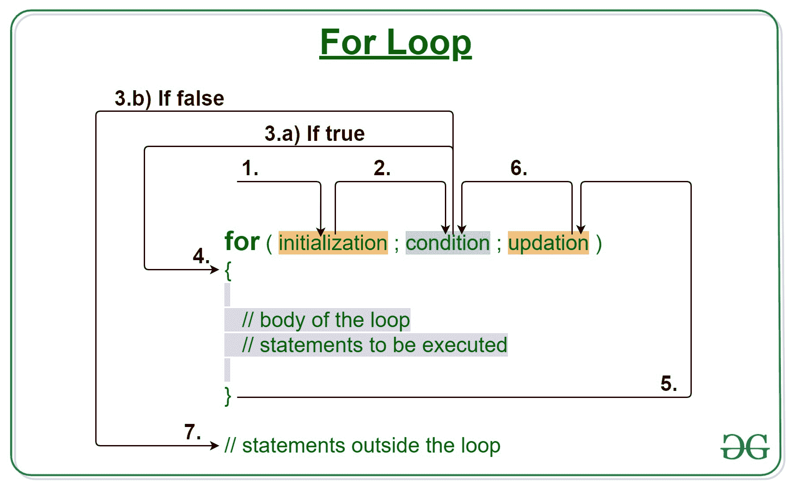
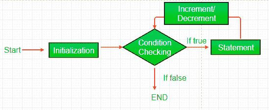

# Java For 循环示例

> 原文:[https://www.geeksforgeeks.org/java-for-loop-with-examples/](https://www.geeksforgeeks.org/java-for-loop-with-examples/)

当我们需要重复执行一段语句时，Java 中的 [**循环**](https://www.geeksforgeeks.org/loops-in-java/) 开始使用。
**Java for loop** 提供了一种简洁的编写循环结构的方式。for 语句在一行中消耗初始化、条件和递增/递减，从而提供一个更短、更易于调试的循环结构。



**语法:**

```
for (initialization expr; test expr; update exp)
{
     // body of the loop
     // statements we want to execute
}
```

For 循环的各个**部分是:** 

1.**初始化表达式:**在这个表达式中，我们必须将循环计数器初始化为某个值。
**例:**

```
int i=1;

```

2.**测试表达式:**在这个表达式中，我们要测试条件。如果条件评估为真，那么我们将执行循环的主体并更新表达式。否则，我们将退出 for 循环。
**例:**

```
i <= 10

```

3.**更新表达式**:执行循环体后，该表达式将循环变量递增/递减某个值。
**例:**

```
i++;

```

**For 循环是如何执行的？**

1.  控件落入 for 循环。初始化完成
2.  流程跳转到条件
3.  测试条件。
    1.  如果条件为真，流体进入身体
    2.  如果条件为假，流程将超出循环
4.  循环体内部的语句被执行。
5.  流向上升
6.  上升发生，流程再次进入步骤 3
7.  for 循环已结束，流已流出。

**循环流程图(控制流程):**



**例 1:** 本程序将尝试打印《Hello World》5 次。

## Java 语言(一种计算机语言，尤用于创建网站)

```
// Java program to illustrate for loop
class forLoopDemo {
    public static void main(String args[])
    {
        // Writing a for loop
        // to print Hello World 5 times
        for (int i = 1; i <= 5; i++)
            System.out.println("Hello World");
    }
}
```

```
Output:

Hello World
Hello World
Hello World
Hello World
Hello World
```

**试运行示例 1:** 程序将以以下方式执行。

```
1\. Program starts.
2\. i is initialized with value 1.
3\. Condition is checked. 1 <= 5 yields true.
  3.a) "Hello World" gets printed 1st time.
  3.b) Updation is done. Now i = 2.
4\. Condition is checked. 2 <= 5 yields true.
  4.a) "Hello World" gets printed 2nd time.
  4.b) Updation is done. Now i = 3.
5\. Condition is checked. 3 <= 5 yields true.
  5.a) "Hello World" gets printed 3rd time
  5.b) Updation is done. Now i = 4.
6\. Condition is checked. 4 <= 5 yields true.
  6.a) "Hello World" gets printed 4th time
  6.b) Updation is done. Now i = 5.
7\. Condition is checked. 5 <= 5 yields true.
  7.a) "Hello World" gets printed 5th time
  7.b) Updation is done. Now i = 6.
8\. Condition is checked. 6 <= 5 yields false.
9\. Flow goes outside the loop. Program terminates.
```

**例 2:** 下面的程序打印 x 的总和，范围从 1 到 20。

## Java 语言(一种计算机语言，尤用于创建网站)

```
// Java program to illustrate for loop.
class forLoopDemo {
    public static void main(String args[])
    {
        int sum = 0;

        // for loop begins
        // and runs till x <= 20
        for (int x = 1; x <= 20; x++) {
            sum = sum + x;
        }
        System.out.println("Sum: " + sum);
    }
}
```

**Output:** 

```
Sum: 210
```

[**增强 For 循环或 Java For-每个循环**](https://www.geeksforgeeks.org/for-each-loop-in-java/)

Java 还包括 Java 5 中引入的 for 循环的另一个版本。增强的 for 循环提供了一种更简单的方法来迭代集合或数组的元素。它是不灵活的，应该仅在需要以顺序方式迭代元素而不知道当前处理的元素的索引时使用。
**注意:**当使用增强 for 循环时，对象/变量是不可变的，即它确保数组中的值不能被修改，因此可以说它是一个只读循环，在那里您不能更新值，而在其他循环中，值可以被修改。
**语法:**

```
for (T element:Collection obj/array)
{
    // loop body
    // statement(s)
}
```

让我们举一个例子来演示如何使用增强的 for 循环来简化工作。假设有一个名称数组，我们希望打印该数组中的所有名称。让我们通过这个简单的实现来看看这两个例子的区别:

## Java 语言(一种计算机语言，尤用于创建网站)

```
// Java program to illustrate enhanced for loop

public class enhancedforloop {

    public static void main(String args[])
    {
        String array[] = { "Ron", "Harry", "Hermoine" };

        // enhanced for loop
        for (String x : array) {
            System.out.println(x);
        }

        /* for loop for same function 
        for (int i = 0; i < array.length; i++) 
        { 
            System.out.println(array[i]); 
        } 
        */
    }
}
```

**Output:** 

```
Ron
Harry
Hermoine
```

**建议:**尽可能使用这种陈述形式，而不是一般形式。(根据 JAVA 文档。)

1.  [Java 中的循环](https://www.geeksforgeeks.org/loops-in-java/)
2.  [Java 中的循环|要点](https://www.geeksforgeeks.org/loop-java-important-points/)
3.  [理解 Java 中的循环](https://www.geeksforgeeks.org/understanding-for-loops-in-java/)
4.  [Java while 循环示例](https://www.geeksforgeeks.org/java-while-loop-with-examples/)
5.  [Java 边做边循环示例](https://www.geeksforgeeks.org/java-do-while-loop-with-examples/)
6.  [对于 Java 中的每个循环](https://www.geeksforgeeks.org/for-each-loop-in-java/)
7.  [C、C++、Java 中 for 和 while 循环的区别](https://www.geeksforgeeks.org/difference-between-for-and-while-loop-in-c-c-java/)
8.  [C、C++、Java 中 for 和 do-while 循环的区别](https://www.geeksforgeeks.org/difference-between-for-and-do-while-loop-in-c-c-java/)