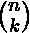

# Java 番石榴| long math 类的二项式(int n，int k)举例

> 原文:[https://www . geesforgeks . org/Java-guava-binomialint-n-int-k-of-long math-class-with-examples/](https://www.geeksforgeeks.org/java-guava-binomialint-n-int-k-of-longmath-class-with-examples/)

番石榴[龙数学类](https://www.geeksforgeeks.org/longmath-class-guava-java/)的**二项式(int n，int k)** 法接受两个参数 **n** 和 **k** ，计算二项式系数的值。如果计算值溢出了 long 的最大值，则该方法返回 Long。最大值，即一个长的最大值。

**语法:**

```java
public static long binomial(int n, int k)

```

**参数**:该方法接受两个参数 **n** 和 **k** ，计算二项式系数的值。

**返回值:**该方法返回 n 和 k 的二项式系数。

**异常:**如果 n 为负，或者 k 为负或者 k 大于 n，二项式(int n，int k)方法抛出***IllegalArgumentException***

下面的例子说明了 LongMath 类的二项式()方法:

**例 1 :**

```java
// Java code to show implementation of
// binomial(int n, int k) method of Guava's
// LongMath class
import java.math.RoundingMode;
import com.google.common.math.LongMath;

class GFG {

    // Driver code
    public static void main(String args[])
    {
        int n = 4;
        int k = 3;

        // Using binomial(int n, int k) method of
        // Guava's LongMath class
        long ans = LongMath.binomial(n, k);

        System.out.println("Binomial Coefficient of "
                           + n + " and " + k
                           + " is : " + ans);

        int n1 = 20;
        int k1 = 4;

        // Using binomial(int n, int k) method of
        // Guava's LongMath class
        long ans1 = LongMath.binomial(n1, k1);

        System.out.println("Binomial Coefficient of "
                           + n1 + " and " + k1
                           + " is : " + ans1);
    }
}
```

**Output:**

```java
Binomial Coefficient of 4 and 3 is : 4
Binomial Coefficient of 20 and 4 is : 4845

```

**例 2 :**

```java
// Java code to show implementation of
// binomial(int n, int k) method of Guava's
// LongMath class

import java.math.RoundingMode;
import com.google.common.math.LongMath;

class GFG {

    static long findBinomial(int n, int k)
    {
        try {
            // Using binomial(int n, int k)
            // method of Guava's LongMath class
            // This should throw "IllegalArgumentException"
            // as k < 0
            long ans = LongMath.binomial(n, k);

            // Return the answer
            return ans;
        }
        catch (Exception e) {
            System.out.println(e);
            return -1;
        }
    }

    // Driver code
    public static void main(String args[])
    {
        int n = 5;
        int k = 7;

        try {
            // Function calling
            findBinomial(n, k);
        }
        catch (Exception e) {
            System.out.println(e);
        }
    }
}
```

**Output:**

```java
java.lang.IllegalArgumentException: k (7) > n (5)

```

**参考:**[https://Google . github . io/guava/releases/20.0/API/docs/com/Google/common/math/longmath . html # binomial-int-int-](https://google.github.io/guava/releases/20.0/api/docs/com/google/common/math/LongMath.html#binomial-int-int-)