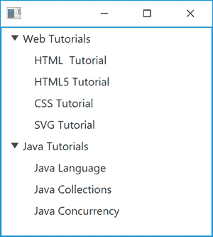

# Java 图形用户界面编程——基于 javaFx 的树形视图的实现

> 原文:[https://www . geesforgeks . org/Java-GUI-programming-implementation-of-JavaFX-based-treeview/](https://www.geeksforgeeks.org/java-gui-programming-implementation-of-javafx-based-treeview/)

**TreeView** 是最重要的控件之一，它使用 JavaFX 在基于 GUI 的 Java 编程中以树状格式实现数据的分层视图。“分层”意味着一些项目被放置为其他项目的从属项目，例如，树通常用于显示文件系统的内容，其中各个文件从属于它们所属的目录。TreeView 是使用树数据结构的 java GUI 程序的简单概念实现。

树用单个根节点表示，表示树的起点，在根节点下连接一个或多个子节点，子节点有两种类型

*   叶节点
*   分支节点
*   **叶节点**是没有子节点的节点**也称为**(终端节点)**，而分支节点是形成子树根节点的节点。从根节点到特定节点的节点序列称为路径。**
*   TreeView 最有用的特性是，只要树的大小超过视图的维度，它就会自动提供滚动条。

**如何使用 JavaFX 类实现 TreeView:**

**1。导入必要的库:**

我们调用必要的库来激活 JavaFX 控件，并收集所有资源来使用 TreeView，如下所示:

> 导入 JavaFX . application . application；
> 
> 导入 JavaFX . scene . scene；
> 
> 导入 JavaFX . scene . control . TreeItem；
> 
> 导入 JavaFX . scene . control . treeview；
> 
> 导入 JavaFX . scene . layout . vbox；
> 
> 导入 JavaFX . stage . stage；

**2** 。**创建树形视图:**

首先，我们通过调用 TreeView 类的新实例来创建一个 TreeView 对象，下面演示的示例显示了如何为 TreeView 类设置对象的示例:

```
TreeView tV = new TreeView();  
```

**3。** **将树形视图添加到场景图中:**

我们的下一个任务是将 TreeView 添加到 JavaFx 场景图中，以便可以看到它，下面的代码片段用于强制执行此操作:

> 公共无效开始(舞台主舞台){ 0
> 
> TreeView Tv = new TreeView()；
> 
> VBox vb = new VBox（tV）;
> 
> 场景 s =新场景(VB)；
> 
> primaryStage.setScene
> 
> primarystage . show()；
> 
> }

**4。将树项目附加到树视图:**

将由 JavaFx 树视图显示的项目由树项目类(javafx.scene.control.TreeItem)表示。

> TreeItem rItem = new TreeItem（"Tutorials"）;
> 
> TreeItem wItem =新的 TreeItem(“网络教程”)；
> 
> wItem.getChildren()。添加(新的 TreeItem(“HTML 教程”))；
> 
> wItem.getChildren()。添加(新的 tree item(“html 5 教程”)；
> 
> wItem.getChildren()。添加(新的 TreeItem(“CSS 教程”))；
> 
> wItem.getChildren()。添加(新的 TreeItem(“SVG 教程”))；
> 
> rItem.getChildren()。添加(WebItem)；
> 
> tree item javaitem = new tree item(" Java 教程")；
> 
> javaItem.getChildren()。添加(新的 TreeItem(“Java 语言”))；
> 
> javaItem.getChildren()。添加(新的 TreeItem(“Java Collections”)；
> 
> javaItem.getChildren()。添加(新的 TreeItem(“Java 并发”))；
> 
> rootItem.getChildren()。add(JavaItem)；
> 
> TreeView Tv = new TreeView()；
> 
> 电视. setRoot(节奏)：

**5。向树形视图添加子视图:**

在 TreeView 中，元素之间的父子关系以递归方式运行，即 TreeItem 可以有 otherTreeItem 实例作为子对象，我们使用方法 **getChildren()** 从 JavaItem 中获取元素，并通过使用方法 **add()** 将其添加到 TreeView 中，如下面的代码片段所示:

> tree item javaitem = new tree item(" Java 教程")；
> 
> javaItem.getChildren()。添加(新的 TreeItem(“Java 语言”))；
> 
> javaItem.getChildren()。添加(新的 TreeItem(“Java Collections”)；
> 
> javaItem.getChildren()。添加(新的 TreeItem(“Java 并发”))；
> 
> TreeItem rItem = new TreeItem（"Tutorials"）;
> 
> rItem.getChildren（）.add（javaItem）;

**6。隐藏树形视图的根项目:**

最后也是最重要的一步是隐藏根项目，即 JavaFx 树形视图的根节点。我们通过调用 setShowRoot()方法来实现，该方法使用布尔参数 false 进行初始化。

```
tV.setShowRoot(false);
```

## Java 语言(一种计算机语言，尤用于创建网站)

```
// Java Program to implement javaFx based TreeView

// Importing all necessary libraries
import javafx.application.Application;
import javafx.scene.Scene;
import javafx.scene.control.TreeItem;
import javafx.scene.control.TreeView;
import javafx.scene.layout.VBox;
import javafx.stage.Stage;

// Main class
// This class is extending Application class
public class GFG extends Application {

    // Main driver method
    public static void main(String[] args) { launch(args); }

    // @Override
    public void start(Stage primaryStage)
    {

        // Initializing variable to TreeItem element
        // All arguments are custom entries
        TreeItem rItem = new TreeItem("Tutorials");

        // Initializing variable for TreeItem variable
        TreeItem wItem = new TreeItem("Web Tutorials");

        // Adding labels for elements to TreeItem
        // Custom entries
        wItem.getChildren().add(
            new TreeItem("HTML  Tutorial"));
        wItem.getChildren().add(
            new TreeItem("HTML5 Tutorial"));
        wItem.getChildren().add(
            new TreeItem("CSS Tutorial"));
        wItem.getChildren().add(
            new TreeItem("SVG Tutorial"));
        rItem.getChildren().add(wItem);

        // Initializing new TreeItem
        TreeItem javaItem = new TreeItem("Java Tutorials");
        javaItem.getChildren().add(
            new TreeItem("Java Language"));
        javaItem.getChildren().add(
            new TreeItem("Java Collections"));
        javaItem.getChildren().add(
            new TreeItem("Java Concurrency"));
        rootItem.getChildren().add(javaItem);

        // Creating an object of TreeView class
        TreeView tV = new TreeView();

        tV.setRoot(rootItem);

        tV.setShowRoot(false);

        // Creating an object of VBox class
        VBox vb = new VBox(tV);

        // Creating an object of Scene class
        Scene s = new Scene(vb);

        // Now, setting the scene for primaryStage
        primaryStage.setScene(s);

        // Finally, display all the elements
        // using show() method
        primaryStage.show();
    }
}
```

**输出:**



> **注意:**上图中输入的元素仅作为示例展示，您可以根据情境在 TreeView 中标记项目。