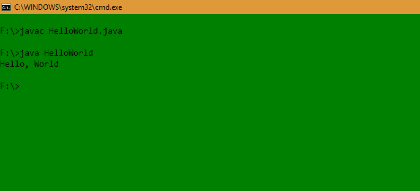
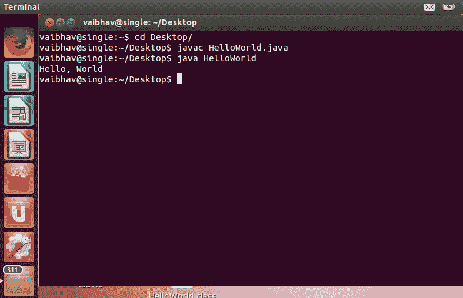

# Java Hello 世界计划

> 原文:[https://www.geeksforgeeks.org/java-hello-world-program/](https://www.geeksforgeeks.org/java-hello-world-program/)

Java 是最流行和使用最广泛的编程语言和平台之一。Java 快速、可靠、安全。从桌面到网络应用，从科学超级计算机到游戏机，从手机到互联网，Java 被应用到每一个角落。

Java 易学，语法简单易懂。它基于 C++(所以对懂 C++的程序员来说更容易)。

Java 编程的过程可以简化为三个步骤:

*   通过在文本编辑器中键入程序并将其保存到文件中来创建程序——HelloWorld.java。
*   通过在终端窗口中键入“javac HelloWorld.java”进行编译。
*   通过在终端窗口中键入“java HelloWorld”来执行(或运行)它。

下面给出的程序是 Java 把“Hello World”打印到屏幕上最简单的程序。让我们试着一步一步地理解每一点代码。

## Java 语言(一种计算机语言，尤用于创建网站)

```
// This is a simple Java program.
// FileName : "HelloWorld.java".

class HelloWorld
{
    // Your program begins with a call to main().
    // Prints "Hello, World" to the terminal window.
    public static void main(String args[])
    {
        System.out.println("Hello, World");
    }
}
```

**Output**

```
Hello, World
```

《你好世界》程序由三个主要组件组成:HelloWorld 类定义、main 方法和源代码注释。以下解释将为您提供对代码的基本理解:

#### **1。类别定义**

这一行使用关键字 **class** 来声明正在定义一个新的类。

```
class HelloWorld 
```

#### **2。地狱世界**

它是一个标识符，是类的名称。整个类定义，包括它的所有成员，将位于左花括号 **{** 和右花括号 **}** 之间。

#### **3。主要方法:**

在 Java 编程语言中，每个应用程序都必须包含一个主方法，其签名是:

```
public static void main(String[] args)
```

*   **公共**:让 [JVM](https://www.geeksforgeeks.org/jvm-works-jvm-architecture/) 可以从任何地方执行该方法。
*   **静态**:主要方法是不带对象调用。修饰符 public 和 static 可以按任意顺序编写。
*   **void** :主法不返回任何东西。
*   **main()** :在 JVM 中配置的名称。
*   **String[]**:main 方法接受单个参数，即 String 类型的元素数组。

像在 C/C++中一样，主方法是应用程序的入口点，随后将调用程序所需的所有其他方法。

这里显示了下一行代码。请注意，它发生在 main()方法内部。

```
System.out.println("Hello, World");
```

这一行输出字符串“你好，世界”，后面是屏幕上的一个新行。输出是通过内置的 println( *)* 方法完成的。**系统**是提供系统访问的预定义类， **out** 是连接到控制台的输出流类型变量。

### **评论**

它们可以是多行或单行注释。

```
// This is a simple Java program. 
// Call this file "HelloWorld.java". 
```

这是一个单行注释。这种类型的注释必须以//开头，就像在 C/C++中一样。对于多行注释，它们必须从/*开始，以*/结束。

### **重要点**

*   程序定义的类名为 HelloWorld，与文件名(HelloWorld.java)相同。这不是巧合。在 Java 中，所有代码都必须驻留在一个类中，并且最多有一个包含 main()方法的公共类。
*   按照惯例，main 类(包含 main 方法的类)的名称应该与保存程序的文件名匹配。

### **编译程序**

*   成功[设置环境](https://www.geeksforgeeks.org/setting-environment-java/)后，我们可以在 Windows/Unix 中打开一个终端，进入文件所在的目录——HelloWorld.java。
*   现在，要编译 HelloWorld 程序，执行编译器–javac，在命令行上指定**源**文件的名称，如图所示:

```
javac HelloWorld.java 
```

*   编译器创建一个 HelloWorld.class(在当前工作目录中)，其中包含程序的字节码版本。现在，要执行我们的程序，需要使用 Java 调用 **JVM** (Java 虚拟机)，在命令行上指定**类**文件的名称，如图所示:

```
java HelloWorld
```

*   这将打印“你好世界”到终端屏幕。

### **在窗口**



### **在 Linux 中**



本文由**高拉夫·米格拉尼**供稿。如果你喜欢 GeeksforGeeks 并想投稿，你也可以使用[write.geeksforgeeks.org](https://write.geeksforgeeks.org)写一篇文章或者把你的文章邮寄到 review-team@geeksforgeeks.org。看到你的文章出现在极客博客主页上，帮助其他极客。如果你发现任何不正确的地方，或者你想分享更多关于上面讨论的话题的信息，请写评论。