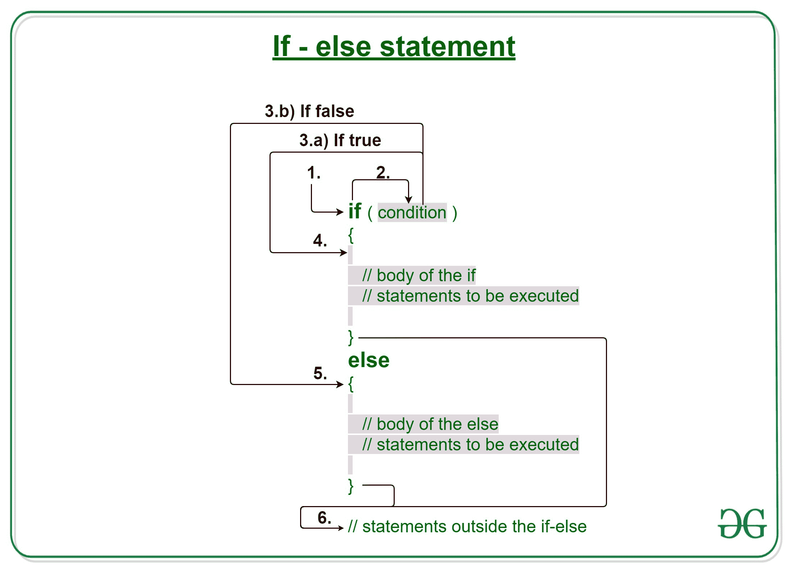
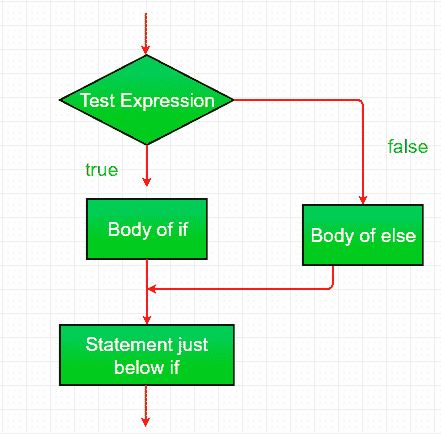

# 带有示例的 Java if-else 语句

> 原文:[https://www . geesforgeks . org/Java-if-else-statement-with-examples/](https://www.geeksforgeeks.org/java-if-else-statement-with-examples/)

[**Java 中的决策制定**](https://www.geeksforgeeks.org/decision-making-javaif-else-switch-break-continue-jump/) 有助于编写决策驱动的语句，并根据特定条件执行特定的一组代码。

仅 **if 语句**就告诉我们，如果条件为真，它将执行一组语句，如果条件为假，它不会执行。但是如果条件是假的，我们想做别的事情怎么办。 **else 语句**来了。当条件为假时，我们可以使用 else 语句和 if 语句来执行一段代码。

[](https://media.geeksforgeeks.org/wp-content/uploads/20191118180512/If-else-statement-GeeksforGeeks1.jpg)

**语法:**

```
if (condition)
{
    // Executes this block if
    // condition is true
}
else
{
    // Executes this block if
    // condition is false
}
```

**if-else 语句的工作**

1.  控件落入 if 块。
2.  流程跳转到条件。
3.  测试条件。
    1.  如果条件为真，转到步骤 4。
    2.  如果条件为假，转到步骤 5。
4.  if 块或 if 中的主体被执行。
5.  else 块或 else 中的主体被执行。
6.  流程退出 if-else 块。

**流程图 if-else:**

[](https://media.geeksforgeeks.org/wp-content/uploads/20191108170014/Java-if-else.png)

**例 1:**

```
// Java program to illustrate if-else statement

class IfElseDemo {
    public static void main(String args[])
    {
        int i = 20;

        if (i < 15)
            System.out.println("i is smaller than 15");
        else
            System.out.println("i is greater than 15");

        System.out.println("Outside if-else block");
    }
}
```

**Output:**

```
i is greater than 15
Outside if-else block

```

**空转示例 1:**

```
1\. Program starts.
2\. i is initialized to 20.
3\. if-condition is checked. 20<15, yields false. 4\. flow enters the else block. 4.a) "i is greater than 15" printed 5\. "outside if-else block" printed. < pre>**例 2:** 

```
// Java program to illustrate if-else statement

class IfElseDemo {
    public static void main(String args[])
    {
        String str = "geeksforgeeks";

        if (str == "geeks")
            System.out.println("Hello geek");
        else
            System.out.println("Welcome to GeeksforGeeks");
    }
}
```

**Output:**

```
Welcome to GeeksforGeeks

```

 **相关文章:**1.  [Java 中的决策](https://www.geeksforgeeks.org/decision-making-javaif-else-switch-break-continue-jump/)2.  [带示例的 Java if 语句](https://www.geeksforgeeks.org/java-if-statement-with-examples/)3.  [Java if-else-if 阶梯示例](https://www.geeksforgeeks.org/java-if-else-if-ladder-with-examples/)4.  [Java 中的 Switch 语句](https://www.geeksforgeeks.org/switch-statement-in-java/)5.  [Java 中的 Break 语句](https://www.geeksforgeeks.org/break-statement-in-java/)6.  [返回 Java 中的关键字](https://www.geeksforgeeks.org/return-keyword-java/)

15,>
```