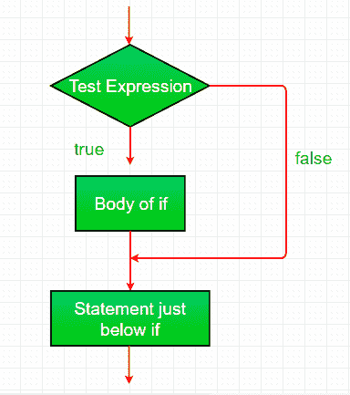

# 带示例的 Java if 语句

> 原文:[https://www . geesforgeks . org/Java-if-statement-with-examples/](https://www.geeksforgeeks.org/java-if-statement-with-examples/)

[**Java 中的决策制定**](https://www.geeksforgeeks.org/decision-making-javaif-else-switch-break-continue-jump/) 有助于编写决策驱动的语句，并根据特定条件执行特定的一组代码。

**Java if 语句**是最简单的决策语句。它用于决定是否执行某个语句或语句块，即如果某个条件为真，则执行某个语句块，否则不执行。

[](https://media.geeksforgeeks.org/wp-content/uploads/20191118171408/If-statement-GeeksforGeeks1.jpg)

**语法:**

```
if(condition) 
{
   // Statements to execute if
   // condition is true
}
```

**if 语句的工作状态**

1.  控件落入 if 块。
2.  流程跳转到条件。
3.  测试条件。
    1.  如果条件为真，转到步骤 4。
    2.  如果条件为假，转到步骤 5。
4.  if 块或 if 中的主体被执行。
5.  流程走出 if 块。

**流程图 if 语句:**
[](https://media.geeksforgeeks.org/wp-content/uploads/20191108163721/java-if.png)

**操作:**
if-statement 求值后的条件为真或假。Java 中的 if 语句接受布尔值，如果该值为真，那么它将执行其下的语句块。

**注意:**如果我们没有在 if( condition)之后提供花括号“{ 0 }”和“}”，那么默认情况下 If 语句会将紧接的 one 语句视为在其块内。例如，

```
if(condition)
   statement1;
   statement2;

// Here if the condition is true, if block 
// will consider only statement1 to be inside 
// its block.
```

**例 1:**

```
// Java program to illustrate If statement

class IfDemo {
    public static void main(String args[])
    {
        int i = 10;

        if (i < 15)
            System.out.println("10 is less than 15");

        // This statement will be executed
        // as if considers one statement by default
        System.out.println("Outside if-block");
    }
}
```

**Output:**

```
10 is less than 15
Outside if-block

```

**空转示例 1:**

```
1\. Program starts.
2\. i is initialized to 10.
3\. if-condition is checked. 10<15, yields true. 3.a) "10 is less than 15" gets printed. 4\. "outside if-block" < pre>**例 2:** 

```
// Java program to illustrate If statement

class IfDemo {
    public static void main(String args[])
    {
        String str = "GeeksforGeeks";
        int i = 4;

        // if block
        if (i == 4) {
            i++;
            System.out.println(str);
        }

        // Executed by default
        System.out.println("i = " + i);
    }
}
```

**Output:**

```
GeeksforGeeks
i = 5

```

**相关文章:**1.  [Java 中的决策](https://www.geeksforgeeks.org/decision-making-javaif-else-switch-break-continue-jump/)2.  [带有示例的 Java if-else 语句](https://www.geeksforgeeks.org/java-if-else-statement-with-examples/)3.  [Java if-else-if 阶梯示例](https://www.geeksforgeeks.org/java-if-else-if-ladder-with-examples/)4.  [Java 中的 Switch 语句](https://www.geeksforgeeks.org/switch-statement-in-java/)5.  [Java 中的 Break 语句](https://www.geeksforgeeks.org/break-statement-in-java/)6.  [返回 Java 中的关键字](https://www.geeksforgeeks.org/return-keyword-java/)

15,>
```