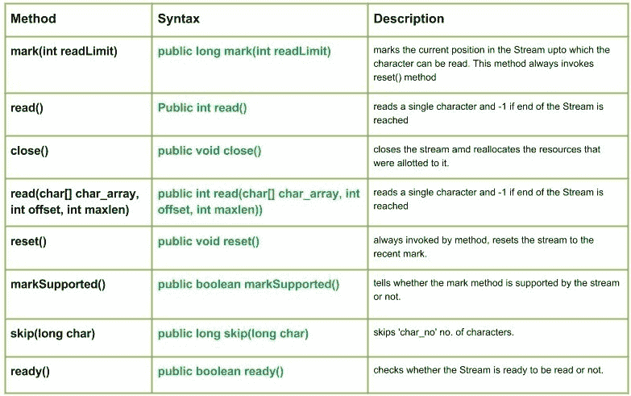

# Java 中的 Java.io.CharArrayReader 类

> 原文:[https://www . geesforgeks . org/Java-io-chararrayreader-class-Java/](https://www.geeksforgeeks.org/java-io-chararrayreader-class-java/)

[](https://media.geeksforgeeks.org/wp-content/uploads/CharArrayReader-Class-in-Java.jpg)

**java.io.CharArrayReader** 类使用字符数组创建字符缓冲区。

**申报:**

```
public class CharArrayReader
   extends Reader
```

**施工方:**

*   **CharArrayReader(char[]char _ array):**从指定的字符数组创建 CharArrayReader。
*   **CharArrayReader(char[]char _ array，int offset，int maxlen) :** 从字符数组的指定部分创建 CharArrayReader。

**方法:**

*   **read():Java . io . chararrayreader . read()**读取单个字符，如果到达 Stream 的末尾，则返回-1。
    **语法:**

```
public int read()
Parameters : 
-----------
Return  :
Returns read character as an integer ranging from range 0 to 65535.
-1 : when end of file is reached.
```

*   **read(char【】char _ array，int offset，int maxlen):Java . io . chararrayreader . read(char【】char _ array，int offset，int maxlen))** 读取单个字符，如果到达 Stream 的末尾则返回-1
    **语法:**

```
public int read(char[] char_array, int offset, int maxlen))
Parameters : 
char_array : destination array  
offset : starting position from where to store characters
maxlen : maximum no. of characters to be read
Return  :
Returns all the characters read
-1 : when end of file is reached.
```

*   **ready():Java . io . chararrayreader . ready()**检查 Stream 是否准备好被读取。
    字符阅读器总是准备好被阅读。
    **语法:**

```
public boolean ready()
Parameters : 
-----------
Return  :
true if CharArrayReader is ready to be read.
```

*   **跳过(长字符):java.io.CharArrayReader.skip(长字符 _no)** 跳过‘char _ no’个字符。如果 n 是负的，那么这个方法什么也不做，返回 0。
    **语法:**

```
public long skip(long char)
Parameters : 
char_no : char no. of characters to be skipped
Return  :
no. of characters skipped
Exception : 
IOException : In case of I/O error occurs
```

## Java 语言(一种计算机语言，尤用于创建网站)

```
// Java program illustrating the working of CharArrayReader class methods
// read(), skip(), ready()
// read(char[] char_array, int offset, int maxlen)

import java.io.*;
public class NewClass
{
    public static void main(String[] args) throws IOException
    {

        // Initializing the character array
        char[] geek = {'G', 'E', 'E', 'K', 'S'};

        // Initializing the char_array
        CharArrayReader char_array1 = new CharArrayReader(geek);
        CharArrayReader char_array2 = new CharArrayReader(geek);

        // Use of ready() method
        boolean check1 = char_array1.ready();
        if(check1 ==true)
            System.out.println("char_array1 is ready");
        else
            System.out.println("char_array1 is not ready");

        int a = 0;
        System.out.print("Use of read() method : ");
        // Use of read() method : reading each character one by one
        while((a = char_array1.read()) != -1)
        {
            char c1 = (char)a;
            System.out.println(c1);

            // Use of skip() method
            long char_no = char_array1.skip(1);
            System.out.println("Characters Skipped : "+(c1+1));

        }
        System.out.println("");

        // Use of ready() method
        boolean check2 = char_array2.ready();
        if(check2 ==true)
            System.out.println("char_array2 is ready");
        else
            System.out.println("char_array2 is not ready");

  // Use of read(char[] char_array, int offset, int maxlen) : reading a part of array
        char_array2.read(geek, 1, 2);

        int b = 0;

  System.out.print("Use of read(char[] char_array, int offset, int maxlen) method : ");

        while((b = char_array2.read()) != -1)
        {
            char c2 = (char)b;
            System.out.print(c2);
        }

    }
}
```

**输出:**

```
char_array1 is ready
Use of read() method : G
Characters Skipped : 72
E
Characters Skipped : 70
S
Characters Skipped : 84

char_array2 is ready
Use of read(char[] char_array, int offset, int maxlen) method : EKS
```

*   **标记(int read limit):Java . io . chararrayreader . mark(int read limit)**标记当前在 Stream 中可以读取字符的位置。此方法总是调用 reset()方法。对 reset()的后续调用会将流重新定位到这一点。
    **语法:**

```
public long mark(int readLimit)
Parameters : 
readLimit : No. of characters that can be read up to the mark
Return  :
void
Exception : 
IOException : In case of I/O error occurs
```

*   **markSupported():Java . io . chararrayreader . markSupported()**告知流是否支持 mark 方法。
    **语法:**

```
public boolean markSupported()
Parameters : 
-------
Return  :
true if the mark method is supported by the stream
Exception : 
IOException : In case of I/O error occurs
```

*   **reset():Java . io . chararrayreader . reset()**将流重置为最近的标记，如果从未标记过，则重置为开头。
    **语法:**

```
public void reset()
Parameters : 
-------
Return  :
void
Exception : 
IOException : In case of I/O error occurs
```

*   **close():Java . io . chararrayreader . close()**关闭流并重新分配分配给它的资源。
    **语法:**

```
public void close()
Parameters : 
-------
Return  :
void
Exception : 
IOException : In case of I/O error occurs
```

## Java 语言(一种计算机语言，尤用于创建网站)

```
// Java program illustrating the working of FilterInputStream method
// mark(), reset()
// markSupported(), close()

import java.io.*;
public class NewClass
{
    public static void main(String[] args) throws Exception
    {
        // Initializing CharArrayReader
        CharArrayReader char_array = null;
        char[] geek = {'H', 'E', 'L', 'L', 'O', 'G',  'E',  'E',  'K', 'S'};

        try
        {
            char_array = new CharArrayReader(geek);

            // read() method : reading and printing Characters
            // one by one
            System.out.println("Char : "+(char)char_array.read());
            System.out.println("Char : "+(char)char_array.read());
            System.out.println("Char : "+(char)char_array.read());

            // mark() : read limiing the 'geek' input stream
            char_array.mark(0);

            System.out.println("mark() method comes to play");
            System.out.println("Char : "+(char)char_array.read());
            System.out.println("Char : "+(char)char_array.read());
            System.out.println("Char : "+(char)char_array.read());

            // Use of markSupported() :
            boolean check = char_array.markSupported();
            if (check == true )
                System.out.println("mark() supported\n");

            if (char_array.markSupported())
            {
                // reset() method : repositioning the stream to
                // marked positions.
                char_array.reset();
                System.out.println("reset() invoked");
                System.out.println("Char : "+(char)char_array.read());
                System.out.println("Char : "+(char)char_array.read());
            }
            else
                System.out.println("mark() method not supported.");

        }
        catch(Exception excpt)
        {
            // in case of I/O error
            excpt.printStackTrace();
        }
        finally
        {
            // Use of close() : releasing the resources back to the
            // GarbageCollector when closes
            if(char_array != null)
                char_array.close();
        }
    }
}
```

**输出:**

```
Char : H
Char : E
Char : L
mark() method comes to play
Char : L
Char : O
Char : G
mark() supported

reset() invoked
Char : L
Char : O
```

本文由 **莫希特·古普塔供稿🙂** 。如果你喜欢 GeeksforGeeks 并想投稿，你也可以使用[write.geeksforgeeks.org](https://write.geeksforgeeks.org)写一篇文章或者把你的文章邮寄到 review-team@geeksforgeeks.org。看到你的文章出现在极客博客主页上，帮助其他极客。
如果发现有不正确的地方，或者想分享更多关于上述话题的信息，请写评论。