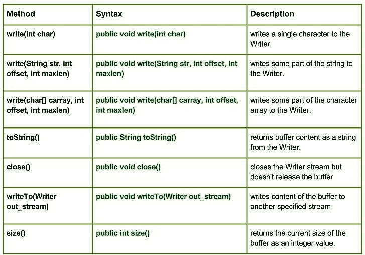

# Java 中的 Java.io.CharArrayWriter 类| Set 1

> 原文:[https://www . geesforgeks . org/Java-io-chararraywriter-class-Java-set-1/](https://www.geeksforgeeks.org/java-io-chararraywriter-class-java-set-1/)

[](https://media.geeksforgeeks.org/wp-content/uploads/CharArrayWriter-class-in-Java-Set-1.jpg)

**java.io.CharArrayWriter** 类创建一个可以作为编写器使用的字符缓冲区。当数据写入流时，缓冲区会自动增长。可以使用 toCharArray()和 toString()检索数据。
**申报:**

```java
public class CharArrayWriter
   extends Writer
```

**建造师:**

*   **CharArrayWriter() :** 从指定的字符数组创建 CharArrayWriter。
*   **CharArrayWriter(int size):**创建具有指定初始大小的 CharArrayWriter。

**方法:**

*   **write(int char):Java . io . chararraywriter . write(int char)**向 Writer 写入单个字符。
    **语法:**

```java
public void write(int char)
Parameters : 
char : int value of the character to be written.
Return  :
void
```

*   **write(String str，int offset，int maxlen):Java . io . chararraywriter . write(String str，int offset，int maxlen)** 将字符串的某一部分写入 Writer。
    **语法:**

```java
public void write(String str, int offset, int maxlen)
Parameters : 
str : string to be written to the Writer.
offset : start position of the String
maxlen : maximum length upto which string has to written
Return  :
void
```

*   **write(char[] carray，int offset，int maxlen):Java . io . chararraywriter . write(char[]carray，int offset，int maxlen)** 将字符数组的某个部分写入 Writer。
    **语法:**

```java
public void write(char[] carray, int offset, int maxlen)
Parameters : 
carray : character to be written to the Writer
offset : start position of the character array
maxlen : maximum no. of the character of the carray has to written
Return  :
void
```

*   **write to(Writer out _ stream):Java . io . chararraywriter . write to(Writer out _ stream)**将缓冲区的内容写入另一个指定的流。
    **语法:**

```java
public void writeTo(Writer out_stream)
Parameters : 
out_stream : destination stream to be write into
Return  :
void
Exception : 
IOException : In case of I/O error occurs
```

*   **toString():Java . io . chararraywriter . toString()**从 Writer 以字符串形式返回缓冲区内容。
    **语法:**

```java
public String toString()
Parameters : 
-----------
Return  :
returns buffer content as a string from the Writer.
```

*   **close():Java . io . stringwriter . close()**关闭 Writer 流但不释放缓冲区
    **语法:**

```java
public void close()
Parameters : 
-----------
Return  :
void
```

*   **size():Java . io . stringwriter . size()**以整数值形式返回缓冲区的当前大小。
    **语法:**

```java
public int size()
Parameters : 
-----------
Return  :
integer value representing the current size of the buffer.
```

**解释 CharArrayWriter 类方法使用的 Java 代码**

## Java 语言(一种计算机语言，尤用于创建网站)

```java
// Java program illustrating the working of CharArrayWriter class methods
// write(int char), toString(), write(char[] carray, int offset, int maxlen)
// write(String str, int offset, int maxlen), size()

import java.io.*;
public class NewClass
{
    public static void main(String[] args) throws IOException
    {

        // Initializing the character array
        char[] geek = {'G', 'E', 'E', 'K', 'S'};
        String geek_str;

        // Initializing the CharArrayWriter
        CharArrayWriter char_array1 = new CharArrayWriter();
        CharArrayWriter char_array2 = new CharArrayWriter();
        CharArrayWriter char_array3 = new CharArrayWriter();

        for(int c = 72; c < 77; c++)
        {
            // Use of write(int char)
            // Writer int value to the Writer
            char_array1.write(c);
        }

        // Use of toString() : returning Buffer content as String
        geek_str = char_array1.toString();
        System.out.println("Using write(int char) : "+ geek_str);

        // Use of write(String str, int offset, int maxlen)
        // writes some part of the string to the Writer.
        char_array2.write(geek_str, 2, 3);

        System.out.println("write(str, offset, maxlen) : "+ char_array2.toString());

        // Use of write(char[] carray, int offset, int maxlen)
        // writes some part of the Char[] geek to the Writer
        char_array3.write(geek, 2, 3);
        System.out.println("write(carray, offset, maxlen) : "+ char_array3.toString());

        // get buffered content as string
        String str = char_array3.toString();

        // Use of writeTo(Writer out_stream)
        char_array3.writeTo(char_array1);

        System.out.println("\nchar_array3 to char_array1 : "+ char_array1.toString());

        // Use of size() method
        System.out.println("\nSize of char_array1 : "+ char_array1.size());
        System.out.println("Size of char_array1 : "+ char_array2.size());
        System.out.println("Size of char_array1 : "+ char_array3.size());

    }
}
```

**输出:**

```java
Using write(int char) : HIJKL
write(str, offset, maxlen) : JKL
write(carray, offset, maxlen) : EKS

char_array3 to char_array1 : HIJKLEKS

Size of char_array1 : 8
Size of char_array1 : 3
Size of char_array1 : 3
```

下一篇: [Java 中的 Java.io.CharArrayWriter 类| Set2](https://www.geeksforgeeks.org/java-io-chararraywriter-class-java-set-2/)
本文由 **莫希特·古普塔供稿🙂** 。如果你喜欢 GeeksforGeeks 并想投稿，你也可以使用[write.geeksforgeeks.org](https://write.geeksforgeeks.org)写一篇文章或者把你的文章邮寄到 review-team@geeksforgeeks.org。看到你的文章出现在极客博客主页上，帮助其他极客。
如果发现有不正确的地方，或者想分享更多关于上述话题的信息，请写评论。