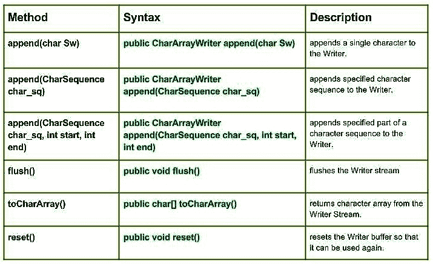

# Java 中的 Java.io.CharArrayWriter 类| Set 2

> 原文:[https://www . geesforgeks . org/Java-io-chararraywriter-class-Java-set-2/](https://www.geeksforgeeks.org/java-io-chararraywriter-class-java-set-2/)

[Java 中的 CharArrayWriter 类| Set 1](https://www.geeksforgeeks.org/java-io-chararraywriter-class-java-set-1/)

[](https://media.geeksforgeeks.org/wp-content/uploads/CharArrayWriter-class-in-Java-Set-2.jpg)

**方法:**

*   **追加(char Sw):****Java . io . chararraywriter . append(char Sw)**向 Writer 追加一个字符。
    **语法:**

```
public CharArrayWriter append(char Sw)
Parameters : 
Sw : character to be append
Return  :
CharArrayWriter
```

*   **追加(CharSequence char _ sq):****Java . io . chararraywriter . append(CharSequence char _ sq)**向 Writer 追加指定的字符序列。
    **语法:**

    ```
    public CharArrayWriter append(CharSequence char_sq)
    Parameters : 
    char_sq : Character sequence to append. 
    Return  :
    CharArrayWriter, if char sequence is null, then NULL appends to the Writer. 
    ```

    *   **追加(CharSequence char_sq，int start，int end):****Java . io . chararraywriter . append(CharSequence char _ sq，int start，int end)** 将字符序列的指定部分追加到 Writer。
    **语法:**

    ```
    public CharArrayWriter append(CharSequence char_sq, int start, int end)
    Parameters : 
    char_sq : Character sequence to append.
    start : start of character in the Char Sequence
    end : end of character in the Char Sequence
    Return  :
    void
    ```

    *   **flush():****Java . io . chararraywriter . flush()**刷新编写器流
    **语法:**

    ```
    public void flush()
    Parameters : 
    -----
    Return  :
    void
    ```

    *   **toCharArray():****Java . io . chararraywriter . toCharArray()**从 Writer Stream 返回字符数组。
    **语法:**

    ```
    public char[] toCharArray()
    Parameters : 
    -----
    Return  :
    void
    ```

    *   **reset() :** **java.io.CharArrayWriter.reset()** resets the Writer buffer so that it can be used again.
    **Syntax:**

    ```
    public void reset()
    Parameters : 
    -----
    Return  :
    void
    ```

    **演示 CharArrayWriter 类方法使用的 Java 程序:**

    ```
    // Java program illustrating the working of CharArrayWriter class methods
    // append(CharSequence char_sq), append(char Sw)
    // append(CharSequence char_sq, int start,int end)
    // flush(), reset(), toCharArray

    import java.io.*;

    public class NewClass
    {
        public static void main(String[] args) throws IOException
        {
            // Initializing String Witer
            CharArrayWriter geek_writer1 = new CharArrayWriter();
            CharArrayWriter geek_writer2 = new CharArrayWriter();
            CharArrayWriter geek_writer3 = new CharArrayWriter();

            char[] Sw = {'G','E','E','K','S'};

            for(char c: Sw)
            {
                // Use of append(char Sw) :
                geek_writer1 .append(c);

                System.out.println("append(char Sw) :" + geek_writer1 .toString());
            }

            // Using flush() method
            geek_writer1.flush();
            System.out.println("\nUsing flush() : "+ geek_writer1.toString());
            System.out.println("");

            // Initializing Character Sequence
            CharSequence char_sq1 = "1 Hello 1";
            CharSequence char_sq2 = " : 2 Geeks 2";

            // Use of append(CharSequence char_sq)
            geek_writer2.append(char_sq1);
            geek_writer2.append(char_sq2);

            System.out.println("append(char_sq) : " + geek_writer2.toString());

            // Use of append(CharSequence char_sq,int start,int end)
            geek_writer3.append(char_sq1, 0, 3);
            geek_writer3.append(char_sq2, 3, 6);

            System.out.println("append(char_sq,start,end) : " + geek_writer3.toString());
            System.out.println("");

            // Use of toCharArray() :
            char[] toChar1 = geek_writer1.toCharArray();
            for (char c1 : toChar1)
            {
                System.out.println("toCharArray : "+ c1);
            }

            geek_writer1.reset();
            System.out.println("\nReset is invoked");

            char[] toChar2 = geek_writer1.toCharArray();
            for (char c2 : toChar2)
            {
                System.out.println("toCharArray : "+ c2);
            }

            System.out.println("\ntoCharArray not working as reset is invoked");
        }
    }
    ```

    **输出:**

    ```
    append(char Sw) :G
    append(char Sw) :GE
    append(char Sw) :GEE
    append(char Sw) :GEEK
    append(char Sw) :GEEKS

    Using flush() : GEEKS

    append(char_sq) : 1 Hello 1 : 2 Geeks 2
    append(char_sq,start,end) : 1 H2 G

    toCharArray : G
    toCharArray : E
    toCharArray : E
    toCharArray : K
    toCharArray : S

    Reset is invoked

    toCharArray not working as reset is invoked
    ```

    本文由 <font color="green">**莫希特·古普塔供稿🙂**</font> 。如果你喜欢 GeeksforGeeks 并想投稿，你也可以使用[contribute.geeksforgeeks.org](http://www.contribute.geeksforgeeks.org)写一篇文章或者把你的文章邮寄到 contribute@geeksforgeeks.org。看到你的文章出现在极客博客主页上，帮助其他极客。

    如果你发现任何不正确的地方，或者你想分享更多关于上面讨论的话题的信息，请写评论。