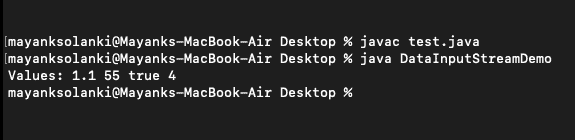

# Java 中的 Java.io.DataInputStream 类|集合 1

> 原文:[https://www . geesforgeks . org/Java-io-datainputstream-class-Java-set-1/](https://www.geeksforgeeks.org/java-io-datainputstream-class-java-set-1/)

**数据输入流**使应用程序能够以独立于机器的方式(而不是原始字节)从底层输入流中读取[原始 Java 数据类型](https://www.geeksforgeeks.org/primitive-data-type-vs-object-data-type-in-java-with-examples/)。这就是为什么它被称为 DataInputStream——因为它读取数据(数字)，而不仅仅是字节。

应用程序使用数据输出流来写入数据，这些数据以后可以由数据输入流读取。数据输入流和数据输出流表示 Unicode 字符串，其格式是对 UTF-8 的轻微修改。对于多线程访问，DataInputStream 不一定是安全的。线程安全是可选的，是这个类中方法的用户的责任。

首先让我们讨论一下这个类的构造函数

<figure class="table">

| **constructor** | **Operation performed** |
| Input stream (InputStream in) | Creates a data InputStream using the specified underlying inputstream. |

</figure>

现在让我们讨论这个类的方法，这些方法以表格形式描述如下:

<figure class="table">

| 方法 | 已执行的操作 |
| --- | --- |
| [读取(字节[] b)](https://www.geeksforgeeks.org/datainputstream-read-method-in-java-with-examples/) | 从包含的输入流中读取一定数量的字节，并将它们存储到缓冲区数组 b 中。 |
| [读取(字节[] b，int off，int len)](https://www.geeksforgeeks.org/datainputstream-read-method-in-java-with-examples/) | 从包含的输入流中读取长度不超过字节的数据到字节数组中。 |
| [读取布尔()](https://www.geeksforgeeks.org/datainputstream-readboolean-method-in-java-with-examples/#:~:text=The%20readBoolean()%20method%20of,then%20this%20method%20returns%20true.&text=Specified%20By%3A%20This%20method%20is,()%20method%20of%20DataInput%20interface.) | 读取一个输入字节，如果该字节非零，则返回 true 如果该字节为零，则返回 false。 |
| [readChar()](https://www.geeksforgeeks.org/datainputstream-readchar-method-in-java-with-examples/) | 读取两个输入字节并返回一个字符值。 |
| readUTF() | 从基础输入流中读取数据，并将字节转换为 Unicode 字符串。 |
| 读字节() | 读取一个输入字节并返回一个字节值。 |
| [readFloat()](https://www.geeksforgeeks.org/datainputstream-readfloat-method-in-java-with-examples/) | 读取四个输入字节并返回一个浮点值。 |
| [readFully()](https://www.geeksforgeeks.org/datainputstream-readfully-method-in-java-with-examples/) | 读取等于字节数组长度的字节 |
| [readDouble()](https://www.geeksforgeeks.org/datainputstream-readdouble-method-in-java-with-examples/) | 读取八个输入字节并返回一个双精度值。 |
| [readInt()](https://www.geeksforgeeks.org/datainputstream-readint-method-in-java-with-examples/) | 读取四个输入字节并返回一个 int 值。 |
| readLine（） | 阅读文本行 |
| [读龙（）](https://www.geeksforgeeks.org/datainputstream-readlong-method-in-java-with-examples/) | 读取八个输入字节并返回一个长值 |
| [readShort()](https://www.geeksforgeeks.org/datainputstream-readshort-method-in-java-with-examples/) | 读取两个输入字节并返回一个短值。 |
| [read signed byte()](https://www.geeksforgeeks.org/datainputstream-readunsignedbyte-method-in-java-with-examples/) | 读取字节并以整数形式返回 |
| [read signed hort()](https://www.geeksforgeeks.org/datainputstream-readunsignedshort-method-in-java-with-examples/) | 读取两个输入字节，并以整数数组形式返回 |
| skipBytes() | 跳过输入流中的 n 字节数据 |

</figure>

> **记住:**DataInputStream 类经常和 [DataOutputStream 一起使用。](https://www.geeksforgeeks.org/dataoutputstream-in-java/)

现在让我们实现上面已经讨论过的这个类的一些方法

> 下面的程序使用试用资源。它需要 JDK 7 或更高版本，因为尝试捕获块的概念是在 Java7 中引入的

**例 1**

## Java 语言(一种计算机语言，尤用于创建网站)

```java
// Java program to Demonstrate DataInputStream Class

// Importing I/O classes
import java.io.*;

// Main class
class DataInputStreamDemo {

    // Main driver method
    public static void main(String args[]) throws IOException {

        // Writing the data

        // Try block to check for exceptions
        try ( DataOutputStream dout =
                        new DataOutputStream(new FileOutputStream("file.dat")) ) {

            dout.writeDouble(1.1);
            dout.writeInt(55);
            dout.writeBoolean(true);
            dout.writeChar('4');
        }

        // Catch block to handle the exceptions
        catch (FileNotFoundException ex) {

            // Display message when FileNotFoundException occurs
            System.out.println("Cannot Open the Output File");
            return;
        }

        // Reading the data back.

        // Try block to check for exceptions
        try ( DataInputStream din =
                        new DataInputStream(new FileInputStream("file.dat")) ) {

            // Illustrating readDouble() method
            double a = din.readDouble();

            // Illustrating readInt() method
            int b = din.readInt();

            // Illustrating readBoolean() method
            boolean c = din.readBoolean();

            // Illustrating readChar() method
            char d = din.readChar();

            // Print the values
            System.out.println("Values: " + a + " " + b + " " + c + " " + d);
        }

        // Catch block to handle the exceptions
        catch (FileNotFoundException e) {

            // Display message when FileNotFoundException occurs
            System.out.println("Cannot Open the Input File");
            return;
        }
    }
}
```

**输出:**



请注意不再有任何显式 close()方法调用。资源尝试结构解决了这个问题。
下一篇: [Java 中的 Java.io.DataInputStream 类|第 2 集](https://www.geeksforgeeks.org/java-io-datainputstream-class-java-set-2/)
本文由 [**Nishant Sharma**](https://www.facebook.com/ChippingEye2766) 供稿。如果你喜欢 GeeksforGeeks 并想投稿，你也可以用[write.geeksforgeeks.org](https://write.geeksforgeeks.org)写一篇文章或者把你的文章邮寄到 review-team@geeksforgeeks.org。看到你的文章出现在极客博客主页上，帮助其他极客。
如果发现有不正确的地方，或者想分享更多关于上述话题的信息，请写评论。