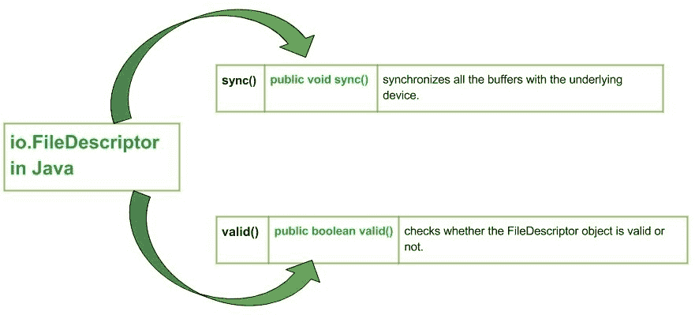

# Java 中的 Java . io . file descriptor

> 原文:[https://www.geeksforgeeks.org/java-io-filedescriptor-java/](https://www.geeksforgeeks.org/java-io-filedescriptor-java/)

[](https://media.geeksforgeeks.org/wp-content/uploads/io.FileDescriptor-in-Java.jpg)

**java.io.FileDescriptor** 用于打开具有特定名称的文件。如果该文件中存在任何内容，它将首先删除所有内容，并将“流程开始”作为第一行。文件描述符类的实例充当底层机器特定结构的不透明句柄，表示打开的文件、打开的套接字或另一个字节源或接收器。

*   文件描述符的主要实际用途是创建一个文件输入流或文件输出流来包含它。
*   应用程序不应该创建自己的文件描述符。

**字段**

*   **错误:**标准错误流的句柄。
*   **in:** 标准输入流的句柄。
*   **out:** 标准输出流的句柄。

**申报:**

```java
public final class FileDescriptor
   extends Object
```

**施工人员:**

*   **文件描述符():**构造文件描述符对象

**方法:**

*   **sync() :** **java.io.File.sync()** synchronizes all the buffers with the underlying device. When all the modified data of the FileDescriptor have been written to the underlying device, the method returns.
    **Syntax :**

    ```java
    public void sync()
    Parameters :
    -----------
    Return : 
    void
    Exception : 
    -> SyncFailedException : This is exception is thrown if there is no guarantee of    
                             synchronization of buffers with the device. 

    ```

    ```java
    // Java program explaining the working of sync() method

    import java.io.*;

    public class NewClass
    {
        public static void main(String[] args) throws IOException
        {
            // Initializing a FileDescriptor
            FileDescriptor geek_descriptor = null;
            FileOutputStream geek_out = null;

            // HERE I'm writing "GEEKS" in my file
            byte[] buffer = {71,69,69,75,83};

            try{
                geek_out = new FileOutputStream("FILE.txt");

                // This getFD() method is called before closing the output stream
                geek_descriptor = geek_out.getFD();

                // writes byte to file output stream
                geek_out.write(buffer);

                // USe of sync() : to sync data to the source file
                geek_descriptor.sync();
                System.out.print("\nUse of Sync Successful ");

            }
            catch(Exception except)
            {
                // if in case IO error occurs
                except.printStackTrace();
            }
            finally
            {
                // releases system resources
                if(geek_out!=null)
                    geek_out.close();
            }
        }
    }
    ```

    **注意:**
    你看不到这段代码对 codea 中提到的“FILE.txt”文件所做的更改，因为 Online IDE 上没有这样的文件。因此，您需要将代码复制到您的系统编译器，并观察文件的变化
    无论文件中存在什么内容，它都会将您的文件同步到设备并覆盖数据。现在文件“FILE.txt”的内容将是

    ```java
    GEEKS
    ```

    您提到，即使不存在这样的文件，它也会自己创建该文件，同步该文件并写入内容。
    **输出:**

    ```java
    Use of Sync Successful :) 
    ```

*   **valid() :** **java.io.File.valid()** checks whether the FileDescriptor object is valid or not.
    **Syntax :**

    ```java
    public boolean valid()
    Parameters :
    -----------
    Return : 
    true : if the FileDescriptor object is valid else, false
    Exception : 
    -----------

    ```

    ```java
    // Java program explianing the working of valid() method

    import java.io.*;

    public class NewClass
    {
        public static void main(String[] args) throws IOException
        {
            // Initializing a FileDescriptor
            FileDescriptor geek_descriptor = null;
            FileInputStream geek_in = null;

            try
            {
                geek_in = new FileInputStream("FILE.txt");

                // get file descriptor
                geek_descriptor = geek_in.getFD();

                boolean check = false;

                // Use of valid() : checking the validity of FileDescriptor
                check = geek_descriptor.valid();

                System.out.print("FileDescriptor is valid : "+check);

            }
            catch(Exception except)
            {
                // if in case IO error occurs
                except.printStackTrace();
            }
            finally
            {
                // releases system resources
                if(geek_in!=null)
                    geek_in.close();
            }
        }
    }
    ```

    **注意:**
    你看不到这段代码对 codea 中提到的“FILE.txt”文件所做的更改，因为 Online IDE 上没有这样的文件。因此，您需要将代码复制到您的系统编译器，并观察文件的变化。这个方法将检查我们的文件描述符的有效性。
    自。代码中的文件描述符是有效的，所以返回 true

    **输出:**

    ```java
    FileDescriptor is valid : true
    ```

    **总结:**

    *   **java.io.File.sync() :** 将所有缓冲区与底层设备同步。
    *   **java.io.File.valid()** 检查 FileDescriptor 对象是否有效。

    本文由 <font color="green">**莫希特·古普塔供稿🙂**</font> 。如果你喜欢 GeeksforGeeks 并想投稿，你也可以使用[write.geeksforgeeks.org](https://write.geeksforgeeks.org)写一篇文章或者把你的文章邮寄到 review-team@geeksforgeeks.org。看到你的文章出现在极客博客主页上，帮助其他极客。

    如果你发现任何不正确的地方，或者你想分享更多关于上面讨论的话题的信息，请写评论。