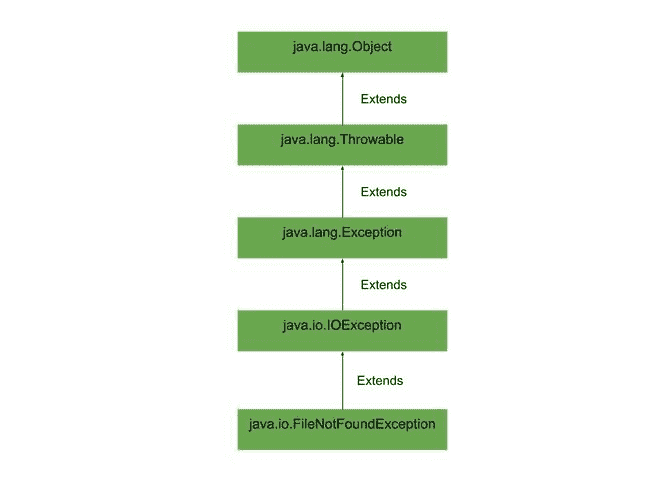

# java 中的 Java . io . file notfoundexception

> 原文:[https://www . geesforgeks . org/Java-io-file notfoundexception-in-Java/](https://www.geeksforgeeks.org/java-io-filenotfoundexception-in-java/)

**Java . io . FileNotFoundException**这是一个常见的异常，在我们试图访问文件时会发生。由构造函数[随机访问文件](https://www.geeksforgeeks.org/java-io-randomaccessfile-class-method-set-1/)、[文件输入流](https://www.geeksforgeeks.org/java-io-fileinputstream-class-java/)和[文件输出流](https://www.geeksforgeeks.org/creating-a-file-using-fileoutputstream/)引发文件未找到。FileNotFoundException 发生在运行时，所以它是一个选中的异常，我们可以通过 java 代码处理这个异常，我们必须处理代码，这样这个异常就不会发生。

**申报:**

```java
public class FileNotFoundException
  extends IOException
    implements ObjectInput, ObjectStreamConstants
```

**施工人员:**

*   **FileNotFoundException() :** 它给出了一个带有空消息的 FileNotFoundException。
*   **文件未找到异常(字符串):**它给出带有详细信息的文件未找到异常。

它没有任何方法。现在让我们来理解这个类的**层次**，即 FileNotFoundException 扩展了 IOException，它进一步扩展了 Exception 类，后者扩展了[可抛出类](https://www.geeksforgeeks.org/throwable-class-in-java-with-examples/)并进一步扩展了 Object 类。

**层级图:**



**为什么会出现这种异常？**

FileNotFoundException 发生时主要有****2 种场景**。现在让我们通过提供的示例来看看它们:**

1.  **如果给定文件在给定位置不可用，则会出现此错误。**
2.  **如果给定的文件是**不可访问的**，例如，如果它是只读的，那么您可以读取该文件，但不能修改该文件，如果我们试图修改它，将会发生错误，或者如果您试图访问的用于读/写操作的文件被另一个程序打开，那么将会发生该错误。**

****场景 1:****

**如果给定文件在给定位置不可用，则会出现此错误。**

****示例:****

## **Java 语言(一种计算机语言，尤用于创建网站)**

```java
// Java program to illustrate 
// FileNotFoundException 

// All output and input streams 
// are available in java.io package
import java.io.*;

public class Example1 
{
  public static void main(String[] args) 
  {

    // creating object of FileReader
    FileReader reader = new FileReader("file.txt");

    // passing FileReader to
    // buffered reader
    BufferedReader br = new BufferedReader(reader);

    // declaring empty string 
    String data =null;

    // while loop to read data 
    // and printing them
    while ((data = br.readLine()) != null) 
    {
        System.out.println(data);
    }

    // closing the object
    br.close();
  }
}
```

### **输出**

```java
prog.java:14: error: unreported exception FileNotFoundException; must be caught or declared to be thrown
    FileReader reader = new FileReader("file.txt");
                        ^
prog.java:25: error: unreported exception IOException; must be caught or declared to be thrown
    while ((data = br.readLine()) != null) 
                              ^
prog.java:31: error: unreported exception IOException; must be caught or declared to be thrown
    br.close();
            ^
3 errors
```

****场景二:****

**如果给定的文件不可访问，例如，如果它是只读的，那么您可以读取该文件，但不能修改该文件。如果我们试图修改它，将会出现错误，或者如果您试图通过读/写操作访问的文件被另一个程序打开，将会出现此错误。**

****示例:****

## **Java 语言(一种计算机语言，尤用于创建网站)**

```java
// Java program to illustrate 
// FileNotFoundException 

// All output and input streams 
// are available in java.io package
import java.io.*;
import java.util.*;

class Example2 {
  public static void main(String[] args) {

    // starting try block
    try {
        // Opening the file
          File f=new File("file.txt");   

          // creating printWriter object
          // by initiating fileWriter 
        PrintWriter p1=new PrintWriter(new FileWriter(f), true);

          // printing sample text
        p1.println("Hello world");
          p1.close();

          // changing the file operation 
          // to read-only 
        f.setReadOnly();

          // trying to write to new file
          PrintWriter p2=new PrintWriter(new FileWriter("file.txt"), true);
        p2.println("Hello World");
    }

    // catching exception thrown
    // by try block
    catch(Exception ex) {
        ex.printStackTrace();
    }
  }
}
```

### **输出**

```java
java.security.AccessControlException: access denied ("java.io.FilePermission" "file.txt" "write")
    at java.base/java.security.AccessControlContext.checkPermission(AccessControlContext.java:472)
    at java.base/java.security.AccessController.checkPermission(AccessController.java:897)
    at java.base/java.lang.SecurityManager.checkPermission(SecurityManager.java:322)
    at java.base/java.lang.SecurityManager.checkWrite(SecurityManager.java:752)
    at java.base/java.io.FileOutputStream.<init>(FileOutputStream.java:225)
    at java.base/java.io.FileOutputStream.<init>(FileOutputStream.java:187)
    at java.base/java.io.FileWriter.<init>(FileWriter.java:96)
    at Example2.main(File.java:19)
```

****异常处理:****

**首先，如果我们知道错误是否会发生，我们必须使用 try-catch 块。在 try block 中，如果有出错的可能，所有的行都应该在那里。还有其他处理例外的方法:**

1.  **如果异常消息告诉您没有这样的文件或目录，那么您需要重新验证您在程序或文件中提到的错误文件名是否存在于该目录中。**
2.  **如果异常消息告诉我们访问被拒绝，那么我们必须检查文件的权限(读、写、读和写)，并且还要检查该文件是否正被另一个程序使用。**
3.  **如果异常消息告诉我们指定的文件是一个目录，那么您必须删除现有目录(如果该目录未被使用)或更改文件名。**