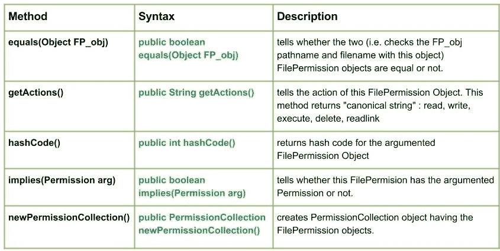

# Java 中的 Java.io.FilePermission 类

> 原文:[https://www . geesforgeks . org/Java-io-file permission-class-Java/](https://www.geeksforgeeks.org/java-io-filepermission-class-java/)

[](https://media.geeksforgeeks.org/wp-content/uploads/io.FilePermission-Class-in-Java.jpg)

**java.io.FilePermission** 类用于表示对文件或目录的访问。这些访问是以路径名和与路径名相关联的一组操作的形式进行的(指定打开哪个文件以及扩展名和路径)。

例如在**file permission(“GEEKS.txt”，“read”)**中，“geeks . txt”是路径，“read”是正在执行的动作。

这些行动如下:

*   **读取:**对文件的读取权限
*   **写入:**对文件的写入权限
*   **删除:**通过调用 File.delete 删除对文件的权限
*   **读取链接:**读取链接权限
*   **执行:**执行了权限

**申报:**

```java
public final class FilePermission
   extends Permission
      implements Serializable
```

**施工人员:**

```java
FilePermission(String p, String a) : Creates a new file permission object with "a" action.
```

**文件权限类的方法:**

*   **equals(Object FP_obj) :** **java.io.FilePermission.equals(Object FP_obj)** tells whether the two (i.e. checks the FP_obj pathname and filename with this object) FilePermission objects are equal or not.
    **Syntax :**

    ```java
    public boolean equals(Object FP_obj)
    Parameters : 
    FP_obj : the FilePermission object to be verified with this object
    Returns :
    true : if both the objects are equal else, false.
    Exception : 
    ----------

    ```

    **实施:**

    ```java
    // Java Program illustrating equals() method

    import java.io.*;
    public class NewClass
    {
        public static void main(String[] args) throws IOException
        {
            boolean bool = false;

            // Creating new FilePermissions("Path", "action")
            FilePermission FP_obj1 = new FilePermission("GEEKS", "read");
            FilePermission FP_obj2 = new FilePermission("ABC", "write");
            FilePermission FP_obj3 = new FilePermission("GEEKS", "read");

            // Use of equals method 
            bool = FP_obj2.equals(FP_obj1);
            System.out.println("Whether FP_obj1 equals FP_obj2 : " + bool);

            bool = FP_obj2.equals(FP_obj3);
            System.out.println("Whether FP_obj2 equals FP_obj2 : " + bool);

            bool = FP_obj1.equals(FP_obj3);
            System.out.println("Whether FP_obj3 equals FP_obj1 : " + bool);

        }
    }
    ```

    **输出:**

    ```java
    Whether FP_obj1 equals FP_obj2 : false
    Whether FP_obj2 equals FP_obj2 : false
    Whether FP_obj3 equals FP_obj1 : true
    ```

*   **getActions() :** **java.io.FilePermission.getActions()** tells the action of this FilePermission Object. If in case there are two actions along with the object : delete and read, then the method will return “read, delete”.
    In such cases this method returns “canonical string” : **read, write, execute, delete, readlink**
    **Syntax :**

    ```java
    public String getActions()
    Parameters : 
    ----------
    Returns :
    canonical string : representing the actions associated with the object.
    Exception : 
    ----------

    ```

    **实施:**

    ```java
    // Java Program illustrating getActions() method
    import java.io.*;
    public class NewClass
    {
        public static void main(String[] args) throws IOException
        {
            // Creating new FilePermissions
            FilePermission FP_obj1 = new FilePermission("GEEKS", "read, delete, write");
            FilePermission FP_obj2 = new FilePermission("ABC", "write, read, execute");
            FilePermission FP_obj3 = new FilePermission("GEEKS", "delete, readlink, read");

            // Use of getActions() method 
            String str = FP_obj1.getActions();
            System.out.println("Actions with FP_obj1 : " + str);

            str = FP_obj2.getActions();
            System.out.println("Actions with FP_obj2 : " + str);

            str = FP_obj3.getActions();
            System.out.println("Actions with FP_obj3 : " + str);

        }
    }
    ```

    **输出:**

    ```java
    Actions with FP_obj1 : read,write,delete
    Actions with FP_obj2 : read,write,execute
    Actions with FP_obj3 : read,delete,readlink
    ```

*   **hashCode() :** **java.io.FilePermission.hashCode()** returns hash code for the argumented FilePermission Object
    **Syntax :**

    ```java
    public int hashCode()
    Parameters : 
    --------
    Returns :
    hash code value for the argumented object
    Exception : 
    ----------

    ```

    **实施:**

    ```java
    // Java Program illustrating hashCode() method

    import java.io.*;
    public class NewClass
    {
        public static void main(String[] args) throws IOException
        {
            // Creating new FilePermissions
            FilePermission FP_obj1=new FilePermission("GEEKS", "read, delete, write");

            // Use of hashCode() method

            int i = FP_obj1.hashCode();
            System.out.println("hashCode value for FP_obj1 : " + i);

        }
    }
    ```

    **输出:**

    ```java
    hashCode value for FP_obj1 : 0
    ```

*   **implies(Permission arg) :****java.io.FilePermission.implies(Permission arg)** tells whether this FilePermision has the argumented Permission or not.
    **Syntax :**

    ```java
    public boolean implies(Permission arg)
    Parameters : 
    arg : Permission to be checked 
    Returns :
    true if the FilePermission object has the argumented Permission else, false
    Exception : 
    ----------

    ```

    **实施:**

    ```java
    // Java Program illustrating implies() method

    import java.io.*;
    public class NewClass
    {
        public static void main(String[] args) throws IOException
        {
            // Creating new FilePermissions
            FilePermission FP_obj1 = new FilePermission("GEEKS", "read");
            FilePermission FP_obj2 = new FilePermission("ABC", "write");
            FilePermission FP_obj3 = new FilePermission("GEEKS", "delete");

            // Use of implies() method

            boolean check = FP_obj1.implies(FP_obj2);
            System.out.println("Using implies() for FP_obj1 : " + check);

            // Checked here with the same FilePermission object
            check = FP_obj2.implies(FP_obj2);
            System.out.println("Using implies() for FP_obj2 : " + check);

        }
    }
    ```

    **输出:**

    ```java
    Using implies() for FP_obj1 : false
    Using implies() for FP_obj2 : true

    ```

*   **newPermissionCollection() :****java.io.FilePermission.newPermissionCollection()** creates PermissionCollection object having the FilePermission objects.
    **Syntax :**

    ```java
    public PermissionCollection newPermissionCollection()
    Parameters : 
    arg : Permission to be checked 
    Returns :
    new PermissionCollection object having the FilePermission objects.
    Exception : 
    ----------

    ```

    **实施:**

    ```java
    // Java Program illustrating newPermissionCollection() method

    import java.io.*;
    import java.security.PermissionCollection;
    public class NewClass
    {
        public static void main(String[] args) throws IOException
        {
            // Creating new FilePermissions
            FilePermission FP_obj1 = new FilePermission("GEEKS.txt", "read");

            // Creating new PermissionCollection
            // Use of newPermissionCollection() 
            PermissionCollection FP = FP_obj1.newPermissionCollection();

            // Collecting the Permissions of FP_obj1 for FP
            FP.add(FP_obj1);

            boolean check = FP.implies(new FilePermission("GEEKS.txt", "read"));
            System.out.println("Is newPermissionCollection() working : " + check);

        }
    }
    ```

    **输出:**

    ```java
    Is newPermissionCollection() working : true
    ```

本文由 <font color="green">**莫希特·古普塔供稿🙂**</font> 。如果你喜欢 GeeksforGeeks 并想投稿，你也可以使用[contribute.geeksforgeeks.org](http://www.contribute.geeksforgeeks.org)写一篇文章或者把你的文章邮寄到 contribute@geeksforgeeks.org。看到你的文章出现在极客博客主页上，帮助其他极客。

如果你发现任何不正确的地方，或者你想分享更多关于上面讨论的话题的信息，请写评论。