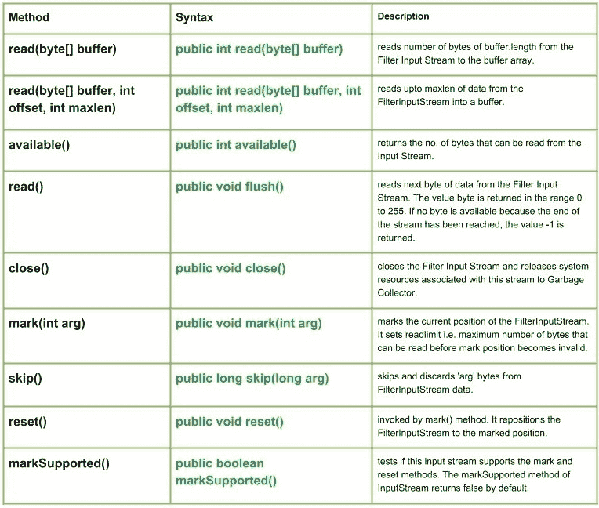

# Java 中的 Java.io.FilterInputStream 类

> 原文:[https://www . geesforgeks . org/Java-io-filterinputstream-class-in-Java/](https://www.geeksforgeeks.org/java-io-filterinputstream-class-in-java/)

[](https://media.geeksforgeeks.org/wp-content/uploads/FilterInputStream-Class-in-Java.jpg)

当数据流在输入流中读取和写入数据时，过滤数据流，并将其传递给底层流。过滤流包括

*   FilterInputStream
*   [过滤输出流](https://www.geeksforgeeks.org/java-io-filteroutputstream-class-java/)

**FilterInputStream:****Java . io . FilterInputStream**类的工作方式几乎和 Java 中的 InputStream 类一样，但它所做的只是覆盖 InputStream 类方法，将请求传递给 InputStream。FilterInputStream 类的 read()方法过滤数据并读取它，然后将数据传递给基础流过滤，这是根据流来完成的。

**申报:**

```
public class FilterInputStream
   extends InputStream
```

**施工人员:**

*   **受保护的 FilterInputStream(InputStream in):**通过将中的参数赋给字段 this.in 来创建 FilterInputStream，以便记住它供以后使用。

**方法:**

*   **read(byte[] buffer) :** **java.io.FilterInputStream.read(byte[] buffer)** reads number of bytes of buffer.length from the Filter Input Stream to the buffer array.
    **Syntax :**

    ```
    public int read(byte[] buffer)
    Parameters :
    buffer : buffer to be read
    Return : 
    reads number of bytes of buffer.length to the buffer 
    else, -1 i.e. when end of file is reached.
    Exception :
    ->  IOException : If I/O error occurs.
    ```

    **实施:**

    ```
    // Java program illustrating the working of read(byte[] buffer) method

    import java.io.*;

    public class NewClass
    {
        public static void main(String[] args) throws IOException
        {
            // LineNumberInputStream & FileInputStream initailly null
            FilterInputStream geek_input = null;
            InputStream geek = null;

            try{
                char c;
                int a;
                byte[] buffer = new byte[6];

                // New InputStream : 'GEEKS' is created
                geek = new FileInputStream("GEEKS.txt");
                geek_input = new BufferedInputStream(geek);

                a = geek.read(buffer);
                // read() method returning Bytes of Input Stream as integer
                // '-1' indicating to read till end Of Input Stream
                int length = 1 ;

                for(byte g : buffer)
                {
                    // Since read() method returns Integer value
                    // So, we convert each integer value to char
                    c = (char)g;

                    System.out.println("At position " + length  +  " : "  + c);
                    length++;
                }
            }
            catch(Exception e)
            {
                // In case of error
                e.printStackTrace();
                System.out.println("ERROR Occurs ");
            }
            finally
            {
                // Closing the streams, Once the End of Input Stream is reached
                if(geek != null)
                    geek.close();

                if(geek_input != null)
                    geek_input.close();
            }
        }
    }
    ```

    **注意:**
    下面的 Java 代码不会在这里运行，因为我们无法访问在线 IDE 上的任何文件。
    所以，将程序复制到您的系统中并在那里运行。

    程序中使用的**GEKES . txt**文件包含:

    ```
    HelloGeeks
    ```

    在给定的代码缓冲区中，长度= 6，因此只有 HelloG 将通过 read(byte[] buffer)方法进行 b 读取
    **输出:**

    ```
    At position 1 : H
    At position 2 : e
    At position 3 : l
    At position 4 : l
    At position 5 : o
    At position 6 : G
    ```

*   **read(byte[] buffer，int offset，int maxlen):****Java . io . FilterInputStream . read(byte[]buffer，int offset，int maxlen)** 将高达 maxlen 的数据从 FilterInputStream 读取到缓冲区中。
    **语法:**

```
public int read(byte[] buffer, int offset, int maxlen)
Parameters :
buffer : Destination buffer
offset : start position to read
maxlen : max. length of bytes to be read
Return : 
total no. of bytes to be written else, -1 i.e. when end of Stream is reached.
Exception :
->  IOException : If I/O error occurs.
```

**实施:**

```
// Java program illustrating the working of
// read(byte[] buffer, int offset, int maxlen) method

import java.io.*;

public class NewClass
{
    public static void main(String[] args) throws IOException
    {
        // LineNumberInputStream & FileInputStream initailly null
        FilterInputStream geek_input = null;
        InputStream geek = null;

        try{
            char c;
            int a;
            byte[] buffer = new byte[4];

            // New InputStream : 'ABC' is created
            geek = new FileInputStream("ABC.txt");
            geek_input = new BufferedInputStream(geek);

            // Offset = 1(*), Maxlen = 3 (MOH)
            a = geek.read(buffer, 1, 3);
            // read() method returning Bytes of Input Stream as integer
            // '-1' indicating to read till end Of Input Stream

            for(byte g : buffer)
            {
                // Since read() method returns Integer value
                // So, we convert each integer value to char
                c = (char)g;

                if(g == 0)
                    c = '*';

                System.out.print(c);
            }
        }
        catch(Exception e)
        {
            // In case of error
            e.printStackTrace();
            System.out.println("ERROR Occurs ");
        }
        finally
        {
            // Closing the streams, Once the End of Input Stream is reached
            if(geek != null)
                geek.close();

            if(geek_input != null)
                geek_input.close();
        }
    }
}
```

**注意:**
下面的 Java 代码不会在这里运行，因为我们无法访问在线 IDE 上的任何文件。
所以，把程序复制到你的系统，在那里运行。

程序中使用的 ABC.txt 文件包含:

```
MOHIT
```

偏移= 1 即*和 Maxlen = 3 即 MOH
**输出:**

```
*MOH
```

*   **available() :** **java.io.FilterInputStream.available()** returns the no. of bytes that can be read from the Input Stream.
    **Syntax :**

    ```
    public int available()
    Parameters : 
    -------
    Return : 
    returns the no. of bytes that an be read from the FilterInputStream.
    Exception: 
    IOException : in case I/O error occurs
    ```

    **实施:**

    ```
    // Java program illustrating the working of available() method

    import java.io.*;
    public class NewClass
    {
        public static void main(String[] args) throws IOException
        {
            // FilterInputStream & FileInputStream initailly null
            FilterInputStream geek_input = null;

            InputStream geek = null;

            try{
                char c;
                int a, b;

                // New InputStream : 'ABC' is created
                geek = new FileInputStream("ABC.txt");
                geek_input = new BufferedInputStream(geek);

                while((a = geek_input.read()) != -1)
                {
                    // So, we convert each integer value to char
                    c = (char)a;

                    // Use of available method : return no. of bytes that can be read
                    a = geek_input.available();
                    System.out.println(c + " Bytes available : " + a);

                }
            }
            catch(Exception e)
            {
                // In case of error
                e.printStackTrace();
                System.out.println("ERROR Occurs ");
            }
            finally
            {
                // Closing the streams, Once the End of FilterInputStream is reached
                if(geek != null)
                    geek.close();

                if(geek_input != null)
                    geek_input.close();
            }
        }
    }
    ```

    **注意:**
    下面的 Java 代码不会在这里运行，因为我们无法访问在线 IDE 上的任何文件。
    所以，将程序复制到您的系统中并在那里运行。

    程序中使用的 ABC.txt 文件包含:

    ```
    MOHIT
    ```

    **输出:**

    ```
    M Bytes available : 4
    O Bytes available : 3
    H Bytes available : 2
    I Bytes available : 1
    T Bytes available : 0
    ```

    *   **read():****Java . io . filterinputstream . read()**从过滤器输入流中读取下一个字节的数据。值字节在 0 到 255 的范围内返回。如果因为已经到达流的末尾而没有字节可用，则返回值-1。
    **语法:**

```
public int read()
Parameters :
------
Return : 
Reads next data else, -1 i.e. when end of Stream is reached.
Exception :
->  IOException : If I/O error occurs.
```

*   **close():****Java . io . filterinputstream . close()**关闭过滤器输入流，并将与该流相关联的系统资源释放给垃圾收集器。
    **语法:**

    ```
    public void close()
    Parameters :
    ------
    Return : 
    void
    Exception :
    ->  IOException : If I/O error occurs.
    ```

    *   **标记(int arg):****Java . io . FilterInputStream . mark(int arg)**标记 FilterInputStream 的当前位置。它设置 readlimit，即在标记位置无效之前可以读取的最大字节数。
    **语法:**

    ```
    public void mark(int arg)
    Parameters :
    arg : integer specifying the read limit of the input Stream
    Return : 
    void
    ```

    *   **skip():****Java . io . FilterInputStream . skip(long arg)**跳过并丢弃 FilterInputStream 数据中的“arg”字节。
    **语法:**

    ```
    public long skip(long arg)
    Parameters : 
    arg : no. of bytes of FilterInputStream data to skip.
    Return : 
    no. of bytes to be skipped
    Exception: 
    IOException : in case I/O error occurs
    ```

    *   **reset():****Java . io . filterinputstream . reset()**由 mark()方法调用。它将 FilterInputStream 重新定位到标记的位置。
    **语法:**

    ```
    public void reset()
    Parameters :
    ----
    Return : 
    void
    Exception :
    ->  IOException : If I/O error occurs.
    ```

    *   **markSupported() :** **java.io.FilterInputStream.markSupported()** method tests if this input stream supports the mark and reset methods. The markSupported method of InputStream returns false by default.
    **Syntax :**

    ```
    public boolean markSupported()
    Parameters :
    -------
    Return : 
    true if input stream supports the mark() and reset() method  else,false
    ```

    **Java 程序讲解:markSupported()、close()、reset()、mark()、read()、skip()方法**

    ```
    // Java program illustrating the working of FilterInputStream method
    // mark(), read(), skip()
    // markSupported(), close(), reset()

    import java.io.*;

    public class NewClass
    {
        public static void main(String[] args) throws Exception
        {
            InputStream geek = null;
            // FilterInputStream initialised to null here
            FilterInputStream geek_input = null;
            try {

                geek = new FileInputStream("GEEKS.txt");

            geek_input = new BufferedInputStream(geek);

                // read() method : reading and printing Characters
                // one by one
                System.out.println("Char : " + (char)geek_input.read());
                System.out.println("Char : " + (char)geek_input.read());
                System.out.println("Char : " + (char)geek_input.read());

                // mark() : read limiing the 'geek' input stream
                geek_input.mark(0);

                // skip() : it results in redaing of 'e' in G'e'eeks
                geek_input.skip(1);
                System.out.println("skip() method comes to play");
                System.out.println("mark() method comes to play");
                System.out.println("Char : " + (char)geek_input.read());
                System.out.println("Char : " + (char)geek_input.read());
                System.out.println("Char : " + (char)geek_input.read());

                boolean check = geek_input.markSupported();
                if (geek_input.markSupported())
                {
                    // reset() method : repositioning the stream to
                    // marked positions.
                    geek_input.reset();
                    System.out.println("reset() invoked");
                    System.out.println("Char : " + (char)geek_input.read());
                    System.out.println("Char : " + (char)geek_input.read());
                }
                else
                    System.out.println("reset() method not supported.");
                    System.out.println("geek_input.markSupported() supported" 
                                                    + " reset() : " + check);

            }
            catch(Exception excpt)
            {
                // in case of I/O error
                excpt.printStackTrace();
            }
            finally
            {
                // releasing the resources back to the
                // GarbageCollector when closes
                if (geek != null)
                { // Use of close() : closing the file
                    // and releasing resources
                    geek.close();
                }

                if(geek_input != null)
                    geek_input.close();
            }
        }
    }
    ```

    **注意:**
    这段代码不会在在线 IDE 上运行，因为这里没有这样的文件。
    您可以在您的系统上运行该代码来检查工作情况。
    **GEEKS.txt** 文件中使用的代码有

    ```
    HelloGeeks
    ```

    **输出:**

    ```
    Char : H
    Char : e
    Char : l
    skip() method comes to play
    mark() method comes to play
    Char : o
    Char : G
    Char : e
    reset() invoked
    Char : l
    Char : o
    geek_input.markSupported() supported reset() : true
    ```

    本文由 <font color="green">**莫希特·古普塔供稿🙂**</font> 。如果你喜欢 GeeksforGeeks 并想投稿，你也可以使用[contribute.geeksforgeeks.org](http://www.contribute.geeksforgeeks.org)写一篇文章或者把你的文章邮寄到 contribute@geeksforgeeks.org。看到你的文章出现在极客博客主页上，帮助其他极客。

    如果你发现任何不正确的地方，或者你想分享更多关于上面讨论的话题的信息，请写评论。