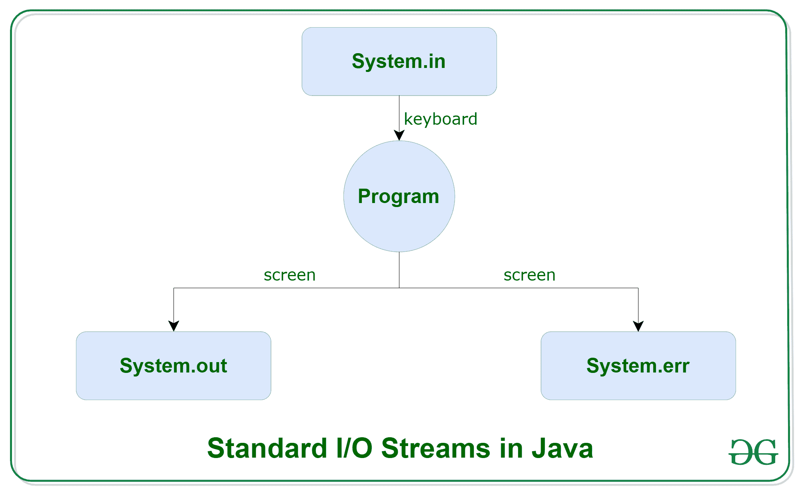
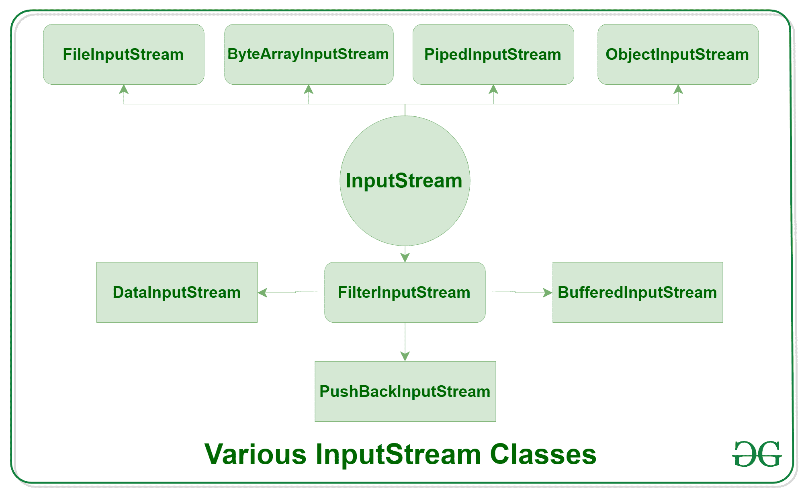
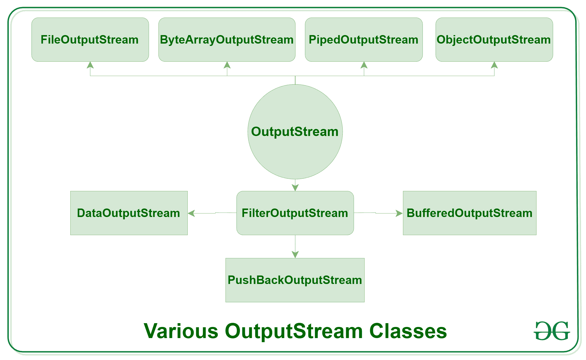
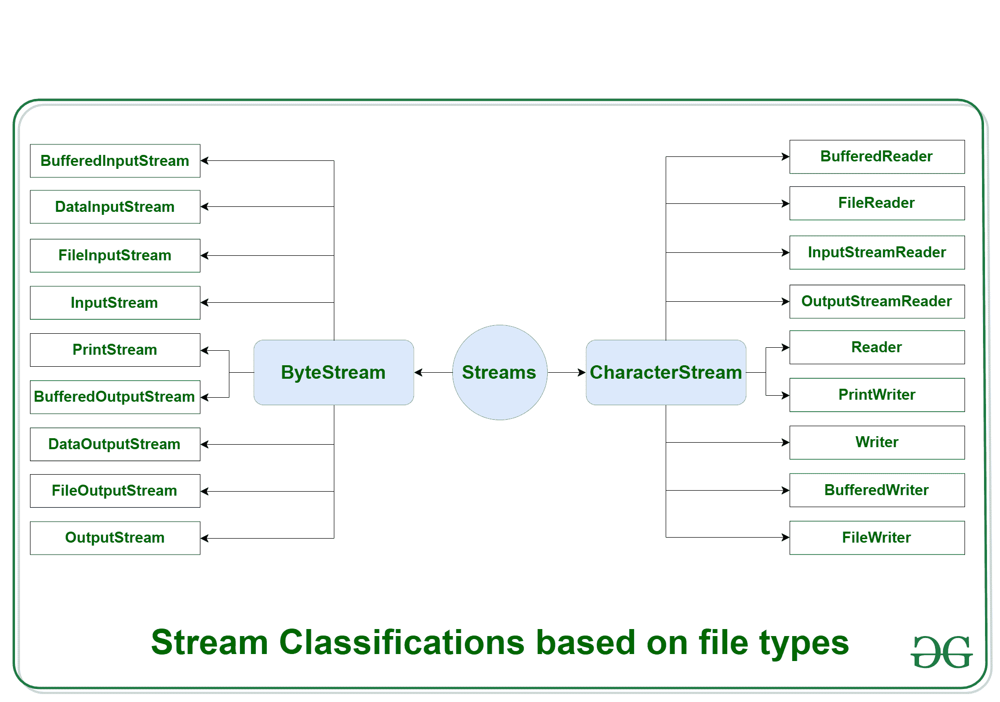

# Java IO:Java 中的输入输出，示例

> 原文:[https://www . geesforgeks . org/Java-io-input-output-in-Java-with-examples/](https://www.geeksforgeeks.org/java-io-input-output-in-java-with-examples/)

[Java](https://www.geeksforgeeks.org/java/) 带来了各种流及其 I/O 包，帮助用户执行所有的输入输出操作。这些流支持所有类型的对象、数据类型、字符、文件等，以完全执行输入/输出操作。

[](https://media.geeksforgeeks.org/wp-content/uploads/20191126125125/Java-Input-Output-Stream.jpg)

在探索各种输入和输出流之前，让我们先看看 Java 必须提供的 **3 个标准或默认流**，它们也是最常用的:

[](https://media.geeksforgeeks.org/wp-content/uploads/20191127113736/Java-Basic-input-output1.png)

1.  **[System.in](https://www.geeksforgeeks.org/java-lang-system-class-java/) :** 这是**标准输入流**，用于从键盘或任何其他标准输入设备读取字符。
2.  **[System.out](https://www.geeksforgeeks.org/java-lang-system-class-java/):** This is the **standard output stream** that is used to produce the result of a program on an output device like the computer screen.

    下面是我们用来输出语句的各种打印功能的列表:

    *   **[print()](https://www.geeksforgeeks.org/difference-between-print-and-println-in-java/):** This method in Java is used to display a text on the console. This text is passed as the parameter to this method in the form of String. This method prints the text on the console and the cursor remains at the end of the text at the console. The next printing takes place from just here.
        **Syntax:**

        ```java
        System.out.print(*parameter*);
        ```

        **示例:**

        ```java
        // Java code to illustrate print()
        import java.io.*;

        class Demo_print {
            public static void main(String[] args)
            {

                // using print()
                // all are printed in the
                // same line
                System.out.print("GfG! ");
                System.out.print("GfG! ");
                System.out.print("GfG! ");
            }
        }
        ```

        **输出:**

        ```java
        GfG! GfG! GfG! 
        ```

    *   **[println()](https://www.geeksforgeeks.org/difference-between-print-and-println-in-java/):** This method in Java is also used to display a text on the console. It prints the text on the console and the cursor moves to the start of the next line at the console. The next printing takes place from the next line.
        **Syntax:**

        ```java
        System.out.println(*parameter*);
        ```

        **示例:**

        ```java
        // Java code to illustrate println()

        import java.io.*;

        class Demo_print {
            public static void main(String[] args)
            {

                // using println()
                // all are printed in the
                // different line
                System.out.println("GfG! ");
                System.out.println("GfG! ");
                System.out.println("GfG! ");
            }
        }
        ```

        **输出:**

        ```java
        GfG! 
        GfG! 
        GfG! 
        ```

    *   **[printf()](https://www.geeksforgeeks.org/formatted-output-in-java/) :** 这是所有方法中最简单的，因为这类似于 c 语言中的 printf。注意，System.out.print()和 System.out.println()采用单个参数，但 printf()可能采用多个参数。这用于在 Java 中格式化输出。
        **例:**

    ```java
    // A Java program to demonstrate working of printf() in Java
    class JavaFormatter1 {
        public static void main(String args[])
        {
            int x = 100;
            System.out.printf(
                "Printing simple"
                    + " integer: x = %d\n",
                x);

            // this will print it upto
            // 2 decimal places
            System.out.printf(
                "Formatted with"
                    + " precision: PI = %.2f\n",
                Math.PI);

            float n = 5.2f;

            // automatically appends zero
            // to the rightmost part of decimal
            System.out.printf(
                "Formatted to "
                    + "specific width: n = %.4f\n",
                n);

            n = 2324435.3f;

            // here number is formatted from
            // right margin and occupies a
            // width of 20 characters
            System.out.printf(
                "Formatted to "
                    + "right margin: n = %20.4f\n",
                n);
        }
    }
    ```

    **输出:**

    ```java
    Printing simple integer: x = 100
    Formatted with precision: PI = 3.14
    Formatted to specific width: n = 5.2000
    Formatted to right margin: n =         2324435.2500
    ```

3.  **[System.err](https://www.geeksforgeeks.org/java-lang-system-class-java/):** This is the **standard error stream** that is used to output all the error data that a program might throw, on a computer screen or any standard output device.

    该流还使用上述所有 3 个函数来输出错误数据:

    *   打印()
    *   println()
    *   printf()

    **示例:**

    ```java
    // Java code to illustrate standard
    // input output streams

    import java.io.*;
    public class SimpleIO {

        public static void main(String args[])
            throws IOException
        {

            // InputStreamReader class to read input
            InputStreamReader inp = null;

            // Storing the input in inp
            inp = new InputStreamReader(System.in);

            System.out.println("Enter characters, "
                               + " and '0' to quit.");
            char c;
            do {
                c = (char)inp.read();
                System.out.println(c);
            } while (c != '0');
        }
    }
    ```

    **输入:**

    ```java
    GeeksforGeeks0
    ```

    **输出:**

    ```java
    Enter characters, and '0' to quit.
    G
    e
    e
    k
    s
    f
    o
    r
    G
    e
    e
    k
    s
    0
    ```

**<u>溪流类型:</u>**

*   **根据操作类型**，流可以分为两个主要类别:
    1.  **[输入流:](https://www.geeksforgeeks.org/java-io-inputstream-class-in-java/)** 这些流用于从源阵列或文件或任何外围设备读取必须作为输入的数据。例如，文件输入流、缓冲输入流、字节数组输入流等。
        [](https://media.geeksforgeeks.org/wp-content/uploads/20191126132719/Java-Input-Stream.png)
    2.  **[输出流:](https://www.geeksforgeeks.org/java-io-outputstream-class-java/)** 这些流用于将数据作为输出写入阵列或文件或任何输出外围设备。例如，文件输出流、缓冲输出流、字节数组输出流等。
        [](https://media.geeksforgeeks.org/wp-content/uploads/20191126133237/Java-Output-Stream.png)
*   **根据文件**的类型，Streams 可以分为两个主要类，这些主要类可以进一步分为其他类，这可以通过下图以及后面的解释看到。
    [](https://media.geeksforgeeks.org/wp-content/uploads/20191127121553/Java-stream-classification-filetype2.png)
    1.  **ByteStream:** This is used to process data byte by byte (8 bits). Though it has many classes, the FileInputStream and the FileOutputStream are the most popular ones. The FileInputStream is used to read from the source and FileOutputStream is used to write to the destination. Here is the list of various ByteStream Classes:

        | 流类 | 描述 |
        | --- | --- |
        | [buffer edinpertstream](https://www.geeksforgeeks.org/java-io-bufferedinputstream-class-java/) | 它用于缓冲输入流。 |
        | datainputstream | 它包含读取 java 标准数据类型的方法。 |
        | fileinputstream | 这用于读取文件 |
        | [InputStream](https://www.geeksforgeeks.org/java-io-inputstream-class-in-java/) | 这是一个描述流输入的抽象类。 |
        | 打印流 | 这包含最常用的 print()和 println()方法 |
        | [缓冲器 utputStream](https://www.geeksforgeeks.org/java-io-bufferedoutputstream-class-java/) | 这用于缓冲输出流。 |
        | [DataOutputStream](https://www.geeksforgeeks.org/dataoutputstream-in-java/) | 这包含编写 java 标准数据类型的方法。 |
        | 档案输出流 | 这用于写入文件。 |
        | 输出流 | 这是一个描述流输出的抽象类。 |

        **示例:**

        ```java
        // Java Program illustrating the
        // Byte Stream to copy
        // contents of one file to another file.
        import java.io.*;
        public class BStream {
            public static void main(
                String[] args) throws IOException
            {

                FileInputStream sourceStream = null;
                FileOutputStream targetStream = null;

                try {
                    sourceStream
                        = new FileInputStream("sorcefile.txt");
                    targetStream
                        = new FileOutputStream("targetfile.txt");

                    // Reading source file and writing
                    // content to target file byte by byte
                    int temp;
                    while ((
                               temp = sourceStream.read())
                           != -1)
                        targetStream.write((byte)temp);
                }
                finally {
                    if (sourceStream != null)
                        sourceStream.close();
                    if (targetStream != null)
                        targetStream.close();
                }
            }
        }
        ```

        **输出:**

        ```java
        Shows contents of file test.txt 
        ```

    2.  **CharacterStream:** In Java, characters are stored using Unicode conventions (Refer this for details). Character stream automatically allows us to read/write data character by character. Though it has many classes, the FileReader and the FileWriter are the most popular ones. FileReader and FileWriter are character streams used to read from the source and write to the destination respectively. Here is the list of various CharacterStream Classes:

        | 流类 | 描述 |
        | --- | --- |
        | 缓冲器 | 它用于处理缓冲的输入流。 |
        | 档案管理员 | 这是从文件读取的输入流。 |
        | 输入流阅读器 | 该输入流用于将字节转换为字符。 |
        | 输出流阅读器 | 该输出流用于将字符转换为字节。 |
        | [阅读器](https://www.geeksforgeeks.org/java-io-reader-class-java/) | 这是一个定义字符流输入的抽象类。 |
        | [PrintWriter](https://www.geeksforgeeks.org/java-io-printwriter-class-java-set-1/) | 这包含最常用的 print()和 println()方法 |
        | [作家](https://www.geeksforgeeks.org/java-io-writer-class-java/) | 这是一个定义字符流输出的抽象类。 |
        | [BufferedWriter](https://www.geeksforgeeks.org/io-bufferedwriter-class-methods-java/) | 这用于处理缓冲输出流。 |
        | [档案作者](https://www.geeksforgeeks.org/file-handling-java-using-filewriter-filereader/) | 这用于输出写入文件的流。 |

        **示例:**

        ```java
        // Java Program illustrating that
        // we can read a file in a human-readable
        // format using FileReader

        // Accessing FileReader, FileWriter,
        // and IOException
        import java.io.*;
        public class GfG {
            public static void main(
                String[] args) throws IOException
            {
                FileReader sourceStream = null;
                try {
                    sourceStream
                        = new FileReader("test.txt");

                    // Reading sourcefile and
                    // writing content to target file
                    // character by character.
                    int temp;
                    while ((
                               temp = sourceStream.read())
                           != -1)
                        System.out.println((char)temp);
                }
                finally {
                    // Closing stream as no longer in use
                    if (sourceStream != null)
                        sourceStream.close();
                }
            }
        }
        ```

        [关于 Java 中字节流和字符流类的完全区别，请参考这里。](https://www.geeksforgeeks.org/character-stream-vs-byte-stream-java/)