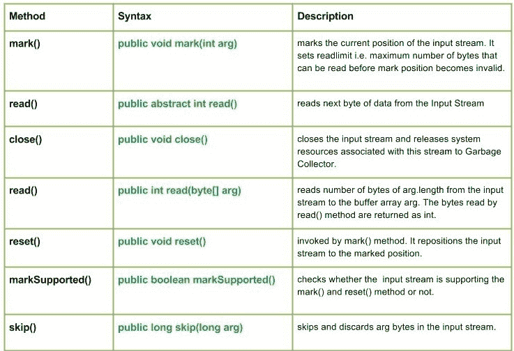

# Java 中的 Java.io.InputStream 类

> 原文:[https://www . geesforgeks . org/Java-io-inputstream-class-in-Java/](https://www.geeksforgeeks.org/java-io-inputstream-class-in-java/)

InputStream 类是所有 io 类的超类，即代表一个输入字节流。它表示字节的输入流。定义 InputStream 子类的应用程序必须提供方法，返回输入的下一个字节。
调用 reset()方法，将流重新定位到最近标记的位置。
[](https://media.geeksforgeeks.org/wp-content/uploads/InputStream.jpg) 
**申报:**

```
public abstract class InputStream
   extends Object
      implements Closeable
```

**施工方:**

*   InputStream():单个构造函数

**方法:**
[](https://media.geeksforgeeks.org/wp-content/uploads/InputStream-Class-in-Java..jpg)

*   **mark():****Java . io . inputstream . mark(int arg)**标记输入流的当前位置。它设置 readlimit，即在标记位置无效之前可以读取的最大字节数。
    **语法:**

```
public void mark(int arg)
Parameters :
arg : integer specifying the read limit of the input Stream
Return : 
void
```

*   **read():****Java . io . inputstream . read()**从输入流中读取下一个字节的数据。值字节在 0 到 255 的范围内返回。如果因为已经到达流的末尾而没有字节可用，则返回值-1。
    **语法:**

    ```
    public abstract int read()
    Parameters :
    ------
    Return : 
    Reads next data else, -1 i.e. when end of file is reached.
    Exception :
    ->  IOException : If I/O error occurs.
    ```

    *   **close():****Java . io . inputstream . close()**关闭输入流，并将与该流相关联的系统资源释放给垃圾收集器。
    **语法:**

    ```
    public void close()
    Parameters :
    ------
    Return : 
    void
    Exception :
    ->  IOException : If I/O error occurs.
    ```

    *   **read():****Java . io . InputStream . read(byte[]arg)**从输入流读取 arg.length 的字节数到缓冲区数组 arg。read()方法读取的字节以 int 形式返回。如果 len 为零，则不读取字节，返回 0；否则，将尝试读取至少一个字节。
    **语法:**

    ```
    public int read(byte[] arg)
    Parameters :
    arg : array whose number of bytes to be read
    Return : 
     reads number of bytes and return to the buffer else, -1 i.e. when end of file is reached.
    Exception :
    ->  IOException : If I/O error occurs.
    ->  NullPointerException : if arg is null.
    ```

    *   **reset():**T3】Java . io . inputstream . reset()由 mark()方法调用。它将输入流重新定位到标记的位置。
    **语法:**

    ```
    public void reset()
    Parameters :
    ----
    Return : 
    void
    Exception :
    ->  IOException : If I/O error occurs.
    ```

    *   **MarkSupported():****Java . io . InputStream . MarkSupported()**方法测试该输入流是否支持标记和重置方法。默认情况下，InputStream 的 markSupported 方法返回 false。
    **语法:**

    ```
    public boolean markSupported()
    Parameters :
    -------
    Return : 
    true if input stream supports the mark() and reset() method  else,false
    ```

    *   **skip() :** **Java.io.InputStream.skip(long arg)** skips and discards **arg** bytes in the input stream.
    **Syntax :**

    ```
    public long skip(long arg)
    Parameters :
    arg : no. of bytes to be skipped
    Return : 
    skip bytes.
    Exception :
    ->  IOException : If I/O error occurs.
    ```

    **解释 InputStream 类方法的 Java 程序:**

    ```
    // Java program illustrating the working of InputStream method
    // mark(), read(), skip()
    // markSupported(), close(), reset()
    import java.io.*;

    public class NewClass
    {
        public static void main(String[] args) throws Exception
        {
            InputStream geek = null;
            try {

                geek = new FileInputStream("ABC.txt");

                // read() method : reading and printing Characters
                // one by one
                System.out.println("Char : "+(char)geek.read());
                System.out.println("Char : "+(char)geek.read());
                System.out.println("Char : "+(char)geek.read());

                // mark() : read limiing the 'geek' input stream
                geek.mark(0);

                // skip() : it results in redaing of 'e' in G'e'eeks
                geek.skip(1);
                System.out.println("skip() method comes to play");
                System.out.println("mark() method comes to play");
                System.out.println("Char : "+(char)geek.read());
                System.out.println("Char : "+(char)geek.read());
                System.out.println("Char : "+(char)geek.read());

                boolean check = geek.markSupported();
                if (geek.markSupported())
                {
                    // reset() method : repositioning the stram to
                    // marked positions.
                    geek.reset();
                    System.out.println("reset() invoked");
                    System.out.println("Char : "+(char)geek.read());
                    System.out.println("Char : "+(char)geek.read());
                }
                else
                    System.out.println("reset() method not supported.");

                System.out.println("geek.markSupported() supported"+
                                  " reset() : "+check);

            }
            catch(Exception excpt)
            {
                // in case of I/O error
                excpt.printStackTrace();
            }
            finally
            {
                // releasing the resources back to the
                // GarbageCollector when closes
                if (geek!=null)
                {
                    // Use of close() : closing the file
                    // and releasing resources
                    geek.close();
                }
            }
        }
    }
    ```

    **注意:**
    这段代码不会在联机 IDE 上运行，因为这里没有 suc 文件。
    您可以在您的系统上运行该代码来检查工作情况。
    **ABC.txt** 文件中使用的代码有

    ```
    HelloGeeks
    ```

    **输出:**

    ```
    Char : H
    Char : e
    Char : l
    skip() method comes to play
    mark() method comes to play
    Char : o
    Char : G
    Char : e
    reset() method not supported.
    geek.markSupported() supported reset() : false
    ```

    本文由 <font color="green">**莫希特·古普塔供稿🙂**</font> 。如果你喜欢 GeeksforGeeks 并想投稿，你也可以使用[contribute.geeksforgeeks.org](http://www.contribute.geeksforgeeks.org)写一篇文章或者把你的文章邮寄到 contribute@geeksforgeeks.org。看到你的文章出现在极客博客主页上，帮助其他极客。

    如果你发现任何不正确的地方，或者你想分享更多关于上面讨论的话题的信息，请写评论。