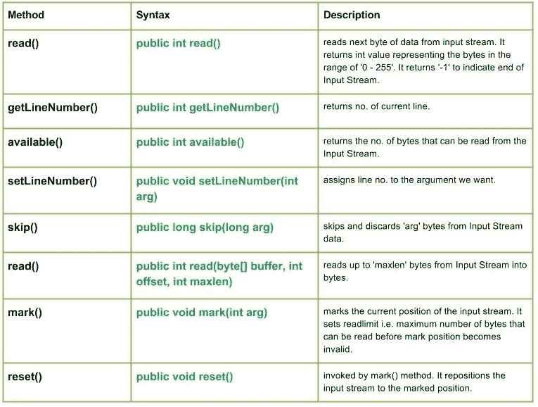

# Java 中的 Java.io.LineNumberInputStream 类

> 原文:[https://www . geesforgeks . org/Java-io-line numberinputstream-class-Java/](https://www.geeksforgeeks.org/java-io-linenumberinputstream-class-java/)

java.io.LineNumberInputStream 类只是输入流的一个扩展，提供了一个额外的工具来保存当前行号的记录。

**行**是以“\r”结尾的字节序列，即回车符或换行符:“\n”，或回车符后的换行符。

**申报:**

```java
public class LineNumberInputStream
   extends Reader
```

**施工人员:**

```java
LineNumberInputStream(InputStream in) : 
Constructs a newline no. stream that reads 
it's input from the specified Input Stream.
```

**方法:**

[](https://media.geeksforgeeks.org/wp-content/uploads/LineNumberInputStream-Class.jpg)

*   **read():Java . io . LineNumberInputStream . read()**从输入流中读取下一个字节的数据。它返回表示“0–255”范围内的字节的 int 值。它返回“-1”表示输入流结束。
    **语法:**

```java
public int read()
Parameters : 
-------
Return : 
int value representing the bytes in the range of '0 - 255'.
return -1, indicating end of Input Stream.
Exception: 
IOException : in case I/O error occurs
```

**实施:**

## Java 语言(一种计算机语言，尤用于创建网站)

```java
// Java program illustrating the working of read() method

import java.io.*;

public class NewClass
{
    public static void main(String[] args) throws IOException
    {
        // LineNumberInputStream & FileInputStream initially null
        LineNumberInputStream geekline = null;
        FileInputStream geekinput = null;

        try{
            char c;
            int a;

            // New InputStream : 'ABC' is created
            geekinput = new FileInputStream("ABC.txt");
            geekline = new LineNumberInputStream(geekinput);

            // read() method returning Bytes of Input Stream as integer
            // '-1' indicating to read till end Of Input Stream
            while((a = geekline.read()) != -1)
            {
                // Since read() method returns Integer value
                // So, we convert each integer value to char
                c = (char)a;
                System.out.print(c);
            }
        }
        catch(Exception e)
        {
            // In case of error
            e.printStackTrace();
            System.out.println("ERROR Occurs ");
        }
        finally
       {
            // Closing the streams, Once the End of Input Stream is reached
            if(geekinput != null)
                geekinput.close();

            if(geekline != null)
                geekline.close();
        }
    }
}
```

**注意:**
下面的 Java 代码不会在这里运行，因为我们无法访问在线 IDE 上的任何文件。
所以，将程序复制到您的系统中并在那里运行。

程序中使用的 **ABC.txt** 文件包含:

```java
Hello
Geeks.
Explaining 
read() method
```

**输出:**

```java
Hello
Geeks.
Explaining 
read() method
```

*   **getline number():Java . io . line number inputstream . getline number()**返回当前行号。
    **语法:**

```java
 public int getLineNumber()
Parameters : 
-------
Return : 
no. of current line
```

**实施:**

## Java 语言(一种计算机语言，尤用于创建网站)

```java
// Java program illustrating the working of getLineNumber() method

import java.io.*;

public class NewClass
{
    public static void main(String[] args) throws IOException
    {
        // LineNumberInputStream & FileInputStream initially null
        LineNumberInputStream geekline = null;
        FileInputStream geekinput = null;

        try
           {
            char c;
            int a, b;

            // New InputStream : 'ABC' is created
            geekinput = new FileInputStream("ABC.txt");
            geekline = new LineNumberInputStream(geekinput);

            while((a = geekline.read()) != -1)
            {
                // So, we convert each integer value to char
                c = (char)a;

                // Use of getLineNumber() : to print line no.
                a = geekline.getLineNumber();
                System.out.println(" At line : " + a);
                System.out.print(c);

            }
            a = geekline.getLineNumber();
            System.out.println(" at line: " + a);

        }
        catch(Exception e)
        {
            // In case of error
            e.printStackTrace();
            System.out.println("ERROR Occurs ");
        }
        finally
        {
            // Closing the streams, Once the End of Input Stream is reached
            if(geekinput != null)
                geekinput.close();
            if(geekline != null)
                geekline.close();
        }
    }
}
```

**注意:**
下面的 Java 代码不会在这里运行，因为我们无法访问在线 IDE 上的任何文件。
所以，将程序复制到您的系统中并在那里运行。

程序中使用的 **ABC.txt** 文件包含:

```java
no. of
lines
```

**输出:**

```java
 At line : 0
n At line : 0
o At line : 0
. At line : 0
  At line : 0
o At line : 0
f At line : 1

 At line : 1
l At line : 1
i At line : 1
n At line : 1
e At line : 1
s at line: 1
```

*   **available():Java . io . LineNumberInputStream . available()**返回可以从输入流中读取而不阻塞的字节数。
    **语法:**

```java
public int available()
Parameters : 
-------
Return : 
returns the no. of bytes that an be read from the Input Stream.
Exception: 
IOException : in case I/O error occurs
```

**实施:**

## Java 语言(一种计算机语言，尤用于创建网站)

```java
// Java program illustrating the working of available() method

import java.io.*;

public class NewClass
{
    public static void main(String[] args) throws IOException
    {
        // LineNumberInputStream & FileInputStream initially null
        LineNumberInputStream geekline = null;
        FileInputStream geekinput = null;

        try{
            char c;
            int a, b;

            // New InputStream : 'ABC' is created
            geekinput = new FileInputStream("ABC.txt");
            geekline = new LineNumberInputStream(geekinput);

            while((a = geekline.read()) != -1)
            {
              // So, we convert each integer value to char
                c = (char)a;

              // Use of available method : return no. of bytes that can be read
                a = geekline.available();
                System.out.println(c + " Bytes available : " + a);

            }

        }
        catch(Exception e)
        {
            // In case of error
            e.printStackTrace();
            System.out.println("ERROR Occurs ");
        }
        finally
        {
            // Closing the streams, Once the End of Input Stream is reached
            if(geekinput != null)
                geekinput.close();

            if(geekline != null)
                geekline.close();
        }
    }
}
```

**注意:**
下面的 Java 代码不会在这里运行，因为我们无法访问在线 IDE 上的任何文件。
所以，将程序复制到您的系统中并在那里运行。

程序中使用的 **ABC.txt** 文件包含:

```java
available
```

**输出:**

```java
a Bytes available : 4
v Bytes available : 3
a Bytes available : 3
i Bytes available : 2
l Bytes available : 2
a Bytes available : 1
b Bytes available : 1
l Bytes available : 0
e Bytes available : 0
```

*   **setline number():Java . io . line number inputstream . setline number(int arg)**为我们想要的参数分配行号。
    **语法:**

```java
public void setLineNumber(int arg)
Parameters : 
arg : line number to assign
Return : 
void
Exception: 
-----
```

**实施:**

## Java 语言(一种计算机语言，尤用于创建网站)

```java
// Java program illustrating the working of setLineNumber() method

import java.io.*;

public class NewClass
{
    public static void main(String[] args) throws IOException
    {
        // LineNumberInputStream & FileInputStream initially null
        LineNumberInputStream geekline = null;
        FileInputStream geekinput = null;

        try{
            char c;
            int a, b = 0;

            // New InputStream : 'ABC' is created
            geekinput = new FileInputStream("ABC.txt");
            geekline = new LineNumberInputStream(geekinput);

            while((a = geekline.read()) != -1)
            {
                // So, we convert each integer value to char
                c = (char)a;

                // Use of setLineNumber() : to set the line no.
                geekline.setLineNumber(100 + b);

                // getLineNumber() : returning the current line no.
                a = geekline.getLineNumber();
                System.out.println(c + " Line No. Set : " + a);
                b++;
            }
        }
        catch(Exception e)
        {
            // In case of error
            e.printStackTrace();
            System.out.println("ERROR Occurs ");
        }
        finally
        {
            // Closing the streams, Once the End of Input Stream is reached
            if(geekinput != null)
                geekinput.close();

            if(geekline != null)
                geekline.close();
        }
    }
}
```

**注意:**
下面的 Java 代码不会在这里运行，因为我们无法访问在线 IDE 上的任何文件。
所以，将程序复制到您的系统中并在那里运行。

程序中使用的 **ABC.txt** 文件包含:

```java
LineNumber
```

**输出:**

```java
L Line No. Set : 100
i Line No. Set : 101
n Line No. Set : 102
e Line No. Set : 103
N Line No. Set : 104
u Line No. Set : 105
m Line No. Set : 106
b Line No. Set : 107
e Line No. Set : 108
r Line No. Set : 109
```

*   **skip():Java . io . LineNumberInputStream . skip(long arg)**跳过并丢弃输入流数据中的‘arg’字节。LineNumberInputStream 的 skip 方法创建一个字节数组，然后反复读取，直到读取了 n 个字节或到达了流的末尾。
    **语法:**

```java
public long skip(long arg)
Parameters : 
arg : no. of bytes of Input Stream data to skip.
Return : 
no. of bytes to be skipped
Exception: 
IOException : in case I/O error occurs
```

**实施:**

## Java 语言(一种计算机语言，尤用于创建网站)

```java
// Java program illustrating the working of setLineNumber() method

import java.io.*;

public class NewClass
{
    public static void main(String[] args) throws IOException
    {
        // LineNumberInputStream & FileInputStream initially null
        LineNumberInputStream geekline = null;
        FileInputStream geekinput = null;

        try{
            char c;
            int a, b = 0;

            // New InputStream : 'ABC' is created
            geekinput = new FileInputStream("ABC.txt");
            geekline = new LineNumberInputStream(geekinput);

            while((a = geekline.read()) != -1)
            {
                // So, we convert each integer value to char
                c = (char)a;

                // skip() : to skip and discard 'arg' bytes
                // Here skip() will skip and discard 3 bytes.
                geekline.skip(3);
                System.out.println(c);
            }
        }
        catch(Exception e)
        {
            // In case of error
            e.printStackTrace();
            System.out.println("ERROR Occurs ");
        }
        finally{
            // Closing the streams, Once the End of Input Stream is reached
            if(geekinput != null)
                geekinput.close();
            if(geekline != null)
                geekline.close();
        }
    }
}
```

**注意:**
下面的 Java 代码不会在这里运行，因为我们无法访问在线 IDE 上的任何文件。
所以，将程序复制到您的系统中并在那里运行。

程序中使用的 **ABC.txt** 文件包含:

```java
Program
Explaining
Skip() method
```

**输出:**

```java
P
r
E
a
n
k
)
t
```

*   **read():Java . io . LineNumberInputStream . read(byte[]buffer，int offset，int maxlen)** 从 InputStream 读取最多‘maxlen’个字节为字节。
    **语法:**

```java
public int read(byte[] buffer, int offset, int maxlen)
Parameters : 
buffer : buffer whose data to read
offset : starting offset of the data
maxlen : max. no. of bytes to read
Return : 
total no. of bytes, else return -1 if End of Input Stream is identified
Exception: 
IOException : in case I/O error occurs
```

**实施:**

## Java 语言(一种计算机语言，尤用于创建网站)

```java
// Java program illustrating the working of read() method

import java.io.*;

public class NewClass
{
    public static void main(String[] args) throws IOException
    {
        // LineNumberInputStream & FileInputStream initially null
        LineNumberInputStream geekline = null;
        FileInputStream geekinput = null;

        try{
            char c;
            int a;

            // New InputStream : 'ABC' is created
            geekinput = new FileInputStream("ABC.txt");
            geekline = new LineNumberInputStream(geekinput);

            // read() method returning Bytes of Input Stream as integer
            // '-1' indicating to read till end Of Input Stream
            while((a=geekline.read())!=-1)
            {
                // Since read() method returns Integer value
                // So, we convert each integer value to char
                c = (char)a;
                System.out.print(c);
            }
        }
        catch(Exception e)
        {
            // In case of error
            e.printStackTrace();
            System.out.println("ERROR Occurs ");
        }
        finally
       {
            // Closing the streams, Once the End of Input Stream is reached
            if(geekinput != null)
                geekinput.close();

            if(geekline != null)
                geekline.close();
        }
    }
}
```

**注意:**
下面的 Java 代码不会在这里运行，因为我们无法访问在线 IDE 上的任何文件。
所以，将程序复制到您的系统中并在那里运行。

程序中使用的 **ABC.txt** 文件包含:

```java
Read() method
```

该方法的作用是 offset = r，maxlen = 5…so—即 3 个偏移量，然后是 5 个字节即 Read(，然后再次是 offset，so —
**输出:**

```java
The number of char read: 5

---Read(--
```

*   **mark():Java . io . LineNumberInputStream . mark(int arg)**标记输入流的当前位置。它设置 readlimit，即在标记位置无效之前可以读取的最大字节数。
    **语法:**

```java
public void mark(int arg)
Parameters :
arg : integer specifying the read limit of the input Stream
Return : 
void
```

*   **reset():通过 mark()方法调用 Java . io . LineNumberInputStream . reset()**。它将输入流重新定位到标记的位置。
    **语法:**

```java
public void reset()
Parameters :
----
Return : 
void
Exception :
->  IOException : If I/O error occurs.
```

**解释 LineNumberInputStream 类方法的 Java 程序:reset()和 mark()**

## Java 语言(一种计算机语言，尤用于创建网站)

```java
// Java program illustrating the working of LineNumberInputStream method
// mark() and reset()

import java.io.*;

public class NewClass
{
    public static void main(String[] args) throws Exception
    {

        LineNumberInputStream geekline = null;
        FileInputStream geek = null;
        try{

            geek = new FileInputStream("GEEKS.txt");
            geekline = new LineNumberInputStream(geek);

            // read() method : reading and printing Characters one by one
            System.out.println("Char : " + (char)geekline.read());
            System.out.println("Char : " + (char)geekline.read());
            System.out.println("Char : " + (char)geekline.read());

            // mark() : read limiting the 'geek' input stream
            geekline.mark(0);

            // skip() : it results in reading of 'e' in G'e'eeks
            geekline.skip(1);
            System.out.println("skip() method comes to play");
            System.out.println("mark() method comes to play");
            System.out.println("Char : " + (char)geekline.read());
            System.out.println("Char : " + (char)geekline.read());
            System.out.println("Char : " + (char)geekline.read());

            boolean check = geekline.markSupported();
            if(geekline.markSupported())
            {
                // reset() method : repositioning the stream to marked positions.
                geekline.reset();
                System.out.println("reset() invoked");
                System.out.println("Char : " + (char)geekline.read());
                System.out.println("Char : " + (char)geekline.read());
            }
            else
            {
                System.out.println("reset() method not supported.");
            }

            System.out.println("geekline.markSupported() supported reset() : "
                                                        + check);

        }
        catch(Exception except)
        {

            // in case of I/O error
            except.printStackTrace();
        }
        finally
        {
            // releasing the resources back to the GarbageCollector when closes
            if(geek != null)
                geek.close();

            if(geekline != null)
                geekline.close();
        }
    }
}
```

**注意:**
这段代码不会在在线 IDE 上运行，因为这里没有这样的文件。
您可以在您的系统上运行该代码来检查工作情况。

**ABC.txt** 文件中使用的代码有

```java
HelloGeeks
```

**输出:**

```java
Char : H
Char : e
Char : l
skip() method comes to play
mark() method comes to play
Char : o
Char : G
Char : e
reset() method not supported.
geekline.markSupported() supported reset() : false
```

本文由**莫希特·古普塔供稿🙂**。如果你喜欢 GeeksforGeeks 并想投稿，你也可以使用[contribute.geeksforgeeks.org](http://www.contribute.geeksforgeeks.org)写一篇文章或者把你的文章邮寄到 contribute@geeksforgeeks.org。看到你的文章出现在极客博客主页上，帮助其他极客。
如果你发现任何不正确的地方，或者你想分享更多关于上面讨论的话题的信息，请写评论。