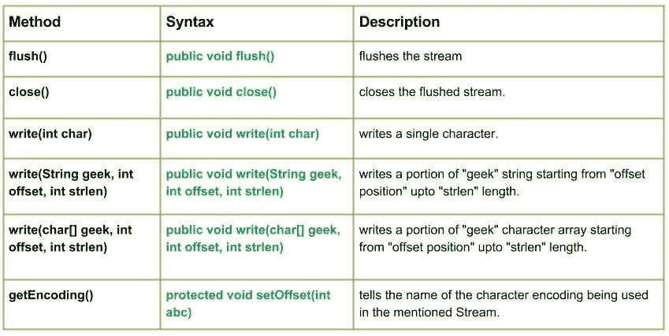

# Java.io.OutputStreamWriter 类方法

> 原文:[https://www . geesforgeks . org/Java-io-outputstreamwriter-class-methods/](https://www.geeksforgeeks.org/java-io-outputstreamwriter-class-methods/)

[](https://media.geeksforgeeks.org/wp-content/uploads/io.OutputStreamWriter-Class-methods.jpg)

**OutputStreamWriter** 类将字符流连接到字节流。它使用指定的字符集将字符编码成字节。
**申报:**

```java
public class OutputStreamWriter
   extends Writer
```

**施工方:**

*   **输出流编写器(OutputStream geek_out) :** 创建一个“geek_out”输出流编写器，使用
    作为编码的默认字符集。
*   **OutputStream writer(OutputStream geek _ out，Charset geek_set) :** 创建“geek _ out”OutputStream writer 使用“geek_set”字符集进行编码。
*   **OutputStreamWriter(OutputStream geek _ out，CharsetEncoder encoder):**创建使用给定编码器的“geek _ out”OutputStreamWriter。
*   **OutputStreamWriter(OutputStream geek _ out，String setName) :** 创建使用命名字符集的“geek _ out”OutputStreamWriter。

**方法:**

*   **flush():Java . io . outputstreamwriter . flush()**刷新流。
    **语法:**

```java
public void flush()
Parameters : 
------
Return : 
void
Exception : 
-> IOException : if in case anu I/O error occurs.
```

*   **close():Java . io . outputstreamwriter . close()**关闭刷新的流。
    **语法:**

```java
public void close()
Parameters : 
------
Return : 
void
Exception : 
-> IOException : if in case anu I/O error occurs, e.g writing after closing the stream
```

*   **write(int char):Java . io . outputstreamwriter . write(int char)**写单个字符。
    **语法:**

```java
public void write(int char)
Parameters : 
char : character to be written
Return : 
void
```

## Java 语言(一种计算机语言，尤用于创建网站)

```java
// Java code explaining the working of write(int char), flush(), close()

import java.io.*;
public class NewClass
{
    public static void main(String[] args)
    {       
        try
        {
            // Creation of new OutputStreamWriter
            OutputStream g = new FileOutputStream("test.txt");
            OutputStreamWriter geeks_out1 = new OutputStreamWriter(g);

            // Creating an Input Stream
            FileInputStream in = new FileInputStream("test.txt");

            // Use of write(int char) :
            // Writing character values to the "test.txt"
            geeks_out1.write(71);
            geeks_out1.write(69);
            geeks_out1.write(69);
            geeks_out1.write(75);
            geeks_out1.write(83);

            // flush the stream
            geeks_out1.flush();

            // read what we write
            for (int i = 0; i < 5; i++)
            {
                // Reading the content of "test.txt" file
                System.out.println("write(int char) : " + (char) in.read());
            }
            geeks_out1.close();
        }
        catch (Exception ex)
        {
            System.out.println("Error");
            ex.printStackTrace();
        }
    }
}
```

*   **输出:**

```java
write(int char) : G
write(int char) : E
write(int char) : E
write(int char) : K
write(int char) : S
```

*   **write(String geek，int offset，int strlen):Java . io . outputstreamwriter . write(String geek，int offset，int strlen)** 从“offset position”开始到“strlen”长度写一部分“geek”字符串。
    **语法:**

```java
public void write(String geek, int offset, int strlen)
Parameters : 
geek : string whose portion is to be written 
offset : starting position from where to write
strlen : length upto which we need to write
Return : 
void
Exception : 
-> IOException : if in case any I/O error occurs.
```

## Java 语言(一种计算机语言，尤用于创建网站)

```java
// Java code explaining the working of write(String geek, int offset, int strlen))

import java.io.*;
public class NewClass
{
    public static void main(String[] args)
    {
        String geek = "GEEKSForGeeks";
        try
        {
            // Creation of new OutputStreamWriter
            OutputStream g = new FileOutputStream("test.txt");
            OutputStreamWriter geeks_out1 = new OutputStreamWriter(g);

            // Creating an Input Stream
            FileInputStream in = new FileInputStream("test.txt");

            // Use of writewrite(String geek, int offset, int strlen)) :
            // Writing character values to the "test.txt"
            geeks_out1.write(geek, 4, 9);

            // flush the stream
            geeks_out1.flush();

            // read what we write
            for (int i = 0; i < 5; i++)
            {
                // Reading the content of "test.txt" file
                System.out.println("write(int char) : " + (char) in.read());
            }
            geeks_out1.close();
        }
        catch (Exception ex)
        {
            System.out.println("Error");
            ex.printStackTrace();
        }
    }
}
```

*   **输出:**

```java
write(int char) : S
write(int char) : F
write(int char) : o
write(int char) : r
write(int char) : G
```

*   **write(char[] geek，int offset，int strlen):Java . io . outputstreamwriter . write(char[]geek，int offset，int strlen)** 写一部分“geek”字符数组，从“offset position”开始，到“strlen”长度。
    **语法:**

```java
public void write(char[] geek, int offset, int strlen)
Parameters : 
geek : character array whose portion is to be written 
offset : starting position from where to write
strlen : length upto which we need to write
Return : 
void
Exception : 
-> IOException : if in case anu I/O error occurs.
```

*   **getEncoding():Java . io . outputstreamwriter . getEncoding()**告诉在提到的流中使用的字符编码的名称。
    如果存在预定义名称，则返回该名称，否则返回编码的规范名称。
    如果流已经关闭，则返回空。
    **语法:**

```java
public String getEncoding()
Parameters : 
------
Return : 
Name of the charset encoding used
Exception : 
-> IOException : if in case anu I/O error occurs.
```

## Java 语言(一种计算机语言，尤用于创建网站)

```java
// Java code explaining write(char[] geek, int offset, int strlen)
// and getEncoding() method

import java.io.*;
public class NewClass
{
    public static void main(String[] args)
    {
        char[] geek = {'G', 'E', 'E', 'K', 'S'};
        try
        {
            // Creation of new OutputStreamWriter
            OutputStream g = new FileOutputStream("test.txt");
            OutputStreamWriter geeks_out1 = new OutputStreamWriter(g);

            // Creating an Input Stream
            FileInputStream in = new FileInputStream("test.txt");

            // Use of writewrite(char[] geek, int offset, int strlen)) :
            // Writing character values to the "test.txt"
            geeks_out1.write(geek, 0, 3);

            // flush the stream
            geeks_out1.flush();

            // read what we write
            for (int i = 0; i < 3; i++)
            {
                // Reading the content of "test.txt" file
                System.out.println("char[] geek, int offset, int strlen) : "
                                                            + (char) in.read());
            }

            // get and print the encoding for this stream
            System.out.println("\nName of the charset : "
                                        + geeks_out1.getEncoding());

            // Closing the OutputStreamWriter
            geeks_out1.close();
        }

        catch (Exception ex)
        {
            System.out.println("Error");
            ex.printStackTrace();
        }
    }
}
```

*   **输出:**

```java
char[] geek, int offset, int strlen) : G
char[] geek, int offset, int strlen) : E
char[] geek, int offset, int strlen) : E

Name of the charset : UTF8
```

本文由**莫希特·古普塔供稿🙂**。如果你喜欢 GeeksforGeeks 并想投稿，你也可以使用[write.geeksforgeeks.org](https://write.geeksforgeeks.org)写一篇文章或者把你的文章邮寄到 review-team@geeksforgeeks.org。看到你的文章出现在极客博客主页上，帮助其他极客。
如果你发现任何不正确的地方，或者你想分享更多关于上面讨论的话题的信息，请写评论。