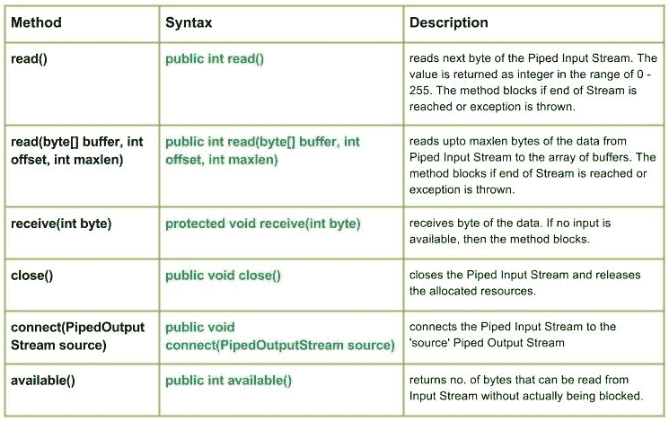

# Java 中的 Java.io.PipedInputStream 类

> 原文:[https://www . geesforgeks . org/Java-io-pipe dinputstream-class-Java/](https://www.geeksforgeeks.org/java-io-pipedinputstream-class-java/)

[](https://media.geeksforgeeks.org/wp-content/uploads/io.PipedInputStream-class.jpg)

**IO 中的 Pipes** 提供了同时在 JVM 中运行的两个线程之间的链接。因此，管道既可以用作源，也可以用作目标。

*   PipedInputStream 也通过管道与 PipedOutputStream 连接。因此，数据可以使用 PipedOutputStream 写入，也可以使用 PipedInputStream 写入。但是，同时使用两个线程会给线程造成死锁。
*   如果向连接的管道输出流提供数据字节的线程不再活动，则管道被称为断开。

**申报:**

```
public class PipedInputStream
  extends InputStream
```

**施工方:**

*   **PipedInputStream() :** 创建一个 PipedInputStream，表示它没有连接。
*   **PipedInputStream(int PSize):**创建一个 pipe dinputstream，表示它没有与指定的管道尺寸连接。
*   **管道输出流(管道输出流) :创建一个管道输出流，它连接到管道输出流–“输出流”。**
*   **管道输出流(管道输出流，int pSize) :** 创建一个管道输入流，该输入流连接到具有指定管道大小的管道输出流。

**方法:**

*   **int read():** Reads the next byte of data from this piped input stream.The value byte is returned as an int in the range 0 to 255\. This method blocks until input data is available, the end of the stream is detected, or an exception is thrown.

    ```
    // Java program illustrating the working of read() method
    import java.io.*;
    public class NewClass
    {
        public static void main(String[] args) throws IOException
        {
            PipedInputStream geek_input = new PipedInputStream();
            PipedOutputStream geek_output = new PipedOutputStream();
            try
            {
                // Use of connect() : connecting geek_input with geek_output
                geek_input.connect(geek_output);

                // Use of read() method :
                geek_output.write(71);
                System.out.println("using read() : " + (char)geek_input.read());
                geek_output.write(69);
                System.out.println("using read() : " + (char)geek_input.read());
                geek_output.write(75);
                System.out.println("using read() : " + (char)geek_input.read());

            }
            catch (IOException except)
            {
                except.printStackTrace();
            }
        }
    }
    ```

    **输出:**

    ```
    using read() : G
    using read() : E
    using read() : K
    ```

*   **read(byte[] buffer，int offset，int maxlen):****Java . io . pipedinputstream . read(byte[]buffer，int offset，int maxlen)** 从管道输入流读取最多 maxlen 字节的数据到缓冲区数组。如果到达流的末尾或引发异常，该方法将阻塞。
    **语法:**

    ```
    public int read(byte[] buffer, int offset, int maxlen)
    Parameters : 
    buffer : the destination buffer into which the data is to be read
    offset : starting in the destination array - 'buffer'.
    maxlen : maximum length of array to be read
    Return :                                               
    next 'maxlen' bytes of the data as an integer value 
    return -1 is end of stream is reached
    Exception :
    -> IOException : if in case IO error occurs.
    -> NullPointerException : if buffer is null.
    -> IndexOutOfBoundsException : if offset is -ve or 
                                    maxlen is -ve or maxlen > buffer.length - offset.

    ```

*   **接收(int byte):****Java . io . pipedinputstream . receive(int byte)**接收字节的数据。如果没有可用的输入，则该方法阻塞。
    **语法:**

    ```
    protected void receive(int byte)
    Parameters : 
    byte : the bytes of the data received
    Return :                                               
    void
    Exception :
    -> IOException : if in case IO error occurs or pipe is broken.
    ```

*   **close():****Java . io . pipe dinputstream . close()**关闭管道输入流并释放分配的资源。
    **语法:**

    ```
    public void close()
    Parameters : 
    --------------
    Return :                                               
    void
    Exception :
    -> IOException : if in case IO error occurs.
    ```

*   **connect(PipedOutputStream 源):****Java . io . pipe dinputstream . connect(pipe doutputstream 源)**将管道输入流连接到“源”管道输出流，如果“源”是带有其他流的管道，则会引发 IO 异常
    **语法:**

    ```
    public void connect(PipedOutputStream source)
    Parameters : 
    source : the Piped Output Stream to be connected to
    Return :                                               
    void
    Exception :
    -> IOException : if in case IO error occurs.
    ```

*   **available() :** **java.io.PipedInputStream.available()** returns no. of bytes that can be read from Input Stream without actually being blocked.
    **Syntax :**

    ```
    public int available()
    Parameters : 
    -------------
    Return :                                               
    no. of bytes that can be read from Input Stream without actually being blocked.
    0, if the stream is already closed but by invoking close() method
    Exception :
    -> IOException : if in case IO error occurs.
    ```

    **解释 PipedInputStream 类方法工作的 Java 程序:**

    ```
    // Java program illustrating the working of PipedInputStream
    // connect(), read(byte[] buffer, int offset, int maxlen),
    // close(), available()

    import java.io.*;
    public class NewClass
    {
        public static void main(String[] args) throws IOException
        {
            PipedInputStream geek_input = new PipedInputStream();
            PipedOutputStream geek_output = new PipedOutputStream();
            try
            {
                // Use of connect() : connecting geek_input with geek_output
                geek_input.connect(geek_output);

                geek_output.write(71);
                geek_output.write(69);
                geek_output.write(69);
                geek_output.write(75);
                geek_output.write(83);

                // Use of available() :
                System.out.println("Use of available() : " + geek_input.available());

                // Use of read(byte[] buffer, int offset, int maxlen) :
                byte[] buffer = new byte[5];
                // destination 'buffer'
                geek_input.read(buffer, 0, 5);

                String str = new String(buffer);
                System.out.println("Using read(buffer, offset, maxlen) : " + str);

                // USe of close() method :
                System.out.println("Closing the stream");
                geek_input.close();

            }
            catch (IOException except)
            {
                except.printStackTrace();
            }
        }
    }
    ```

    **输出:**

    ```
    Use of available() : 5
    Using read(buffer, offset, maxlen) : GEEKS
    Closing the stream
    ```

    下一篇文章: [Java 中的 Java.io.PipedOutputStream 类](https://www.geeksforgeeks.org/java-io-pipedoutputstream-class-java/)

    本文由 <font color="green">**莫希特·古普塔供稿🙂**</font> 。如果你喜欢 GeeksforGeeks 并想投稿，你也可以使用[write.geeksforgeeks.org](https://write.geeksforgeeks.org)写一篇文章或者把你的文章邮寄到 review-team@geeksforgeeks.org。看到你的文章出现在极客博客主页上，帮助其他极客。

    如果你发现任何不正确的地方，或者你想分享更多关于上面讨论的话题的信息，请写评论。