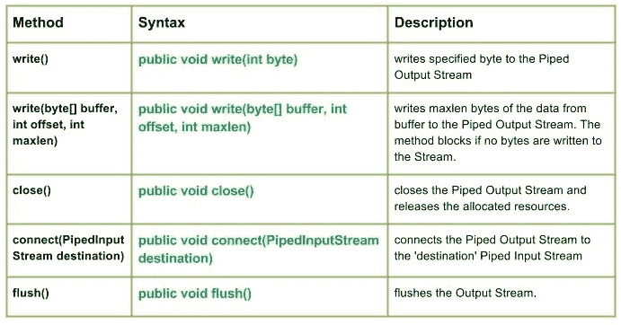

# Java 中的 Java.io.PipedOutputStream 类

> 原文:[https://www . geesforgeks . org/Java-io-pipe doutputstream-class-Java/](https://www.geeksforgeeks.org/java-io-pipedoutputstream-class-java/)

[Java 中的 Java.io.PipedInputStream 类](https://www.geeksforgeeks.org/java-io-pipedinputstream-class-java/)



IO 中的**管道**提供了同时在 JVM 中运行的两个线程之间的链接。因此，管道既可以用作源，也可以用作目标。

*   PipedInputStream 也通过管道与 PipedOutputStream 连接。因此，数据可以使用 PipedOutputStream 写入，也可以使用 PipedInputStream 写入。但是，同时使用两个线程会给线程造成死锁。
*   管道输出流是管道的发送端。数据被写入管道输出流。如果正在读取数据的 PipedInputStream 不再存在，则称该管道已损坏。

**申报:**

```
public class PipedOutputStream
  extends OutputStream
```

**施工方:**

*   **PipedOutputStream() :** 创建一个没有连接的 PipedOutputStream。
*   **管道输出流(管道输出流输入流):**创建一个管道输出流，它
    连接到管道输入流–“输入流”。

**方法:**

*   **write():Java . io . PipeDouttStream . write(int byte)**将指定的字节写入管道输出流。
    **语法:**

```
public void write(int byte)
Parameters : 
byte : byte to be written
Return :                                               
void
Exception :
-> IOException : if in case IO error occurs.
```

*   **write(byte[] buffer，int offset，int maxlen):Java . io . pipedoutputstream . write(byte[]buffer，int offset，int maxlen)** 将 maxlen 字节的数据从缓冲区写入管道输出流。如果没有字节写入流，方法将阻止。
    **语法:**

```
public void write(byte[] buffer, int offset, int maxlen)
Parameters : 
buffer : data of the buffer
offset : starting in the destination array - 'buffer'.
maxlen : maximum length of array to be read
Return :                                               
void
Exception :
-> IOException : if in case IO error occurs.
```

## Java 语言(一种计算机语言，尤用于创建网站)

```
// Java program illustrating the working of PipedInputStream
// write(byte[] buffer, int offset, int maxlen)

import java.io.*;
public class NewClass
{
    public static void main(String[] args) throws IOException
    {
        PipedInputStream geek_input = new PipedInputStream();
        PipedOutputStream geek_output = new PipedOutputStream();

        // Use of connect() : connecting geek_input with geek_output
        geek_input.connect(geek_output);

        byte[] buffer = {'J', 'A', 'V', 'A'};

        // Use of write(byte[] buffer, int offset, int maxlen)
        geek_output.write(buffer, 0, 4);
        int a = 5;
        System.out.print("Use of write(buffer, offset, maxlen) : ");
        while(a>0)
        {
            System.out.print(" " + (char) geek_input.read());
        }
    }
}
```

**输出:**

```
Use of write(buffer, offset, maxlen) :  J A V A
```

*   **close():Java . io . pipedoutputstream . close()**关闭管道输出流并释放分配的资源。
    **语法:**

```
public void close()
Parameters : 
--------------
Return :                                               
void
Exception :
-> IOException : if in case IO error occurs.
```

*   **connect(PipedInputStream 目的地):Java . io . pipe doutputstream . connect(pipe dinputstream 目的地)**将管道输出流连接到“目的地”管道输入流，如果“目的地”是带有其他流的管道，则会引发 IO 异常
    **语法:**

```
public void connect(PipedInputStream destination)
Parameters : 
destination : the Piped Input Stream to be connected to
Return :                                               
void
Exception :
-> IOException : if in case IO error occurs.
```

*   **flush():Java . io . pipedoutputstream . flush()**刷新输出流。
    **语法:**

```
public void flush()
Parameters : 
------------
Return :                                               
void
Exception :
-> IOException : if in case IO error occurs.
```

**说明 PipedOutputStream 类方法工作的 Java 代码:**

## Java 语言(一种计算机语言，尤用于创建网站)

```
// Java program illustrating the working of PipedInputStream
// write(), write(byte[] buffer, int offset, int maxlen),
// close(), flush(), connect()

import java.io.*;
public class NewClass
{
    public static void main(String[] args) throws IOException
    {
        PipedInputStream geek_input = new PipedInputStream();
        PipedOutputStream geek_output = new PipedOutputStream();
        try
        {
            // Use of connect() : connecting geek_input with geek_output
            geek_input.connect(geek_output);

            // Use of write(int byte) :
            geek_output.write(71);
            geek_output.write(69);
            geek_output.write(69);
            geek_output.write(75);
            geek_output.write(83);

            // Use of flush() method :
            geek_output.flush();
            System.out.println("Use of flush() method : ");

            int i = 5;
            while(i > 0)
            {
                System.out.print(" " + (char) geek_input.read());
                i--;
            }

            // USe of close() method :
            System.out.println("\nClosing the Output stream");
            geek_output.close();

        }
        catch (IOException except)
        {
            except.printStackTrace();
        }
    }
}
```

**输出:**

```
Use of flush() method : 
 G E E K S
Closing the Output stream
```

本文由**莫希特·古普塔供稿🙂**。如果你喜欢 GeeksforGeeks 并想投稿，你也可以使用[write.geeksforgeeks.org](https://write.geeksforgeeks.org)写一篇文章或者把你的文章邮寄到 review-team@geeksforgeeks.org。看到你的文章出现在极客博客主页上，帮助其他极客。
如果你发现任何不正确的地方，或者你想分享更多关于上面讨论的话题的信息，请写评论。