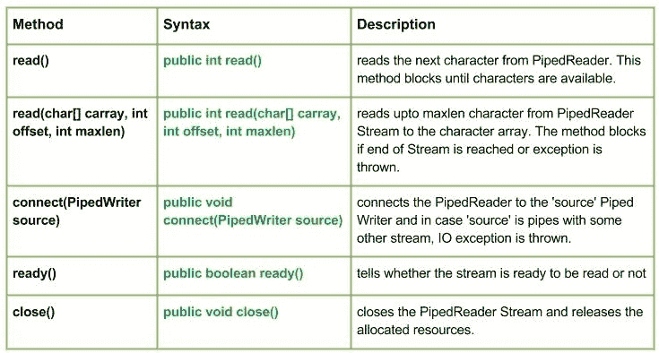

# Java 中的 Java . io . PipeDrader 类

> 原文:[https://www . geesforgeks . org/Java-io-pipeladeler-class-Java/](https://www.geeksforgeeks.org/java-io-pipedreader-class-java/)

[](https://media.geeksforgeeks.org/wp-content/uploads/io.PipedReader-Class-in-Java.jpg)

这个类基本上是一个管道字符输入流。在输入/输出**管道中，**只是指同时在 JVM 中运行的两个线程之间的链接。因此，管道既可以用作源，也可以用作目标。
如果向连接的管道输出流提供数据字节的线程不再活动，则称管道断开。

**申报:**

```
public class PipedReader
  extends Reader
```

**施工方:**

*   **管道探测器():**创建一个没有连接的管道探测器()。
*   **管道探测器(int pSize) :** 创建一个管道探测器，它没有与指定的管道尺寸连接。
*   **管道探测器(PipedWriterStream src) :** 创建一个管道探测器，它连接到 PipeDwriterstream–“src”。
*   **管道读取器(PipedWriterStream src，int pSize) :** 创建一个管道读取器，该读取器连接到具有指定管道大小的管道写入器。

**方法:**

*   **read() :** **java.io.PipedReader.read()** reads the next character from PipedReader. This method blocks until characters are available. Returns -1 if end of the stream is detected, or an exception is thrown and the method blocks
    **Syntax() :**

    ```
    public int read()
    Parameters: 
    -----------
    Return :
    reads the next character from PipedReader.
    else, return-1 if end of the stream is detected.
    Exception : 
    -> IOException : if in case an IO error occurs.

    ```

    **实施:**

    ```
    // Java program illustrating the working of read() method

    import java.io.*;
    public class NewClass
    {
        public static void main(String[] args) throws IOException
        {
            PipedReader geek_reader = new PipedReader();
            PipedWriter geek_writer = new PipedWriter();

                geek_reader.connect(geek_writer);

                // Use of read() method 
                geek_writer.write(71);
                System.out.println("using read() : " + (char)geek_reader.read());
                geek_writer.write(69);
                System.out.println("using read() : " + (char)geek_reader.read());
                geek_writer.write(75);
                System.out.println("using read() : " + (char)geek_reader.read());        
        }
    }
    ```

    **输出:**

    ```
    using read() : G
    using read() : E
    using read() : K
    ```

*   **read(char【】carray，int offset，int maxlen):****Java . io . pipeledader . read(char【】carray，int offset，int maxlen)** 从 PipedReader Stream 读取多达 maxlen 个字符到字符数组。如果到达流的末尾或引发异常，该方法将阻塞。
    **语法:**

    ```
    public int read(char[] carray, int offset, int maxlen)
    Parameters : 
    carray : buffer into which the data is to be read
    offset : starting in the destination array - 'carray'.
    maxlen : maximum length of array to be read
    Return :                                               
    next 'maxlen' bytes of the data as an integer value 
    return -1 is end of stream is reached
    Exception :
    -> IOException : if in case IO error occurs.

    ```

*   **close():****Java . io . PipedPiedReader . close()**关闭 PipedReader 流并释放分配的资源。
    **语法:**

    ```
    public void close()
    Parameters : 
    --------------
    Return :                                               
    void
    Exception :
    -> IOException : if in case IO error occurs.
    ```

*   **connect(PipedWriter 源):****Java . io . PipedWriter . connect(PipedWriter 源)**将 PipedWriter 连接到“源”管道编写器，如果“源”是带有其他流的管道，则会引发 IO 异常
    **语法:**

    ```
    public void connect(PipedWriter source)
    Parameters : 
    source : the PipedWriter to be connected to
    Return :                                               
    void
    Exception :
    -> IOException : if in case IO error occurs.
    ```

*   **ready() :** **java.io.PipedPipedReader.ready()** tells whether the stream is ready to be read or not
    **Syntax :**

    ```
    public boolean ready()
    Parameters : 
    --------------
    Return :                                               
    true : if the stream is ready to be read else, false
    Exception :
    -> IOException : if in case IO error occurs.
    ```

    **演示 PipedReader 类方法工作的 Java 程序:**

    ```
    // Java program illustrating the working of PipedReader
    // connect(), read(char[] carray, int offset, int maxlen),
    // close(), ready()

    import java.io.*;
    public class NewClass
    {
        public static void main(String[] args) throws IOException
        {
            PipedReader geek_reader = new PipedReader();
            PipedWriter geek_writer = new PipedWriter();

            // Use of connect() : connecting geek_reader with geek_writer
            geek_reader.connect(geek_writer);

            geek_writer.write(71);
            geek_writer.write(69);
            geek_writer.write(69);
            geek_writer.write(75);
            geek_writer.write(83);

            // Use of ready() method
            System.out.print("Stream is ready to be read : "+geek_reader.ready());

            // Use of read(char[] carray, int offset, int maxlen)
            System.out.print("\nUse of read(carray, offset, maxlen) : ");
            char[] carray = new char[5];
            geek_reader.read(carray, 0, 5);

            for (int i = 0; i < 5; i++)
            {
                System.out.print(carray[i]);
            }

            // USe of close() method :
            System.out.println("\nClosing the stream");
            geek_reader.close();
        }
    }
    ```

    **输出:**

    ```
    Stream is ready to be read : true
    Use of read(carray, offset, maxlen) : GEEKS
    Closing the stream
    ```

    **下一篇:** [Java 中的 Java . io . pipe writer 类](https://www.geeksforgeeks.org/java-io-pipedwriter-class-java/)

    本文由 <font color="green">**莫希特·古普塔供稿🙂**</font> 。如果你喜欢 GeeksforGeeks 并想投稿，你也可以使用[contribute.geeksforgeeks.org](http://www.contribute.geeksforgeeks.org)写一篇文章或者把你的文章邮寄到 contribute@geeksforgeeks.org。看到你的文章出现在极客博客主页上，帮助其他极客。
    如果发现有不正确的地方，或者想分享更多关于上述话题的信息，请写评论。
    如果你喜欢 GeeksforGeeks 并想投稿，你也可以写一篇文章，把你的文章邮寄到 contribute@geeksforgeeks.org。看到你的文章出现在极客博客主页上，帮助其他极客。