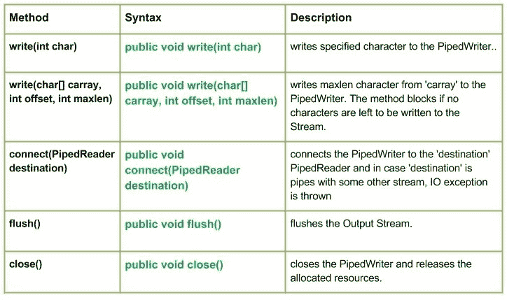

# Java 中的 Java.io.PipedWriter 类

> 原文:[https://www . geesforgeks . org/Java-io-pipe dwriter-class-Java/](https://www.geeksforgeeks.org/java-io-pipedwriter-class-java/)

[](https://media.geeksforgeeks.org/wp-content/uploads/io.PipedWriter-Class-in-Java.jpg)

这个类基本上是一个管道字符输出流。在输入/输出**管道中，**只是指同时在 JVM 中运行的两个线程之间的链接。因此，管道既可以用作源，也可以用作目标。
如果向连接的管道输出流提供数据字节的线程不再活动，则称管道断开。

**申报:**

```
public class PipedWriter
  extends Writer
```

**施工方:**

*   **管道写入器():**创建一个管道写入器，表示它没有连接。
*   **管道写入器(管道写入器入流):**创建一个管道写入器，它连接到管道写入器–“入流”。

**方法:**

*   **write(int char):****Java . io . PipedWriter . write(int char)**将指定的字符写入 pipe dwriter。
    **语法:**

    ```
    public void write(int char)
    Parameters : 
    char : character to be written
    Return :                                               
    void
    Exception :
    -> IOException : if in case IO error occurs.
    ```

*   **write(char[] carray, int offset, int maxlen) :** **java.io.PipedWriter.write(char[] carray, int offset, int maxlen)** writes maxlen character from ‘carray’ to the PipedWriter. The method blocks if no characters are left to be written to the Stream.
    **Syntax :**

    ```
    public void write(char[] carray, int offset, int maxlen)
    Parameters : 
    carray : data of the carray
    offset : starting in the destination array - 'carray'.
    maxlen : maximum length of array to be read
    Return :                                               
    void
    Exception :
    -> IOException : if in case IO error occurs.
    ```

    **实施:**

    ```
    // Java program illustrating the working of PipedWriter
    // write(char[] carray, int offset, int maxlen)

    import java.io.*;
    public class NewClass
    {
        public static void main(String[] args) throws IOException
        {
            PipedReader geek_reader = new PipedReader();
            PipedWriter geek_writer = new PipedWriter();

            // Use of connect() : connecting geek_reader with geek_writer
            geek_reader.connect(geek_writer);

            char[] carray = {'J', 'A', 'V', 'A'};

            // Use of write(char[] carray, int offset, int maxlen)
            geek_writer.write(carray, 0, 4);
            int a = 5;
            System.out.print("Use of write(carray, offset, maxlen) : ");
            while(a>0)
            {
                System.out.print(" " + (char) geek_reader.read());          
            }

        }
    }
    ```

    **输出:**

    ```
    Use of write(carray, offset, maxlen) :  J A V A
    ```

*   **close():****Java . io . PipedWriter . close()**关闭 pipe dwriter 并释放分配的资源。
    **语法:**

    ```
    public void close()
    Parameters : 
    --------------
    Return :                                               
    void
    Exception :
    -> IOException : if in case IO error occurs.
    ```

*   **connect(PipedReader 目的地):****Java . io . PipedWriter . connect(PipedReader 目的地)**将 pipe dwriter 连接到“目的地”pipe dreader，如果“目的地”是具有其他流的管道，则会引发 IO 异常
    **语法:**

    ```
    public void connect(PipedReader destination)
    Parameters : 
    destination : the PipedReader to be connected to
    Return :                                               
    void
    Exception :
    -> IOException : if in case IO error occurs.
    ```

*   **flush() :** **java.io.PipedWriter.flush()** flushes the Output Stream.
    **Syntax :**

    ```
    public void flush()
    Parameters : 
    ------------
    Return :                                               
    void
    Exception :
    -> IOException : if in case IO error occurs.
    ```

    **说明 PipedWriter 类方法工作的 Java 代码:**

    ```
    // Java program illustrating the working of PipedWriter
    // write(), connect
    // close(), flush()

    import java.io.*;
    public class NewClass
    {
        public static void main(String[] args) throws IOException
        {
            PipedReader geek_reader = new PipedReader();
            PipedWriter geek_writer = new PipedWriter();
            try
            {
                // Use of connect() : connecting geek_reader with geek_writer
                geek_reader.connect(geek_writer);

                // Use of write(int byte) :
                geek_writer.write(71);
                geek_writer.write(69);
                geek_writer.write(69);
                geek_writer.write(75);
                geek_writer.write(83);

                // Use of flush() method :
                geek_writer.flush();
                System.out.println("Use of flush() method : ");

                int i = 5;
                while(i > 0)
                {
                    System.out.print(" " + (char) geek_reader.read());
                    i--;
                }

                // USe of close() method :
                System.out.println("\nClosing the Writer stream");
                geek_writer.close();

            }
            catch (IOException excpt)
            {
                excpt.printStackTrace();
            }
        }
    }
    ```

    **输出:**

    ```
    Use of flush() method : 
     G E E K S
    Closing the Writer stream
    ```

    **下一篇:** [Java 中的 Java . io . pipeledler 类](https://www.geeksforgeeks.org/java-io-pipedreader-class-java/)

    本文由 <font color="green">**莫希特·古普塔供稿🙂**</font> 。如果你喜欢 GeeksforGeeks 并想投稿，你也可以使用[contribute.geeksforgeeks.org](http://www.contribute.geeksforgeeks.org)写一篇文章或者把你的文章邮寄到 contribute@geeksforgeeks.org。看到你的文章出现在极客博客主页上，帮助其他极客。
    如果发现有不正确的地方，或者想分享更多关于上述话题的信息，请写评论。