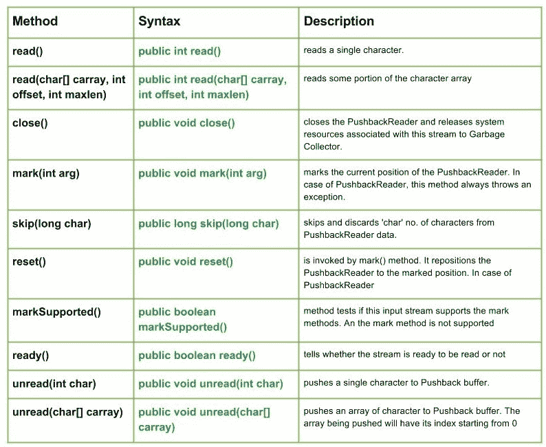

# Java 中的 Java . io . puback reader 类

> 原文:[https://www . geesforgeks . org/Java-io-puback reader-class-Java/](https://www.geeksforgeeks.org/java-io-pushbackreader-class-java/)

[](https://media.geeksforgeeks.org/wp-content/uploads/io.PushbackReader-Class-in-Java.jpg)

**Java . io . puback reader**是一个字符流读取器类，允许将字符推回到流中。

**申报:**

```
public class PushbackReader
   extends FilterReader
```

**施工人员:**

*   **推送阅读器(阅读器推送):**创建一个新的推送阅读器–“推送”带有字符推送缓冲区。
*   **推回读取器(读取器推送，int 大小):**创建一个新的推回读取器，具有特定大小的推回缓冲区。

**推送阅读器类的方法:**

*   **read():****Java . io . puback reader . read()**读取单个字符。
    **语法:**

    ```
    public int read()
    Parameters :
    -----------
    Return : 
    reads single character from the Pushback buffer 
    else, -1 i.e. when end of file is reached.
    Exception :
    ->  IOException : If I/O error occurs.
    ```

*   **read(char[] carray，int offset，int maxlen):****Java . io . pubackreader . read(char[]carray，int offset，int maxlen)** 读取字符数组的某个部分
    **语法:**

    ```
    public int read(char[] carray, int offset, int maxlen)
    Parameters :
    carray : destination buffer to be read into
    offset : starting position of the carray
    maxlen : maximum no. of characters to be read
    Return : 
    reads some portion of the character array
    else, -1 i.e. when end of file is reached.
    Exception :
    ->  IOException : If I/O error occurs.
    ```

*   **close():****Java . io . PushbackReader . close()**关闭 puback reader，并将与此流相关联的系统资源释放给垃圾收集器。
    **语法:**

    ```
    public void close()
    Parameters :
    ------
    Return : 
    void
    Exception :
    ->  IOException : If I/O error occurs.
    ```

*   **标记(int arg):****Java . io . PushbackReader . mark(int arg)**标记 puback reader 的当前位置。在推回阅读器的情况下，这个方法总是抛出一个异常。
    **语法:**

    ```
    public void mark(int arg)
    Parameters :
    arg : integer specifying the read limit of the Stream
    Return : 
    void
    ```

*   **跳过(长字符):****Java . io . PushbackReader . skip(长字符)**跳过并丢弃 puback reader 数据中的“字符”数量。
    **语法:**

    ```
    public long skip(long char)
    Parameters : 
    char : no. of bytes of PushbackReader data to skip.
    Return : 
    no. of bytes to be skipped
    Exception: 
    -> IOException : in case I/O error occurs
    ```

*   **reset():****Java . io . puback reader . reset()**由 mark()方法调用。它将推回阅读器重新定位到标记位置。在推回阅读器的情况下，这个方法总是抛出一个异常。
    **语法:**

    ```
    public void reset()
    Parameters :
    ----
    Return : 
    void
    Exception :
    ->  IOException : If I/O error occurs.

    ```

*   **markSupported():****Java . io . pubackreader . markSupported()**告诉这个流是否支持 mark()操作，它不支持。
    **语法:**

```
public boolean markSupported()
Parameters :
-------
Return : 
true if PushbackReader supports the mark() method  else,false
```

*   **ready():****Java . io . pubackreader . ready()**告知流是否准备好被读取
    **语法:**

    ```
    public boolean ready()
    Parameters :
    -------
    Return : 
    true if the stream is ready to be read else,false
    ```

    *   **unread(int char) :** **java.io.PushbackReader.unread(int char)** pushes a single character to Pushback buffer. The next character to be read will have (char)char value, after this method returns.

    **语法:**

    ```
    public void unread(int char)
    Parameters :
    char : int value of the character to be pushed back
    Return : 
    void
    Exception :
    ->  IOException : If I/O error occurs or Pushback buffer is full.

    ```

    *   **unread(char[] carray) :** **java.io.PushbackReader.unread(char[] carray)** pushes an array of character to Pushback buffer. The array being pushed will have its index starting from 0.
    **Syntax :**

    ```
    public void unread(char[] carray)
    Parameters :
    carray : character array to be pushed back
    Return : 
    void
    Exception :
    ->  IOException : If I/O error occurs or Pushback buffer is full.

    ```

    **解释推回阅读器方法的 Java 代码:read(char[] carray)、close()、markSupported()、read()、mark()、ready()、skip()、unread()**

    ```
    // Java program illustrating the working of PushbackReader
    // read(char[] carray), close(), markSupported()
    // read(), mark(), ready(), skip(), unread()

    import java.io.*;
    public class NewClass
    {
        public static void main(String[] args) throws IOException
        {
            try
            {
                // Initializing a StringReader and PushbackReader
                String s = "GeeksForGeeks";

                StringReader str_reader = new StringReader(s);
                PushbackReader geek_pushReader1 = new PushbackReader(str_reader);
                PushbackReader geek_pushReader2 = new PushbackReader(str_reader);

                // Use of ready() method :
                System.out.println("Is stream1 ready : " + geek_pushReader1.ready());
                System.out.println("Is stream2 ready : " + geek_pushReader2.ready());

                // Use of read() :
                System.out.println("\nWe have used skip() method in 1 : ");
                System.out.print("\nUse of read() in 1 : ");
                for (int i = 0; i < 6; i++)
                {
                    char c = (char) geek_pushReader1.read();
                    System.out.print(c);

                    // Use of skip() :
                    geek_pushReader1.skip(1);
                }
                System.out.println("");

                // USing read() :
                char[] carray = new char[20];
                System.out.println("Using read() in 2 : " + geek_pushReader2.read(carray));

                // USe of markSupported() :
       System.out.println("\nIs mark supported in 1  : " + geek_pushReader1.markSupported());

                geek_pushReader2.unread('F');

                // read the next char, which is the one we unread
                char c3 = (char) geek_pushReader2.read();
                System.out.println("USe of unread() : " + c3);

                // USe of mark() :
                geek_pushReader1.mark(5);

                // Use of close() :
                geek_pushReader1.close();

            }
            catch (IOException excpt)
            {
                System.out.println("mark not supported in 1");

            }
        }
    }
    ```

    **输出:**

    ```
    Is stream1 ready : true
    Is stream2 ready : true

    We have used skip() method in 1 : 

    Use of read() in 1 : GesoGe
    Using read() in 2 : 1

    Is mark supported in 1 : false
    USe of unread() : F
    mark not supported in 1
    ```

    本文由 <font color="green">**莫希特·古普塔供稿🙂**</font> 。如果你喜欢 GeeksforGeeks 并想投稿，你也可以使用[contribute.geeksforgeeks.org](http://www.contribute.geeksforgeeks.org)写一篇文章或者把你的文章邮寄到 contribute@geeksforgeeks.org。看到你的文章出现在极客博客主页上，帮助其他极客。

    如果你发现任何不正确的地方，或者你想分享更多关于上面讨论的话题的信息，请写评论。