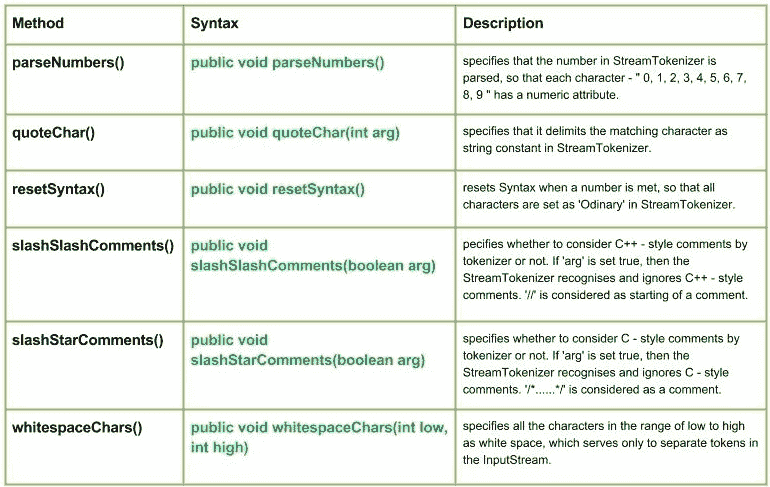

# Java 中的 Java.io.StreamTokenizer 类|集合 2

> 原文:[https://www . geesforgeks . org/Java-io-stream token izer-class-Java-set-2/](https://www.geeksforgeeks.org/java-io-streamtokenizer-class-java-set-2/)

[Java 中的 StringTokenizer 类|集合 1](https://www.geeksforgeeks.org/java-io-streamtokenizer-class-java/)

[](https://media.geeksforgeeks.org/wp-content/uploads/StreamTokenizer-Class-Set-2.jpg)

**方法:**

1.  **parseNumbers():****Java . io . StreamTokenizer . parseNumbers()**指定分析 StreamTokenizer 中的数字，这样每个字符–“0、1、2、3、4、5、6、7、8、9”都有一个数字属性。
    当解析器遇到具有双精度浮点数格式的单词标记时，它会将标记视为数字而不是单词，方法是将 ttype 字段设置为值 TT_NUMBER，并将标记的数值放入 nval 字段。
    **语法:**

```
public void parseNumbers()
Parameters :
-----------
Return :
void
```

**实施:**

```
// Java Program  illustrating use of parseNumbers() method

import java.io.*;
public class NewClass
{
    public static void main(String[] args) throws InterruptedException,
    FileNotFoundException, IOException
    {
        FileReader reader = new FileReader("ABC.txt");
        BufferedReader bufferread = new BufferedReader(reader);
        StreamTokenizer token = new StreamTokenizer(bufferread);

        // Use of parseNumbers() method
        // specifies that the number in StreamTokenizer is parsed
         token.parseNumbers();

        int t;
        while ((t = token.nextToken()) != StreamTokenizer.TT_EOF)
        {
            switch (t)
            {
            case StreamTokenizer.TT_NUMBER:
                System.out.println("Number : " + token.nval);
                break;
            case StreamTokenizer.TT_WORD:
                System.out.println("Word : " + token.sval);
                break;

            }
        }
    }
}
```

**注意:**
这个程序不会在这里运行，因为没有‘ABC’文件存在。您可以在系统的 Java 编译器上检查这些代码。
要检查此代码，请在您的系统上创建一个文件“ABC”。
《ABC》文件包含:

你好极客 1
这个 2
3 是
关于 4
解析数字()

**输出:**

```
Word : Hello
Word : Geeks
Number : 1.0
Word : This
Number : 2.0
Number : 3.0
Word : is
Word : about
Number : 4.0
Word : parseNumbers
```

*   **quoteChar() :** **java.io.StreamTokenizer.quoteChar(int arg)** specifies that it delimits the matching character as string constant in StreamTokenizer.
    When the nextToken method encounters a string constant, the ttype field is set to the string delimiter and the sval field is set to the body of the string.
    **Syntax :**

    ```
    public void quoteChar(int arg)
    Parameters :
    arg : the character to be dilimit 
    Return :
    void
    ```

    **实施:**

    ```
    // Java Program  illustrating use of quoteChar() method

    import java.io.*;
    public class NewClass
    {
        public static void main(String[] args) throws InterruptedException,
                                                 FileNotFoundException, IOException
        {
            FileReader reader = new FileReader("ABC.txt");
            BufferedReader bufferread = new BufferedReader(reader);
            StreamTokenizer token = new StreamTokenizer(bufferread);

            // specify o as a quote char
            token.quoteChar('o');

            int t;
            while ((t = token.nextToken()) != StreamTokenizer.TT_EOF)
            {
                switch (t)
                {
                case StreamTokenizer.TT_WORD:
                    System.out.println("Word : " + token.sval);
                    break;
                case StreamTokenizer.TT_NUMBER:
                    System.out.println("Number : " + token.nval);
                    break;
                default:
                    System.out.println((char) t + " encountered.");

                }
            }
        }
    }
    ```

    **注意:**
    这个程序不会在这里运行，因为没有‘ABC’文件存在。您可以在系统的 Java 编译器上检查这些代码。
    要检查此代码，请在您的系统上创建一个文件“ABC”。
    《ABC》文件包含:

    大家好
    极客
    这里
    是
    关于
    quoteChar()

    **输出:**

    ```
    Word : Hell
    o encountered.
    Word : Geeks
    Word : This
    Word : is
    Word : ab
    o encountered.
    Word : qu
    o encountered.
    ```

    *   **resetSyntax() :** **java.io.StreamTokenizer.resetSynatx()** resets Syntax when a number is met, so that all characters are set as ‘Ordinary’ in StreamTokenizer.
    **Syntax :**

    ```
    public void resetSyntax()
    Parameters :
    ---------
    Return :
    void
    ```

    **实施:**

    ```
    // Java Program  illustrating use of resetSyntax() method

    import java.io.*;
    public class NewClass
    {
        public static void main(String[] args) throws InterruptedException,
                                                 FileNotFoundException, IOException
        {
            FileReader reader = new FileReader("ABC.txt");
            BufferedReader bufferread = new BufferedReader(reader);
            StreamTokenizer token = new StreamTokenizer(bufferread);

            int t;
            while ((t = token.nextToken()) != StreamTokenizer.TT_EOF)
            {
                switch (t)
                {
                case StreamTokenizer.TT_WORD:
                    System.out.println("Word : " + token.sval);
                    break;
                case StreamTokenizer.TT_NUMBER:

                     // Use of resetSyntax() 
                     token.resetSyntax();

                    System.out.println("Number : " + token.nval);
                    break;
                default:
                    System.out.println((char) t + " encountered.");

                }
            }
        }
    }
    ```

    **注意:**
    这个程序不会在这里运行，因为没有‘ABC’文件存在。您可以在系统的 Java 编译器上检查这些代码。
    要检查此代码，请在您的系统上创建一个文件“ABC”。
    《ABC》文件包含:

    你好
    这里是
    resetSyntax()
    1 xmpl
    2🙂
    3
    **输出:**

    ```
    Word : Hello
    Word : This
    Word : is
    Word : resetSyntax
    ( encountered.
    ) encountered.
    Number : 1.0
      encountered.
    x encountered.
    m encountered.
    p encountered.
    l encountered.
     encountered.

     encountered.
    2 encountered.
      encountered.
    : encountered.
    ) encountered.
     encountered.

     encountered.
    3 encountered.
    ```

    *   **slashSlashComments() :** **java.io.StreamTokenizer.slashSlashComments(boolean arg)** specifies whether to consider C++ – style comments by tokenizer or not. If ‘arg’ is set true, then the StreamTokenizer recognises and ignores C++ – style comments. ‘//’ is considered as starting of a comment.
    If the flag argument is false, then C++- style comments are not treated specially.
    **Syntax :**

    ```
    public void slashSlashComments(boolean arg)
    Parameters :
    arg : tells whether to recognise and ignore C++ - style comments or not.
    Return :
    void
    ```

    **实施:**

    ```
    // Java Program  illustrating use of slashSlashComments() method

    import java.io.*;
    public class NewClass
    {
        public static void main(String[] args) throws InterruptedException,
                                                   FileNotFoundException, IOException
        {
            FileReader reader = new FileReader("ABC.txt");
            BufferedReader bufferread = new BufferedReader(reader);
            StreamTokenizer token = new StreamTokenizer(bufferread);

            // Use of slashSlashComments()
            // Here 'arg' is set to true i.e. to recognise and ignore C++style Comments
            boolean arg = true;
            token.slashSlashComments(arg);

            int t;
            while ((t = token.nextToken()) != StreamTokenizer.TT_EOF)
            {
                switch (t)
                {
                case StreamTokenizer.TT_WORD:
                    System.out.println("Word : " + token.sval);
                    break;
                case StreamTokenizer.TT_NUMBER:
                    System.out.println("Number : " + token.nval);
                    break;
                }
            }
        }
    }
    ```

    **注意:**
    这个程序不会在这里运行，因为没有‘ABC’文件存在。您可以在系统的 Java 编译器上检查这些代码。
    要检查此代码，请在您的系统上创建一个文件“ABC”。
    《ABC》文件包含:

    这个程序是关于 SlashComments //方法的

    此方法将 ABC.txt 文件中的“方法”视为注释，因此忽略它。
    **输出:**

    ```
    Word : This
    Word : program
    Word : is
    Word : about
    Word : slashSlashComments
    ```

    *   **slashStarComments() :** **java.io.StreamTokenizer.slashStarComments(boolean arg)** specifies whether to consider C – style comments by tokenizer or not. If ‘arg’ is set true, then the StreamTokenizer recognises and ignores C – style comments. ‘/*……*/’ is considered as a comment.
    **Syntax :**

    ```
    public void slashStarComments(boolean arg)
    Parameters :
    arg : tells whether to recognise and ignore C - style comments or not.
    Return :
    void
    ```

    **实施:**

    ```
    // Java Program illustrating use of slashStarComments() method

    import java.io.*;
    public class NewClass
    {
        public static void main(String[] args) throws InterruptedException,
                                                  FileNotFoundException, IOException
        {
            FileReader reader = new FileReader("ABC.txt");
            BufferedReader bufferread = new BufferedReader(reader);
            StreamTokenizer token = new StreamTokenizer(bufferread);

            // Use of slashStarComments()
            // Here 'arg' is set to true i.e. to recognise and ignore Cstyle Comments
            boolean arg = true;
            token.slashStarComments(true);

            int t;
            while ((t = token.nextToken()) != StreamTokenizer.TT_EOF)
            {
                switch (t)
                {
                case StreamTokenizer.TT_WORD:
                    System.out.println("Word : " + token.sval);
                    break;
                case StreamTokenizer.TT_NUMBER:
                    System.out.println("Number : " + token.nval);
                    break;
                }
            }
        }
    }
    ```

    **注意:**
    这个程序不会在这里运行，因为没有‘ABC’文件存在。您可以在系统的 Java 编译器上检查这些代码。
    要检查此代码，请在您的系统上创建一个文件“ABC”。
    《ABC》文件包含:

    这个程序是关于 slashStarComments /*方法*/ 123 的

    此方法将 ABC.txt 文件中的“方法”视为注释，因此忽略它。
    **输出:**

    ```
    Word : This
    Word : program
    Word : is
    Word : about
    Word : slashStarComments
    Number : 123.0
    ```

    *   **whitespaceChars() :** **java.io.StreamTokenizer.whitespaceChars(int low, int high)** specifies all the characters in the range of low to high as white space, which serves only to separate tokens in the InputStream.
    **Syntax :**

    ```
    public void whitespaceChars(int low, int high)
    Parameters :
    low : lower range of character to be white spaced.
    high : higher range of character to be white spaced 
    Return :
    void
    ```

    **实施:**

    ```
    // Java Program illustrating use of whitespaceChars() method

    import java.io.*;
    public class NewClass
    {
        public static void main(String[] args) throws InterruptedException,
                                             FileNotFoundException, IOException
        {
            FileReader reader = new FileReader("ABC.txt");
            BufferedReader bufferread = new BufferedReader(reader);
            StreamTokenizer token = new StreamTokenizer(bufferread);

            // Use of whitespaceChars() method
            // Here range is low = 'a' to high = 'c'
            token.whitespaceChars('a','d');

            int t;
            while ((t = token.nextToken()) != StreamTokenizer.TT_EOF)
            {
                switch (t)
                {
                case StreamTokenizer.TT_WORD:
                    System.out.println("Word : " + token.sval);
                    break;
                case StreamTokenizer.TT_NUMBER:
                    System.out.println("Number : " + token.nval);
                    break;
                }
            }
        }
    }
    ```

    **注意:**
    这个程序不会在这里运行，因为没有‘ABC’文件存在。您可以在系统的 Java 编译器上检查这些代码。
    要检查此代码，请在您的系统上创建一个文件“ABC”。
    《ABC》文件包含:

    这个程序是关于 whitespaceChars()

    **输出:**

    ```
    Word : This
    Word : progr
    Word : m
    Word : is
    Word : out
    Word : whitesp
    Word : eCh
    Word : rs
    ```

    本文由 <font color="green">**莫希特·古普塔供稿🙂**</font> 。如果你喜欢 GeeksforGeeks 并想投稿，你也可以使用[contribute.geeksforgeeks.org](http://www.contribute.geeksforgeeks.org)写一篇文章或者把你的文章邮寄到 contribute@geeksforgeeks.org。看到你的文章出现在极客博客主页上，帮助其他极客。

    如果你发现任何不正确的地方，或者你想分享更多关于上面讨论的话题的信息，请写评论。