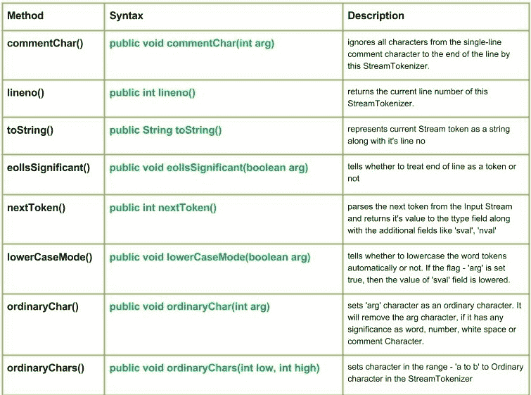

# Java 中的 Java.io.StreamTokenizer 类|集合 1

> 原文:[https://www . geesforgeks . org/Java-io-stream token izer-class-Java/](https://www.geeksforgeeks.org/java-io-streamtokenizer-class-java/)

[](https://media.geeksforgeeks.org/wp-content/uploads/StreamTokenizer-Class-Set-1.jpg)

Java.io.StreamTokenizer 类将输入流解析为“令牌”。它允许一次读取一个令牌。流标记器可以识别数字、带引号的字符串和各种注释样式。
**申报:**

```java
public class StreamTokenizer
  extends Object
```

**构造函数:**
**流标记器(Reader arg) :** 创建一个标记器，用于解析给定的字符流。

**方法:**

***   评论 ar:**
**java.io.StreamTokenizer.commentChar(int arg)**

**Syntax :**

```java
public void commentChar(int arg) 
Parameters : 
arg : the character after which all characters are ignored in the line.
Return :
No value is returned.
```

**实施:**

```java
// Java Program illustrating use of commentChar() method

import java.io.*;
public class NewClass
{
    public static void main(String[] args) throws InterruptedException, 
                                              FileNotFoundException, IOException
    {
        FileReader reader = new FileReader("ABC.txt");
        BufferedReader bufferread = new BufferedReader(reader);
        StreamTokenizer token = new StreamTokenizer(bufferread);
        // Use of commentChar() method
        token.commentChar('a');
        int t;
        while ((t = token.nextToken()) != StreamTokenizer.TT_EOF)
        {
            switch (t)
            {
            case StreamTokenizer.TT_NUMBER:
                System.out.println("Number : " + token.nval);
                break;
            case StreamTokenizer.TT_WORD:
                System.out.println("Word : " + token.sval);
                break;

            }
        }
    }
}
```

**注意:**
这个程序不会在这里运行，因为没有‘ABC’文件存在。您可以在系统的 Java 编译器上检查这些代码。
要检查此代码，请在您的系统上创建一个文件“ABC”。
**【ABC】文件包含:**

程序员
1
2
3
极客
你好
朋友们，这里解释一个程序。

**输出:**

```java
Word : Progr
Number : 1.0
Number : 2.0
Number : 3.0
Word : Geeks
Word : Hello

```

*   **lineno() : **java.io.StreamTokenizer.lineno()** returns the current line number of this StreamTokenizer.
    **Syntax :**

    ```java
    public int lineno()
    Parameters : 
    arg : the character after which all characters are ignored in the line.
    Return :
    returns the current line number of this StreamTokenizer.
    ```

    **实施:**

    ```java
    // Java Program  illustrating use of lineno() method

    import java.io.*;
    public class NewClass
    {

        public static void main(String[] args) throws InterruptedException, 
                                                      FileNotFoundException, IOException
        {
            FileReader reader = new FileReader("ABC.txt");
            BufferedReader bufferread = new BufferedReader(reader);
            StreamTokenizer token = new StreamTokenizer(bufferread);

            token.eolIsSignificant(true);
            // Use of lineno() method 
            // to get current line no.
            System.out.println("Line Number:" + token.lineno());

            token.commentChar('a');
            int t;
            while ((t = token.nextToken()) != StreamTokenizer.TT_EOF)
            {
                switch (t)
                {
                case StreamTokenizer.TT_EOL:
                    System.out.println("");
                    System.out.println("Line No. : " + token.lineno());
                    break;
                case StreamTokenizer.TT_NUMBER:
                    System.out.println("Number : " + token.nval);
                    break;
                case StreamTokenizer.TT_WORD:
                    System.out.println("Word : " + token.sval);
                    break;

                }
            }
        }
    }
    ```

    **输出:**

    ```java
    Line Number:1
    Word : Progr

    Line No. : 2
    Number : 1.0

    Line No. : 3
    Number : 2.0

    Line No. : 4
    Number : 3.0

    Line No. : 5
    Word : Geeks

    Line No. : 6
    Word : Hello

    Line No. : 7
    Word : This
    Word : is

    ```** *   ****toString() : **java.io.StreamTokenizer.toString()** represents current Stream token as a string along with it’s line no.
    **Syntax :**

    ```java
    public String toString()
    Return :
    represents current Stream token as a string along with it's line no.
    ```

    **实施:**

    ```java
    // Java Program  illustrating use of toString() method

    import java.io.*;
    public class NewClass
    {
        public static void main(String[] args) throws InterruptedException, 
                                                  FileNotFoundException, IOException
        {
            FileReader reader = new FileReader("ABC.txt");
            BufferedReader bufferread = new BufferedReader(reader);
            StreamTokenizer token = new StreamTokenizer(bufferread);

            int t;
            while ((t = token.nextToken()) != StreamTokenizer.TT_EOF)
            {
                switch (t)
                {
                case StreamTokenizer.TT_NUMBER:
                    // Value of ttype field returned by nextToken() 
                    System.out.println("Number : " + token.nval);
                    break;
                    // Value of ttype field returned by nextToken()
                case StreamTokenizer.TT_WORD:

                    // Use of toStringn() method
                    System.out.println("Word : " + token.toString());
                    break;
                 }
            }
        }
    }
    ```

    **输出:**

    ```java
    Word : Token[Programmers], line 1
    Number : 1.0
    Number : 2.0
    Number : 3.0
    Word : Token[Geeks], line 5
    Word : Token[Hello], line 6
    Word : Token[a], line 7
    Word : Token[Program], line 7
    Word : Token[is], line 7
    Word : Token[explained], line 7
    Word : Token[here], line 7
    Word : Token[my], line 7
    Word : Token[friends.], line 7

    ```**** *   ******eolIsSignificant() : **java.io.StreamTokenizer.eolIsSignificant(boolean arg)** tells whether to treat end of line as a token or not. If ‘arg’ is true, then it End Of Line is treated as a token. If true, then the method returns TT_EOL and set the ttype field when End Of Line is reached.
    If ‘arg’ is false then the End Of Line is treated simply as a white space.
    **Syntax :**

    ```java
    public void eolIsSignificant(boolean arg)
    Parameters :
    arg : boolean which tells whether to take EOL as a token or white space
    Return :
    No value is returned.
    ```

    **实施:**

    ```java
    // Java Program  illustrating use of eolIsSignificant() method

    import java.io.*;
    public class NewClass
    {
        public static void main(String[] args) throws InterruptedException,
        FileNotFoundException, IOException
        {
            FileReader reader = new FileReader("ABC.txt");
            BufferedReader bufferread = new BufferedReader(reader);
            StreamTokenizer token = new StreamTokenizer(bufferread);

            boolean arg = true;
            // Use of eolIsSignificant() method
            token.eolIsSignificant(arg);
            // Here the 'arg' is set true, so EOL is treated as a token

            int t;
            while ((t = token.nextToken()) != StreamTokenizer.TT_EOF)
            {
                switch (t)
                {
                case StreamTokenizer.TT_EOL:
                    System.out.println("End of Line encountered.");
                    break;
                case StreamTokenizer.TT_NUMBER:
                    System.out.println("Number : " + token.nval);
                    break;
                case StreamTokenizer.TT_WORD:
                    System.out.println("Word : " + token.sval);
                    break;

                }
            }
        }
    }
    ```

    **注意:**
    这个程序不会在这里运行，因为没有‘ABC’文件存在。您可以在系统的 Java 编译器上检查这些代码。
    要检查此代码，请在您的系统上创建一个文件“ABC”。
    **【ABC】文件包含:**

    1
    极客
    2
    为
    3
    极客

    **输出:**

    ```java
    Number : 1.0
    End of Line encountered.
    Word : Geeks
    End of Line encountered.
    Number : 2.0
    End of Line encountered.
    Word : For
    End of Line encountered.
    Number : 3.0
    End of Line encountered.
    Word : Geeks
    ```****** *   ******nextToken() : **java.io.StreamTokenizer.nextToken()** parses the next token from the Input Stream and returns it’s value to the ttype field along with the additional fields like ‘sval’, ‘nval’.
    **Syntax :**

    ```java
    public int nextToken()
    Parameters :
    ------
    Return :
    value to the ttype field
    ```

    **实施:**

    ```java
    // Java Program  illustrating use of nextToken() method

    import java.io.*;
    public class NewClass
    {
        public static void main(String[] args) throws InterruptedException,
        FileNotFoundException, IOException
        {
            FileReader reader = new FileReader("ABC.txt");
            BufferedReader bufferread = new BufferedReader(reader);
            StreamTokenizer token = new StreamTokenizer(bufferread);

            // Use of nextToken() method to parse Next Token from the Input Stream
            int t = token.nextToken();
            while ((t = token.nextToken()) != StreamTokenizer.TT_EOF)
            {
                switch (t)
                {
                case StreamTokenizer.TT_NUMBER:
                    System.out.println("Number : " + token.nval);
                    break;
                case StreamTokenizer.TT_WORD:
                    System.out.println("Word : " + token.sval);
                    break;

                }
            }
        }
    }
    ```

    **注意:**
    这个程序不会在这里运行，因为没有‘ABC’文件存在。您可以在系统的 Java 编译器上检查这些代码。
    要检查此代码，请在您的系统上创建一个文件“ABC”。
    **【ABC】文件包含:**

    1
    这个程序告诉
    2
    关于
    3
    下一个令牌()方法的使用

    **输出:**

    ```java
    Word : This
    Word : program
    Word : tells
    Number : 2.0
    Word : about
    Word : use
    Word : of
    Number : 3.0
    Word : next
    Word : token
    Word : method
    ```****** *   ******lowerCaseMode() : **java.io.StreamTokenizer.lowerCaseMode(boolean arg)** tells whether to lowercase the word tokens automatically or not. If the flag – ‘arg’ is set true, then the value of ‘sval’ field is lowered.
    **Syntax :**

    ```java
    public void lowerCaseMode(boolean arg)
    Parameters :
    arg : indicates whether to lowercase the word tokens automatically or not
    Return :
    void
    ```

    **实施:**

    ```java
    // Java Program  illustrating use of lowerCaseMode() method

    import java.io.*;
    public class NewClass
    {
        public static void main(String[] args) throws InterruptedException,
        FileNotFoundException, IOException
        {
            FileReader reader = new FileReader("ABC.txt");
            BufferedReader bufferread = new BufferedReader(reader);
            StreamTokenizer token = new StreamTokenizer(bufferread);

            /* Use of lowerCaseMode() method to
               Here, the we have set the Lower Case Mode ON
            */
            boolean arg = true;
            token.lowerCaseMode(arg);

            int t;
            while ((t = token.nextToken()) != StreamTokenizer.TT_EOF)
            {
                switch (t)
                {
                case StreamTokenizer.TT_NUMBER:
                    System.out.println("Number : " + token.nval);
                    break;
                case StreamTokenizer.TT_WORD:
                    System.out.println("Word : " + token.sval);
                    break;

                }
            }
        }
    }
    ```

    **注意:**
    这个程序不会在这里运行，因为没有‘ABC’文件存在。您可以在系统的 Java 编译器上检查这些代码。
    要检查此代码，请在您的系统上创建一个文件“ABC”。
    **【ABC】文件包含:**

    哈喽极客们
    这是关于
    lowercsemode()

    **输出:**

    ```java
    Word : hello
    Word : geeks
    Word : this
    Word : is
    Word : about
    Word : lowercasemode
    ```****** *   ******ordinaryChar() : **java.io.StreamTokenizer.ordinaryChar(int arg)** sets ‘arg’ character as an ordinary character. It will remove the arg character, if it has any significance as word, number, white space or comment Character.
    **Syntax :**

    ```java
    public void ordinaryChar(int arg)
    Parameters :
    arg : the character which is to be set as an Ordinary Character
    Return :
    void
    ```

    **实施:**

    ```java
    // Java Program  illustrating use of ordinaryChar() method

    import java.io.*;
    public class NewClass
    {
        public static void main(String[] args) throws InterruptedException,
        FileNotFoundException, IOException
        {
            FileReader reader = new FileReader("ABC.txt");
            BufferedReader bufferread = new BufferedReader(reader);
            StreamTokenizer token = new StreamTokenizer(bufferread);

            // Use of ordinaryChar() method 
            // Here we have taken 's' as an ordinary character
             token.ordinaryChar('s');

            int t;
            while ((t = token.nextToken()) != StreamTokenizer.TT_EOF)
            {
                switch (t)
                {
                case StreamTokenizer.TT_NUMBER:
                    System.out.println("Number : " + token.nval);
                    break;
                case StreamTokenizer.TT_WORD:
                    System.out.println("Word : " + token.sval);
                    break;

                }
            }
        }
    }
    ```

    **注意:**
    这个程序不会在这里运行，因为没有‘ABC’文件存在。您可以在系统的 Java 编译器上检查这些代码。
    要检查此代码，请在您的系统上创建一个文件“ABC”。
    **【ABC】文件包含:**

    你好，极客们
    这是关于
    的普通字符()

    此方法已从整个流中移除

    **输出:**

    ```java
    Word : Hello
    Word : Geek
    Word : Thi
    Word : I
    Word : zz
    Word : About
    Word : ordinaryChar
    ```****** *   ******ordinaryChars() : **java.io.StreamTokenizer.ordinaryChars(int low, int high)** sets character in the range – ‘a to b’ to Ordinary character in the StreamTokenizer
    **Syntax :**

    ```java
    public void ordinaryChars(int low, int high)
    Parameters :
    low : lower limit of range
    high : higher limit of range
    Return :
    void
    ```

    **实施:**

    ```java
    // Java Program  illustrating use of ordinaryChars() method

    import java.io.*;
    public class NewClass
    {
        public static void main(String[] args) throws InterruptedException,
        FileNotFoundException, IOException
        {
            FileReader reader = new FileReader("ABC.txt");
            BufferedReader bufferread = new BufferedReader(reader);
            StreamTokenizer token = new StreamTokenizer(bufferread);

            // Use of ordinaryChars() method 
            // Here we have taken low = 'a' and high = 'c' 
             token.ordinaryChars('a','c');

            int t;
            while ((t = token.nextToken()) != StreamTokenizer.TT_EOF)
            {
                switch (t)
                {
                case StreamTokenizer.TT_NUMBER:
                    System.out.println("Number : " + token.nval);
                    break;
                case StreamTokenizer.TT_WORD:
                    System.out.println("Word : " + token.sval);
                    break;

                }
            }
        }
    }
    ```

    **注意:**
    这个程序不会在这里运行，因为没有‘ABC’文件存在。您可以在系统的 Java 编译器上检查这些代码。
    要检查此代码，请在您的系统上创建一个文件“ABC”。
    **【ABC】文件包含:**

    你好极客们
    这里是
    关于
    普通字符()

    **输出:**

    ```java
    Word : Hello
    Word : Geeks
    Word : This
    Word : is
    Word : out
    Word : ordin
    Word : ryCh
    Word : rs
    ```

    **下一篇文章**–[Java . io . streamtokenizer Java 类|第 2 集](https://www.geeksforgeeks.org/java-io-streamtokenizer-class-java-set-2/)
    T5】本文由 <font color="green">**莫希特·古普塔供稿🙂**</font> 。如果你喜欢 GeeksforGeeks 并想投稿，你也可以使用[contribute.geeksforgeeks.org](http://www.contribute.geeksforgeeks.org)写一篇文章或者把你的文章邮寄到 contribute@geeksforgeeks.org。看到你的文章出现在极客博客主页上，帮助其他极客。

    如果你发现任何不正确的地方，或者你想分享更多关于上面讨论的话题的信息，请写评论。******