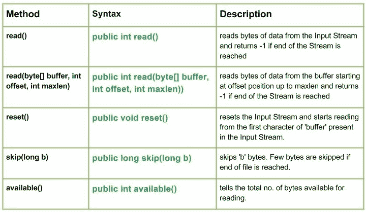

# Java 中的 Java . io . stringbufferinputstream 类

> 原文:[https://www . geesforgeks . org/Java-io-stringbufferinputstream-class-Java/](https://www.geeksforgeeks.org/java-io-stringbufferinputstream-class-java/)

[](https://media.geeksforgeeks.org/wp-content/uploads/io.StringBufferInputStream-class-in-Java.jpg)

**Java . io . stringbufferinputstream**类有助于创建一个输入流，在该流中可以从字符串中读取字节。如果我们使用这个类，我们只能读取字符串中每个字符的低 8 位。
但是如果我们使用[bytearrainputstream](https://www.geeksforgeeks.org/io-bytearrayinputstream-class-java/)，则不限制只读取字符串中每个字符的低 8 位。
此类已被 Oracle 弃用，不应再使用。

**申报:**

```
public class StringBufferInputStream
   extends InputStream
```

**施工方:**

*   **StringBufferInputStream(字符串字符串):**创建一个字符串输入流，从指定的字符串中读取数据。

**方法:**

*   **read():****Java . io . stringbufferinputstream . read()**从输入流中读取字节的数据，如果到达流的末尾，则返回-1。
    **语法:**

    ```
    public int read()
    Parameters : 
    -----------
    Return  :
    Returns read character as an integer ranging from range 0 to 65535.
    -1 : when end of file is reached.
    ```

*   **read(byte[] buffer，int offset，int maxlen):****Java . io . stringbufferinputstream . read(byte[]buffer，int offset，int maxlen))** 从缓冲区中的偏移量位置开始读取字节数据，直到 maxlen，如果到达 Stream 的末尾，则返回-1。
    **语法:**

    ```
    public int read(byte[] buffer, int offset, int maxlen))
    Parameters : 
    buffer : destination buffer to be read into  
    offset : starting position from where to store characters
    maxlen : maximum no. of characters to be read
    Return  :
    Returns all the characters read
    -1 : when end of file is reached.
    ```

*   **reset():****Java . io . stringbufferinputstream . reset()**重置输入流，并从输入流中出现的“buffer”的第一个字符开始读取。
    **语法:**

    ```
    public void reset()
    Parameters : 
    -----------
    Return  :
    void

    ```

*   **跳过(长 b):****Java . io . stringbufferinputstream . skip(长 b)** 跳过“b”字节。如果到达文件结尾，将跳过几个字节。
    **语法:**

    ```
    public long skip(long b)
    Parameters : 
    b : no. of bytes to be skipped
    Return  :
    no. of bytes skipped

    ```

*   **available():****Java . io . stringbufferinputstream . available()**表示可供读取的字节总数。
    **语法:**

    ```
    public int available()
    Parameters : 
    ----------------
    Return  :
    total no. of bytes that can be read

    ```

```
// Java program illustrating the working of StringBufferInputStream class methods
// read(), skip(), available(), reset()
// read(char[] char_array, int offset, int maxlen)

import java.io.*;
public class NewClass
{
    public static void main(String[] args) throws IOException
    {

        String str1 = "Hello Geeks";
        String str2 = "GeeksForGeeks";
        StringBufferInputStream Geek_buffer1 = new StringBufferInputStream(str1);
        StringBufferInputStream Geek_buffer2 = new StringBufferInputStream(str2);

        // USe of available() : to count total bytes to be read
        System.out.println("Use of available() 1 : "+ Geek_buffer1.available());

        int a = 0;
        System.out.print("Use of read() method : ");

        // Use of read() method : reading each byte one by one
        while((a = Geek_buffer1.read()) != -1)
        {
            // Converting byte to char
            char c1 = (char)a;
            System.out.println(c1);

            // Use of skip() method
            long char_no = Geek_buffer1.skip(1);
            System.out.println("Characters Skipped : "+ (c1+1));

        }
        System.out.println("");

        // USe of available() : to count total bytes to be read
        System.out.println("Use of available() 2 : "+ Geek_buffer2.available());

        byte[] buffer = new byte[15];

        // Use of read(char[] char_array, int offset, int maxlen):
        // reading a part of array
        Geek_buffer2.read(buffer, 1, 2);
        int b = 0;

        System.out.print("read(char[] char_array, int offset, int maxlen): ");
        while((b = Geek_buffer2.read()) != -1)
        {
            char c2 = (char)b;
            System.out.print(c2);
        }
        System.out.println("");

        // Use of reset() : to reset str1 for reading again
        Geek_buffer1.reset();
        int i = 0;
        System.out.print("\nUse of read() method again after reset() : ");

        // Use of read() method : reading each character one by one
        while((i = Geek_buffer1.read()) != -1)
        {
            char c3 = (char)i;
            System.out.print(c3);
        }
    }
}
```

**输出:**

```
Use of available() 1 : 11
Use of read() method : H
Characters Skipped : 73
l
Characters Skipped : 109
o
Characters Skipped : 112
G
Characters Skipped : 72
e
Characters Skipped : 102
s
Characters Skipped : 116

Use of available() 2 : 13
Use of read(char[] char_array, int offset, int maxlen) method : eksForGeeks

Use of read() method again after reset() : Hello Geeks
```

。
本文由 **莫希特·古普塔供稿🙂** 。如果你喜欢 GeeksforGeeks 并想投稿，你也可以使用[contribute.geeksforgeeks.org](http://www.contribute.geeksforgeeks.org)写一篇文章或者把你的文章邮寄到 contribute@geeksforgeeks.org。看到你的文章出现在极客博客主页上，帮助其他极客。

如果你发现任何不正确的地方，或者你想分享更多关于上面讨论的话题的信息，请写评论。