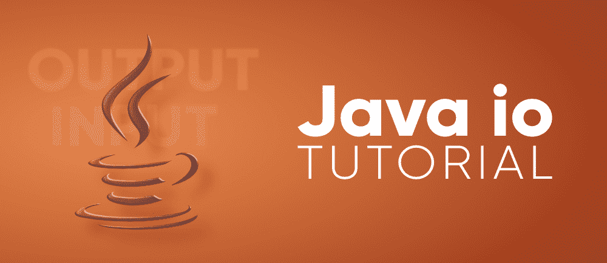
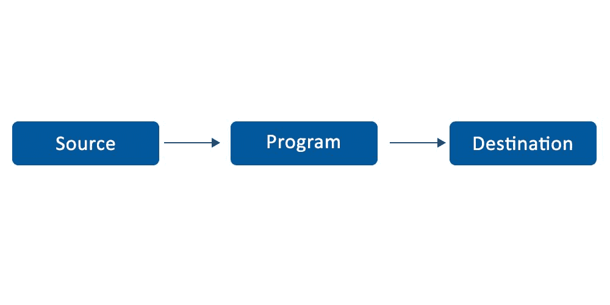
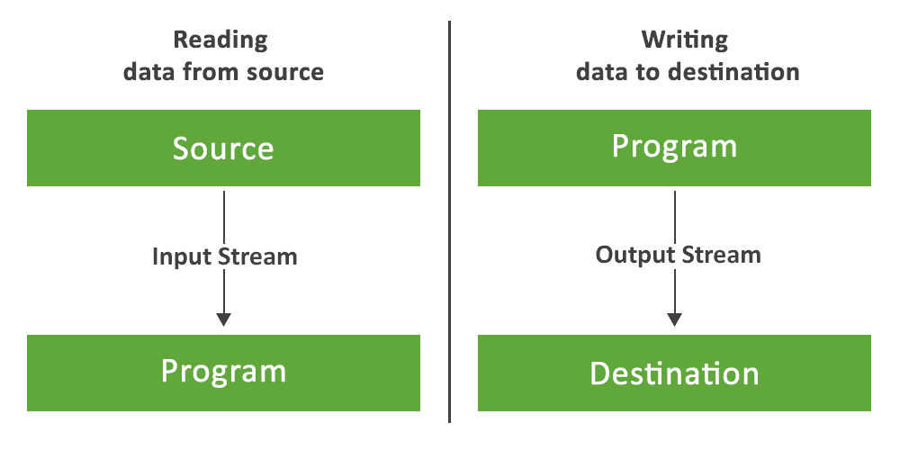
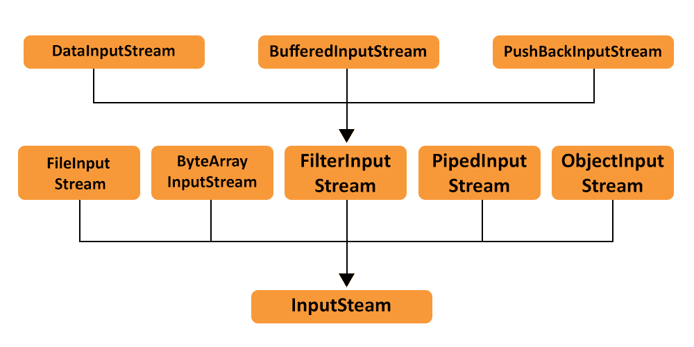

# Java IO 教程

> 原文:[https://www.geeksforgeeks.org/java-io-tutorial/](https://www.geeksforgeeks.org/java-io-tutorial/)

Java 编程语言附带了各种 API，帮助开发人员更高效地编码。其中一个 API 就是 **Java IO** API。Java IO 应用编程接口帮助用户读写数据。简而言之，我们可以说 Java IO 帮助用户获取输入并基于该输入产生输出。几乎每个应用程序或代码都需要一些输入和基于该输入产生的输出。那么我们就从 ***Java IO 教程*** 开始吧。



Java IO API 放置在[**java.io 包**](https://www.geeksforgeeks.org/java-io-packag/) 中。这个包几乎包含了用户在 Java 中执行输入输出所需的所有类。Java IO 包侧重于文件、网络流等的输入和输出。然而，Java IO 包不包括打开网络套接字的类，而网络套接字对于网络通信是必不可少的。

**java.io** 包通常包括从源中读取基本信息并将其写入目的地。下图完美地展示了一个程序从一个源获取输入数据，并基于它产生输出到某个目的地的原理。



### Java 输入输出流

在编程世界中，一个流可以被描述为一系列数据。它被称为溪流，因为它类似于持续流动的水流。Java IO 流是用户可以读取或写入的数据流。像数组一样，流没有索引读或写数据的概念。流被附加到数据源或数据目标。



***Java Streams 使用两个主流来读写数据。这些是:***

**1。输入流–**输入流用于从 Java 应用程序的源中读取数据。数据可以是任何东西，文件、阵列、外围设备或套接字。在 Java 中， **java.io.InputStream** 类是所有 Java IO 输入流的基类。



**Java IO 输入流的方法**

1.  **read()–****read()**方法用于从输入流中读取下一个字节的数据。值字节以 0 到 255 的范围传递。如果没有字节是空闲的，因为流的末尾已经到达，则传递值-1。

2.  **标记(int arg)–****标记(int arg)** 方法用于标记输入流的当前位置。它将读取设置为限制，即在标记位置无效之前可以读取的最大字节数。

3.  **复位()–****复位()**方法由 mark()方法调用。它将输入流的位置更改回标记的位置。

4.  **close()–****close()**方法用于关闭输入流，并将与该流相关联的系统资源释放给垃圾收集器。

5.  **read(byte[]arg)–****read(byte[]arg)**方法用于从输入流读取 *arg.length* 的字节数到缓冲阵列 arg。由 *read()方法*读取的字节作为 int 返回。如果长度为零，则不读取任何字节，除非努力读取至少一个字节，否则返回 0。

6.  **跳过(长 arg)–****跳过(长 arg)** 方法用于跳过和丢弃输入流中的 arg 字节。

7.  **标记支持()–****标记支持()**方法测试输入流是否支持标记和重置方法。默认情况下，Java IO InputStream 的 markSupported 方法会产生 false。

**Java IO 输入流示例:**

## Java 语言(一种计算机语言，尤用于创建网站)

```
// Java program illustrates the use of
// the Java IO InputStream methods

import java.io.*;

public class InputStreamExample
{
    public static void main(String[] args) throws Exception
    {
        InputStream input = null;
        try {

            input = new FileInputStream("Text.txt");

            // read() method - reading and printing Characters
            // one by one
            System.out.println("Char - "+(char)input.read());
            System.out.println("Char - "+(char)input.read());

            // mark() - read limiting the 'input' input stream
            input.mark(0);

            // skip() - it results in skipping of 'e' in Ge'e'ksforGeeks
            input.skip(1);
            System.out.println("skip() method comes to play");
            System.out.println("mark() method comes to play");
            System.out.println("Char - "+(char)input.read());
            System.out.println("Char - "+(char)input.read());

            boolean check = input.markSupported();
            if (input.markSupported())
            {
                // reset() method - repositioning the stream to
                // marked positions.
                input.reset();
                System.out.println("reset() invoked");
                System.out.println("Char - "+(char)input.read());
                System.out.println("Char - "+(char)input.read());
            }
            else
                System.out.println("reset() method not supported.");

            System.out.println("input.markSupported() supported"+
                              " reset() - "+check);

        }
        catch(Exception e)
        {
            // in case of I/O error
            e.printStackTrace();
        }
        finally
        {
            if (input!=null)
            {
                // Use of close() - closing the file
                // and releasing resources
                input.close();
            }
        }
    }
}
```