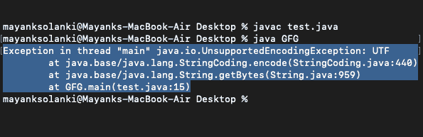

# java . io . unsupportedencodinegexception 在 Java 中的示例

> 原文:[https://www . geesforgeks . org/Java-io-unsupportedencodinegexception-in-Java-with-examples/](https://www.geeksforgeeks.org/java-io-unsupportedencodingexception-in-java-with-examples/)

当在 java 字符串或字节中使用不支持的字符编码方案时，会出现[Java . io . unsupportedencodinegexception](https://www.geeksforgeeks.org/constructor-togenericstring-method-in-java-with-examples/)**。java String getBytes 方法将请求的字符串转换为指定编码格式的字节。如果 java 不支持编码格式，方法 String getBytes 将引发具有给定编码格式的 Java . io . unSupportedencodinegexception。**

**字符编码用于确定如何将原始二进制解释为字符。CP1252 中英文视窗系统的默认编码。其他语言和系统可以使用不同的默认编码。UTF-8 编码方案通常用作字符编码方案。在 java 中，String.getBytes()和 StringCoding.encode()方法用于在原始字节和 java 字符串之间进行解释。**

****班级查看器****

```java
java.lang.Object
    java.lang.Throwable
        java.lang.Exception
            java.io.IOException
                java.io.UnsupportedEncodingException
```

> ****记住:**它确实实现了 Serializable 接口。**
> 
>  ****语法:**
> 
> ```java
> public class UnsupportedEncodingException
> extends IOException
> ```**

**不支持字符编码。接下来，让我们看看这个类的构造函数，如下所示:**

1.  ****不支持 dencodinegexception():**构造一个不包含详细信息的不支持 dencodinegexception。**
2.  ****不支持的拒绝例外(字符串):**构建一个包含详细消息的不支持的拒绝例外。**

****实施:****

**现在让我们找到一条出路，以便在 java 中重现这个问题。我们将借助下面提供的一个例子继续进行，这个例子将抛出[Java . io . unsupportdencodinegexception](https://www.geeksforgeeks.org/constructor-togenericstring-method-in-java-with-examples/)。“UTF”编码方案是无效的编码方案名称。这是因为如果编码方案未知或不受支持，java 无法将字符串解释为字节。如果识别出未知或不支持的编码方法，Java 将抛出 Java . io . unsupportdencodinegexception。**

****例****

## **Java 语言(一种计算机语言，尤用于创建网站)**

```java
// Java Program to Illustrate UnsupportedEncodingException

// Main class
// StringGetBytes
class GFG {

    // Main driver method
    public static void main(String[] args) throws Exception
    {

        // Custom input string
        String str = "GeeksforGeeks";
        // Declaring a byte array
        byte[] bytes;

        bytes = str.getBytes("UTF");

        // Now here we are trying printing
        // given string and corresponding output string
        System.out.println("Given  String : " + str);
        System.out.println("Output bytes   : " + bytes);
    }
}
```

****输出:****

****

**现在我们非常熟悉这个异常，并且已经讨论了它为什么会发生。现在，让我们想出一个办法，通过提出解决方案来摆脱 iff 这个例外。应该在 String.getBytes 方法中提供 java 支持的编码方案名称。[在继续下一步之前，请仔细查看这里提供的一套方法](https://docs.oracle.com/javase/8/docs/technotes/guides/intl/encoding.doc.html)。**

**因此，当需要对编码过程进行更多控制时，应该使用 CharsetEncoder 类。方法返回一个字节数组。**

****例****

## **Java 语言(一种计算机语言，尤用于创建网站)**

```java
// Java Program to Resolve UnsupportedEncodingException

// Main class
// StringGetBytes
public class GFG {

    // Main driver method
    public static void main(String[] args) throws Exception
    {

        // Custom input string
        String str = "GeeksforGeeks";
        byte[] bytes;

        // Getting output bytes via help of getBytes()
        // method
        bytes = str.getBytes("UTF-16");

        // Print and display input string and
        // corresponding UTF16 string
        System.out.println("Given  String : " + str);
        System.out.println("Output bytes   : " + bytes);
    }
}
```

****Output**

```java
Given  String : GeeksforGeeks
Output bytes   : [B@7cc355be

```**