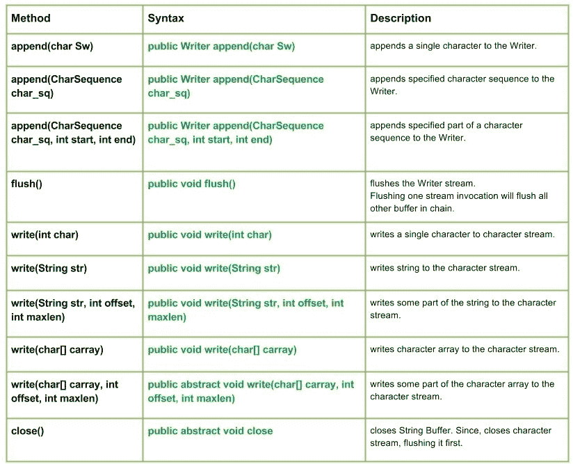

# Java 中的 Java.io.Writer 类

> 原文:[https://www.geeksforgeeks.org/java-io-writer-class-java/](https://www.geeksforgeeks.org/java-io-writer-class-java/)

[](https://media.geeksforgeeks.org/wp-content/uploads/Writer-class-in-JAVA.jpg)

**java.io.Writer 类**是一个抽象类。它用于写入字符流。
T3】申报:

```java
public abstract class Writer
  extends Object
    implements Appendable, Closeable, Flushable
```

**施工人员:**

*   **受保护的编写器():**创建一个新的字符流，该字符流本身可以在编写器上同步。
*   **受保护的编写器(对象对象):**创建一个新的字符流，它本身可以在给定的对象–“对象”上同步。

**方法:**

*   **write(int char):****Java . io . writer . write(int char)**将单个字符写入字符流。正在写入的字符包含在“char”整数值的 16 个低位中，其余 16 个高位被该方法忽略。
    **语法:**

    ```java
    public void write(int char)
    Parameters : 
    char : int value of the character to be written.
    Return  :
    void
    Exception :
    -> IOException : if in case I/O error occurs.
    ```

*   **write(String str):****Java . io . writer . write(String str)**将字符串写入字符流。
    **语法:**

    ```java
    public void write(String str)
    Parameters : 
    str : string to be written to the character stream.
    Return  :
    void
    Exception :
    -> IOException : if in case I/O error occurs.
    ```

*   **write(String str，int offset，int maxlen):****Java . io . writer . write(String str，int offset，int maxlen)** 将字符串的某个部分写入字符流。
    **语法:**

    ```java
    public void write(String str, int offset, int maxlen)
    Parameters : 
    str : string to be written to the character stream.
    offset : start position of the String
    maxlen : maximum length upto which string has to written
    Return  :
    void
    Exception :
    -> IOException : if in case I/O error occurs.
    -> IndexOutOfBoundsException : if offset is -ve or offset + maxlen = -ve || > maxlen
    ```

*   **write(char[]carray):****Java . io . writer . write(char[]carray)**将字符数组写入字符流。
    **语法:**

    ```java
    public void write(char[] carray)
    Parameters : 
    carray : character array to be written to the character stream
    Return  :
    void
    Exception :
    -> IOException : if in case I/O error occurs.
    ```

*   **write(char[] carray，int offset，int maxlen):****Java . io . writer . write(char[]carray，int offset，int maxlen)** 将字符数组的某个部分写入字符流。
    **语法:**

    ```java
    public abstract void write(char[] carray, int offset, int maxlen)
    Parameters : 
    carray : character to be written to the character stream
    offset : start position of the character array
    maxlen : maximum no. of the character of the carray has to written
    Return  :
    void
    Exception :
    -> IOException : if in case I/O error occurs.
    ```

*   **close():****Java . io . writer . close()**关闭字符流，先刷新。
    **语法:**

    ```java
    public abstract void close()
    Parameters : 
    -----------
    Return  :
    void
    Exception :
    -> IOException : if in case I/O error occurs.
    ```

*   **flush() :** **java.io.Writer.flush()** flushes the Writer stream. Flushing one stream invocation will flush all other buffer in chain.
    **Syntax:**

    ```java
    public void flush()
    Parameters : 
    -----
    Return  :
    void
    Exception :
    -> IOException : if in case I/O error occurs.
    ```

    说明 Writer 类方法使用的 Java 程序:

    ```java
    // Java program illustrating the working of Writer class methods
    // write(int char), write(String str), close()
    // write(String str, int offset, int maxlen), flush()
    // write(char[] carray, int offset, int maxlen), write(char[] carray)

    import java.io.*;

    public class NewClass
    {
        public static void main(String[] args) throws IOException
        {
            char[] carray = {'G', 'E', 'E', 'K', 'S'};

            // Initializing Writer
            Writer geek_writer1 = new PrintWriter(System.out);
            Writer geek_writer2 = new PrintWriter(System.out);
            Writer geek_writer3 = new PrintWriter(System.out);
            Writer geek_writer4 = new PrintWriter(System.out);
            Writer geek_writer5 = new PrintWriter(System.out);

            // Use of write(int char) : to write a character
            geek_writer1.write(71);
            geek_writer1.write(70);
            geek_writer1.write(71);

            // Use of flush() method
            System.out.print("Using write(int char[]) : ");
            geek_writer1.flush();

            String str = "Hello Geeks";
            // Use of write(String str) : to write string
            geek_writer2.write(str);

            // Value written by write(String str)
            System.out.print("\nUsing write(String str) : ");
            geek_writer2.flush();

            // Use of write(String str, int offset, int maxlen) 
            //: to write part of string
            geek_writer3.write(str, 2, 4);
            geek_writer3.write(str, 5, 6);

            // Value written by write(String str, int offset, int maxlen)
            System.out.print("\nUsing write(str, offset, maxlen) : ");
            geek_writer3.flush();

            geek_writer4.write(carray);
            System.out.print("\nUsing write(char[] carray) : ");
            geek_writer4.flush();

            // Use of write(char[] carray, int offset, int maxlen):
            // to write part of char array
            geek_writer5.write(carray, 1, 3);

            // Value written by write(String str, int offset, int maxlen)
            System.out.print("\nUsing write(carray, offset, maxlen) : ");
            geek_writer5.flush();

            // Use of close() method
            geek_writer1.close();
            geek_writer2.close();
            geek_writer3.close();
            geek_writer4.close();
            geek_writer5.close();

        }
    }
    ```

    **输出:**

    ```java
    Using write(int char[]) : GFG
    Using write(String str) : Hello Geeks
    Using write(str, offset, maxlen) : llo  Geeks
    Using write(char[] carray) : GEEKS
    Using write(carray, offset, maxlen) : EEK

    ```

*   **追加(char Sw):****Java . io . Writer . append(char Sw)**给 Writer 追加一个字符。
    **语法:**

    ```java
    public Writer append(char Sw)
    Parameters : 
    Sw : character to be append
    Return  :
    Writer
    Exception :
    -> IOException : if in case I/O error occurs.
    ```

*   **追加(CharSequence char _ sq):****Java . io . Writer . append(CharSequence char _ sq)**向 Writer 追加指定的字符序列。
    **语法:**

    ```java
    public Writer append(CharSequence char_sq)
    Parameters : 
    char_sq : Character sequence to append. 
    Return  :
    Writer, if char sequence is null, then NULL appends to the Writer.
    Exception :
    -> IOException : if in case I/O error occurs.
    ```

*   **append(CharSequence char_sq, int start, int end) :** **java.io.Writer.append(CharSequence char_sq, int start, int end)** appends specified part of a character sequence to the Writer.
    **Syntax:**

    ```java
    public Writer append(CharSequence char_sq, int start, int end)
    Parameters : 
    char_sq : Character sequence to append.
    start : start of character in the Char Sequence
    end : end of character in the Char Sequence
    Return  :
    void
    Exception :
    -> IOException : if in case I/O error occurs.
    -> IndexOutOfBoundsException : if start or end are -ve or start > end or 
                                      end > char_sq.length
    ```

    说明 Writer 类方法使用的 Java 程序:

    ```java
    // Java program illustrating the working of Writer class methods
    // append(CharSequence char_sq), append(char Sw)
    // append(CharSequence char_sq, int start,int end)
    // flush()

    import java.io.*;

    public class NewClass
    {
        public static void main(String[] args) throws IOException
        {
            // Initializing String Witer
            Writer geek_writer1 = new PrintWriter(System.out);
            Writer geek_writer2 = new PrintWriter(System.out);
            Writer geek_writer3 = new PrintWriter(System.out);

            // Use of write(int char) : to write a character
            geek_writer1.append('G');
            geek_writer1.append('G');
            geek_writer1.append('G');
            geek_writer1.append('G');
            geek_writer1.append('G');

            // Use of append(char Sw)
            System.out.print("append(char Sw) : ");
            geek_writer1.flush();

            // Initializing Character Sequence
            CharSequence char_sq1 = "1 Hello 1";
            CharSequence char_sq2 = " : 2 Geeks 2";

            // Use of append(CharSequence char_sq)
            geek_writer2.append(char_sq1);
            geek_writer2.append(char_sq2);

            System.out.print("\nappend(char_sq) : ");
            geek_writer2.flush();

            // Use of append(CharSequence char_sq,int start,int end)
            geek_writer3.append(char_sq1, 0, 3);
            geek_writer3.append(char_sq2, 3, 6);

            System.out.print("\nappend(char_sq,start,end) : ");
            geek_writer3.flush();

        }
    }
    ```

    **输出:**

    ```java
    Using write(int char) : GFG
    append(char Sw) : GGGGG
    append(char_sq) : 1 Hello 1 : 2 Geeks 2
    append(char_sq,start,end) : 1 H2 G
    ```

本文由 **莫希特·古普塔供稿🙂** 。如果你喜欢 GeeksforGeeks 并想投稿，你也可以使用[contribute.geeksforgeeks.org](http://www.contribute.geeksforgeeks.org)写一篇文章或者把你的文章邮寄到 contribute@geeksforgeeks.org。看到你的文章出现在极客博客主页上，帮助其他极客。

如果你发现任何不正确的地方，或者你想分享更多关于上面讨论的话题的信息，请写评论。