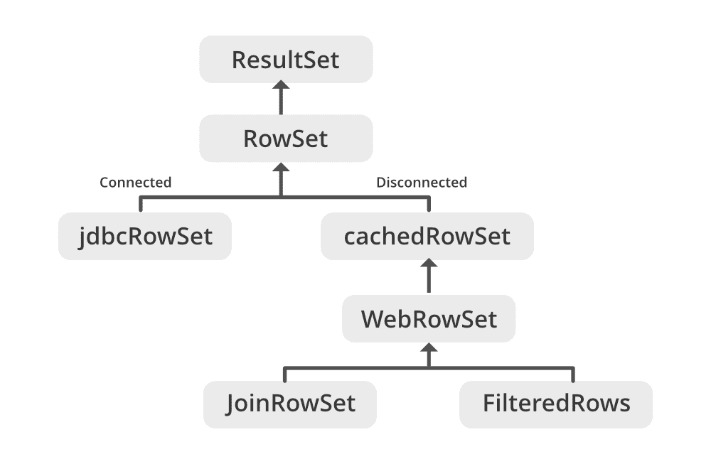

# Java JDBC–行集和结果集之间的差异

> 原文:[https://www . geesforgeks . org/Java-JDBC-行集和结果集之间的差异/](https://www.geeksforgeeks.org/java-jdbc-difference-between-row-set-and-result-set/)

结果集特征如下:

*   它保持与数据库的连接，因此它不能被序列化。
*   它不能通过网络将结果集对象从一个类传递到另一个类。
*   结果集对象保持一个指向其当前数据行的光标。最初，光标位于第一行之前。下一个方法将光标移动到下一行，因为当 ResultSet 对象中没有更多行时，它返回 false，所以可以在 while 循环中使用它来遍历结果集。
*   javax.sql.rowset.RowSet 是一个结果集的包装器，它使得在 JDBC java 中将结果集用作 JavaBeans 组件成为可能。
*   单独的结果集不能用作 JavaBeans 组件。

行集特征如下:

*   它是 JDBC 结果集的断开连接的可序列化版本。它还扩展了 ResultSet 接口。
*   行集可以序列化，因为它没有到任何数据库的连接。
*   行集接口提供了一组 JavaBeans 属性，允许将行集实例配置为连接到 JDBC 数据源并从数据源读取一些数据。一组 setter 方法(setInt、setBytes、setString 等)提供了一种将输入参数传递给行集命令属性的方法。
*   行集接口扩展了 java 中的结果集接口。
*   行集的子类是结果集的包装器，这使得将结果集用作 JavaBeans 组件成为可能。

> **注意:**行集是结果集的替代，但比结果集更有效

现在让我们总结一下如何区分它们，如下所示:

<figure class="table">

| [Row set] | Result set |
| --- | --- |
| Rows exist in javax.sql package. | The result set exists in the java.sql package. |
| Rows can be connected to or disconnected from the database. | The result set always remains connected to the database. |
| Rows are scrollable, providing more flexibility. | By default, the result set is always forward only |
| A rowset object can be serialized. | Cannot serialize. |
| You can pass a Row Set object over the network. | The ResultSet object cannot be passed to others over the network. |
| 结果集对象是一个 JavaBean 对象。行集使用 RowSetProvider.newFactory()。createJdb cRowSet()方法。 | 结果集对象不是 JavaBean 对象结果集使用 executeQuery()方法 |
| Result Set By default, the RowSet object is scrollable and updatable. | By default, the ResultSet object is not scrollable or updatable. |

</figure>