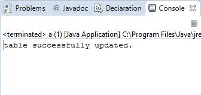
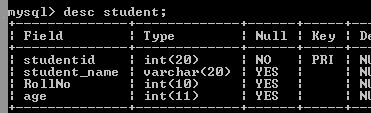

# Java JDBC–更新表格中的一列

> 原文:[https://www . geesforgeks . org/Java-JDBC-update-a-column-in-a-table/](https://www.geeksforgeeks.org/java-jdbc-update-a-column-in-a-table/)

Java 有自己的应用编程接口，JDBC 应用编程接口使用 JDBC 驱动程序进行数据库连接。 [JDBC](https://www.geeksforgeeks.org/introduction-to-jdbc/) API 提供应用程序到 JDBC 的连接，JDBC 驱动程序提供管理器到驱动程序的连接。下面是使用 JDBC 将 java 应用程序连接到我们的数据库的 5 个重要步骤。

*   注册 Java 类
*   创建连接
*   创建语句
*   执行查询
*   关闭连接

**注意:**将 mysqlconnector.jar 加载到程序中。

**步骤:**

*   从以下链接下载 MySQLConnect/J (JDBC 连接器 jar 文件)https://dev.mysql.com/downloads/connector/j
*   在**中选择**平台无关**选择操作系统**选项
*   在项目中复制 MySQL-connector-Java-5 . 1 . 34-bin . jar 文件
*   右键单击它，选择构建路径->配置构建路径->库->添加 JARS
*   在 JAR 选择窗口中，选择项目下的 MySQL-connector-Java-5 . 1 . 34-bin . JAR 库
*   单击确定
*   使用 MySQL cmd 创建一个数据库，添加一个包含记录的表。

## Java 语言(一种计算机语言，尤用于创建网站)

```
// Update a Column in a Table

// dont forget to import below package
import java.sql.*;

public class Database {

    // url that points to mysql database, 'db' is database
    // name
    static final String url
        = "jdbc:mysql://localhost:3306/db";

    public static void main(String[] args)
        throws ClassNotFoundException
    {
        try {
            // this Class.forName() method is user for
            // driver registration with name of the driver
            // as argument i have used MySQL driver
            Class.forName("com.mysql.jdbc.Driver");

            // getConnection() establishes a connection. It
            // takes url that points to your database,
            // username and password of MySQL connections as
            // arguments
            Connection conn = DriverManager.getConnection(
                url, "root", "1234");

            // create.Statement() creates statement object
            // which is responsible for executing queries on
            // table
            Statement stmt = conn.createStatement();

            // Executing the query, student is the table
            // name and RollNo is the new column
            String query
                = "ALTER TABLE student RENAME COLUMN roll_no TO RollNo";

            // executeUpdate() is used for INSERT, UPDATE,
            // DELETE statements.It returns number of rows
            // affected by the execution of the statement
            int result = stmt.executeUpdate(query);

            // if result is greater than 0, it means values
            // has been added
            if (result > 0)
                System.out.println(
                    "table successfully updated.");
            else
                System.out.println("unable to update");

            // closing connection
            conn.close();
        }
        catch (SQLException e) {
            System.out.println(e);
        }
    }
}
```

 