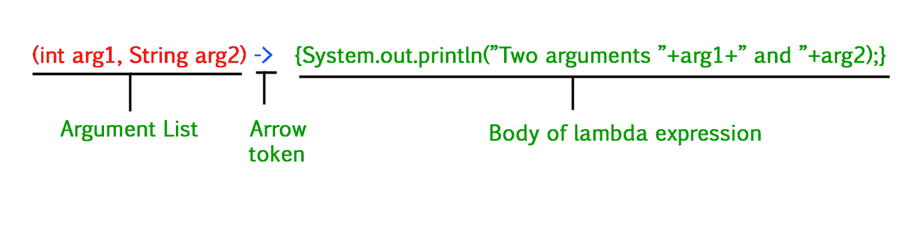

# Java–λ表达式参数

> 原文:[https://www . geesforgeks . org/Java-lambda-expressions-parameters/](https://www.geeksforgeeks.org/java-lambda-expressions-parameters/)

Lambda 表达式是匿名函数。这些函数不需要使用名称或类。Lambda 表达式是在 Java 8 中添加的。Lambda 表达式基本上表示函数接口的实例一个具有单一抽象方法的接口称为函数接口。一个例子是 [java.lang.Runnable.](https://www.geeksforgeeks.org/runnable-interface-in-java/)

Lambda 表达式只实现一个抽象函数，因此实现函数接口。谓词接口是只有一个称为 test()的抽象方法的函数接口的示例。

插图:

```java
interface Predicate
{
    ......
    abstract boolean test(T t)
}
```

上面是一个函数接口，它有一个抽象方法测试，只接收一个类型为 T 的参数，并返回一个布尔值。此方法是采用类型参数的泛型方法。这个接口可以用 lambda 表达式在程序的任何地方实现，而不是用多个函数创建类。例如，要实现只用于多线程的可运行接口，只需要实现 run()方法。然后是可比较的接口，可以使用 compare()方法实现。

**重要点:**



*   lambda 表达式的主体可以包含零个、一个或多个语句。
*   当有单个语句时，花括号不是必需的，匿名函数的返回类型与 body 表达式的返回类型相同。
*   当有多个语句时，这些语句必须用花括号括起来(代码块)，匿名函数的返回类型与代码块中返回的值的类型相同，如果没有返回任何内容，则返回 void。

这些是针对具有 void 返回类型的单个**–**行λ表达式的。

**类型 1:** 无参数。

**语法:**

```java
() -> System.out.println("Hello");
```

它采用以下形式的接口:

```java
interface Test1
{
    void print()
}
```

**类型 2:** 单参数。

**语法:**

```java
(p) -> System.out.println(p);
```

如果可以从上下文中推断出变量的类型，则不一定要使用括号

它采用以下形式的接口:

```java
interface Test2
{
    void print(Integer p)
}
```

lamdas 的类型和返回类型是自动推断的。

**类型 3:** 多参数

```java
(p1, p2) -> System.out.println(p1 + " " + p2);
```

如果可以从上下文中推断出变量的类型，则不一定要使用括号

它采用以下形式的接口:

```java
interface Test3
{
    void print(Integer p1, Integer p2)
}
```

lamdas 的类型和返回类型是自动推断的。

现在，我们已经讨论完了理论概念，现在让我们提出实现部分。因此，这里我们将主要讨论上述三种类型的代码:

> **注意:** [forEach()方法](https://www.geeksforgeeks.org/arraylist-foreach-method-in-java/)属于[可迭代接口](https://www.geeksforgeeks.org/iterable-interface-in-java/)，用于迭代一个集合。这里它采用了一个消费者类型接口的参数。这是一个功能接口，只有一个名为 accept()的抽象方法。因为它是一个函数接口，所以可以传递 lambda 表达式。

因此，如果我们确实得出以上结论

**示例 1:** 不带参数的λ表达式

## Java 语言(一种计算机语言，尤用于创建网站)

```java
// Java code to illustrate lambda expression
// without parameters

// functional interface
// without parameters
interface Test1 {
    void print();
}

class GfG {
    // functional interface parameter is passed
    static void fun(Test1 t) { t.print(); }
    public static void main(String[] args)
    {
        // lambda expression is passed
        // without parameter to functional interface t
        fun(() -> System.out.println("Hello"));
    }
}
```

**Output**

```java
Hello
```

**示例 2:** 使用单个参数键入 2λ表达式

## Java 语言(一种计算机语言，尤用于创建网站)

```java
// Java code to illustrate lambda expression
// with single parameter

// functional interface
// with one parameter of Integer type
interface Test2 {
    // The void type and the Integer type
    // is automatically inferred from here
    // and assigned to the lambda expression
    void print(Integer p);
}

class GfG {
    // takes lambda expression and a variable of
    // Integer type as arguments
    static void fun(Test2 t, Integer p)
    {
        // calls the print function
        t.print(p);
    }
    public static void main(String[] args)
    {
        // lambda expression is passed
        // with a single parameter
        // lambda expression is mapped to the
        // single argument abstract function in the
        // functional interface Test2
        fun(p -> System.out.println(p), 10);
    }
}
```

**Output**

```java
10
```

**例 3:** 多参数 3 型λ表达式

## Java 语言(一种计算机语言，尤用于创建网站)

```java
// Java code to illustrate lambda expression
// with multi parameters

// functional interface Test3
// with 2 parameter of Integer type
interface Test3 {
    // The void type and the Integer type
    // is automatically inferred from here
    // and assigned to the lambda expression
    void print(Integer p1, Integer p2);
}

class GfG {
    // takes parameter of Test3 type followed
    // by 2 integer parameters p1 and p2
    static void fun(Test3 t, Integer p1, Integer p2)
    {
        // calls the print function
        t.print(p1, p2);
    }
    public static void main(String[] args)
    {
        // lambda expression is passed
        // with two parameters
        // lambda expression is mapped to the
        // double argument abstract function in the
        // functional interface Test3
        fun((p1, p2)
                -> System.out.println(p1 + " " + p2),
            10, 20);
    }
}
```

**Output**

```java
10 20
```