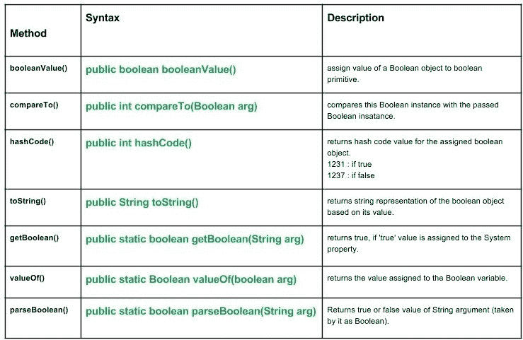

# java.lang.Boolean 类方法

> 原文:[https://www . geesforgeks . org/Java-lang-boolean-class-methods/](https://www.geeksforgeeks.org/java-lang-boolean-class-methods/)

[](https://media.geeksforgeeks.org/wp-content/uploads/Boolean-class-methods..jpg)

布尔类方法。

**About:**
Java . lang . boolean 类将基元类型的布尔值包装在对象中。
**类申报**

```java
public final class Boolean
   extends Object
      implements Serializable, Comparable
```

**施工人员:**

```java
Boolean(boolean val) : Assigning Boolean object representing the val argument.
Boolean(String str)  : Assigning Boolean object representing the value true or false
                              according to the string.
```

**方法:**

*   **Boolean value():Java . lang . Boolean . Boolean value()**用于将布尔对象的值赋给布尔基元。
    **语法:**

```java
public boolean booleanValue()
Returns : 
primitive boolean value of the boolean object.
```

*   **compare to():Java . lang . Boolean . compare to(Boolean arg)**将此布尔实例与传递的布尔实例进行比较。
    **语法:**

```java
public int compareTo(Boolean arg)
Parameter : 
arg : boolean instance to be compared with this instance.
Returns :
0 : if this instance = argumented instance.
+ve value : if this instance > argumented instance.
-ve value : if this instance < argumented instance.
```

*   **hashCode():Java . lang . boolean . hashCode()**返回指定布尔对象的哈希码值。
    **语法:**

```java
public int hashCode()
Returns : 
1231 : if the boolean value of object is true.
1237 : if the boolean value of object is false.
```

*   **toString():Java . lang . boolean . toString()**根据布尔值返回布尔对象的字符串表示形式。
    **语法:**

```java
public String toString()
Returns : 
string value - 'true' if boolean object is true, else false.
```

**实施:**

## Java 语言(一种计算机语言，尤用于创建网站)

```java
// Java program illustrating Boolean class methods
// booleanValue(), compareTo(), hashCode(), toString()
import java.lang.*;
public class NewClass
{

    public static void main(String[] args)
    {
        // Creating a boolean object and assigning value to it.
        Boolean bool1 = new Boolean(true);
        Boolean bool2 = new Boolean(false);
        System.out.println("Boolean object - bool1 : "+bool1);
        System.out.println("Boolean object - bool2 : "+bool2);

        // Creating a boolean primitive bool2
        boolean bool3, bool4 ;
        // Use of booleanValue()
        // Assigning object value to pritimive varialble.
        bool3 = bool1.booleanValue();
        System.out.println("Primitive value of object i.e. bool3 : "+bool3);

        bool4 = bool2.booleanValue();
        System.out.println("Primitive value of object i.e. bool4 : "+bool4);
        System.out.println("");

        // Comparing two boolean instances bool1 and bool2
        // Use of compareTo() method
        int comp = bool1.compareTo(bool2);
        if (comp > 0)
            System.out.println("bool1 is greater than bool2 as comp = "+comp);
        if (comp == 0)
            System.out.println("bool1 is equal to bool2 as comp = "+comp);
        if (comp < 0)
            System.out.println("bool1 is less than bool2 as comp = "+comp);
        System.out.println("");

        // HashCode value of the boolean object.
        // use of hashCode() method
        int h1 = bool1.hashCode();
        int h2 = bool2.hashCode();
        System.out.println("Hash Code value of bool1 : " + h1);
        System.out.println("Hash Code value of bool2 : " + h2);
        System.out.println("");

        // String representation of the boolean object
        // Use of toString() method.
        String s1, s2;
        s1 = bool1.toString();
        s2 = bool2.toString();
        System.out.println("String value of bool1 : " + s1);
        System.out.println("String value of bool2 : " + s2);
    }
}
```

输出:

```java
Boolean object - bool1 : true
Boolean object - bool2 : false
Primitive value of object i.e. bool3 : true
Primitive value of object i.e. bool4 : false

bool1 is greater than bool2 as comp = 1

Hash Code value of bool1 : 1231
Hash Code value of bool2 : 1237

String value of bool1 : true
String value of bool2 : false
```

*   **getBoolean():Java . lang . boolean . getBoolean(String arg)**如果“true”值被赋给 System 属性，则返回 true。
    要给属性赋值，我们使用 System 类的 setProperty()方法。
    **语法:**

```java
public static boolean getBoolean(String arg)
Parameters : 
arg - name of the property
Returns : 
true : if 'true' value is assigned to the System property.
false : if no such property exists or if exists then no value is assigned to it.
```

**实施:**

## Java 语言(一种计算机语言，尤用于创建网站)

```java
// Java program illustrating getBoolean() method
import java.lang.*; // Using Boolean and System classes
public class NewClass
{
    public static void main(String[] args)
    {
        /* Use of getBoolean() to check wheteher
        any value is assignet to Property - p1, p2 or not */
        boolean b1 = Boolean.getBoolean("p1");
        boolean b2 = Boolean.getBoolean("p2");

        System.out.println("Bool Value of p1 : "+b1);
        System.out.println("Bool Value of p2 : "+b2);
        System.out.println("");
        System.out.println("Since, no value assigned to p1, p2, Bool value is false");
        System.out.println("Assign value to p1,p2 using java.lang.System.setProperty()");

        System.out.println("");

        System.setProperty("p1","true");
        System.setProperty("p2","Cool");

        boolean b3 = Boolean.getBoolean("p1");
        boolean b4 = Boolean.getBoolean("p2");

        System.out.println("Bool Value of p1 : " + b3);
        System.out.println("Bool Value of p2 : " + b4);
    }
}
```

输出:

```java
Bool Value of p1 : false
Bool Value of p2 : false

Since, no value assigned to p1, p2, Bool value is false
Assign value to p1,p2 using java.lang.System.setProperty()

Bool Value of p1 : true
Bool Value of p2 : false
```

*   **value of():Java . Java . lang . Boolean . value of(Boolean arg)**返回分配给布尔变量的值。
    如果赋值为真，则返回真，否则返回假。
    要给属性赋值，我们使用的是 System 类的 setProperty()方法。
    **语法:**

```java
public static Boolean valueOf(boolean arg)
Parameters : 
arg - boolean variable
Returns : 
True : if true value is assigned to the boolean variable, else false 
```

*   **parse Boolean():Java . lang . Boolean . parse Boolean(String s)**返回 String 参数的真值或假值(取其为布尔值)。
    是不区分大小写的方法。
    **语法:**

```java
public static boolean parseBoolean(String arg)
Parameters : 
arg - String argument taken as Boolean
Returns : 
Boolean value of a String argument
```

**实施:**

## Java 语言(一种计算机语言，尤用于创建网站)

```java
// Java program illustratingg parseBoolean() and valueOf() method
import java.lang.*;
public class NewClass
{
    public static void main(String[] args)
    {
        boolean b1 = false;
        boolean b2 = true;

        // Use of valueOf() method
        boolean val1 = Boolean.valueOf(b1);
        boolean val2 = Boolean.valueOf(b2);

        System.out.println("Value of b1 : "+ val1);
        System.out.println("Value of b2 : " +val2);
        System.out.println("");

        // Use of parseBoolean() method
        String st1, st2, st3;
        st1 = "True";
        st2 = "yes";
        st3 = "true";  // Case insensitive

        boolean p1 = Boolean.parseBoolean(st1);
        boolean p2 = Boolean.parseBoolean(st2);
        boolean p3 = Boolean.parseBoolean(st3);

        System.out.println("Value of String st1 as Boolean : "+p1);
        System.out.println("Value of String st2 as Boolean : "+p2);
        System.out.println("Value of String st3 as Boolean : "+p3);
    }
}
```

输出:

```java
Value of b1 : false
Value of b2 : true

Value of String st1 as Boolean : true
Value of String st2 as Boolean : false
Value of String st3 as Boolean : true
```

本文由 **莫希特·古普塔** 供稿。如果你喜欢 GeeksforGeeks 并想投稿，你也可以使用[write.geeksforgeeks.org](http://www.write.geeksforgeeks.org)写一篇文章或者把你的文章邮寄到 review-team@geeksforgeeks.org。看到你的文章出现在极客博客主页上，帮助其他极客。
如果发现有不正确的地方，或者想分享更多关于上述话题的信息，请写评论。