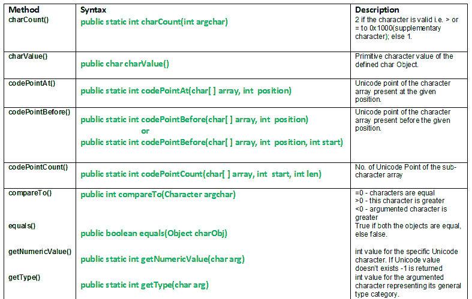

# java.lang.Character 类方法|集合 1

> 原文:[https://www . geesforgeks . org/Java-lang-character-class-methods-set-1/](https://www.geeksforgeeks.org/java-lang-character-class-methods-set-1/)

[](https://media.geeksforgeeks.org/wp-content/uploads/lang.Charcater-class-Set-1.png)

朗。字符类将原始数据类型-char 的值包装到数据类型 char 的对象中，并且该对象包含具有数据类型-char 的单个字段。这个类提供了许多关于字符操作的方法，比如把它们从小写转换成大写。字符类基于 [Unicode](https://en.wikipedia.org/wiki/Unicode) 标准提供字符信息。
类申报:

```java
public final class Character
   extends Object
      implements Serializable, Comparable
```

**下面讨论字符类的方法:**

1.  **char count():****Java . lang . char count()**方法使用 Unicode point 返回字符值的个数来表示参数字符值。一个 **Unicode 码位**用于 U+0000 到 U+10FFFF 范围内的字符值，以及作为 UTF-16 编码的编码单位的 16 位字符值。
    **语法:**

    ```java
    public static int charCount(int argchar)
    Parameters : 
    argchar : char i.e. it's Unicode point to be counted
    Return : 
    2 if the character is valid i.e. > or = to 0X1000(supplementary character); else 1   

    ```

2.  **charValue():****Java . lang . charValue()**方法返回已定义 char Object 的原始字符值。
    **语法:**

    ```java
    public char charValue()
    Return : 
    primitive character value of defined char Object.

    ```

3.  **codePointAt() :** **java.lang.Character.codePointAt(char[ ] array, int position)** method returns Unicode Point of the character array present at the argumented position.
    **Syntax :**

    ```java
    public static int codePointAt(char[] array, int position)
    Parameters : 
    array    : character array
    position : array index of character whose Unicode Point value you need.  
    Return : 
    Unicode point of the character array present at the given position  

    ```

    **解释使用 charCount()、charValue()、codePointat()方法的 Java 代码**

    ```java
    // Java program explaining Character class methods
    // charCount(), charValue(), codePointat()
    import java.lang.Character;
    public class NewClass
    {
        public static void main(String[] args)
        {
            // Use of charCount() method
            int geek = 0x9999,    // < 0x10000
                geek1 = 0x10000,      // = 0x10000
                geek2 = 0x10001;      // > 0x10000

            int check = Character.charCount(geek);
            int check1 = Character.charCount(geek1);
            int check2 = Character.charCount(geek2);

            if (check ==2)    // Checking for geek
                System.out.println("Valid Character geek");
            else
                System.out.println("Invalid Character geek");

            if (check1 ==2)   // Checking for geek1
                System.out.println("Valid Character geek1");
            else
                System.out.println("Invalid Character geek1");

            if (check2 ==2)   // Checking for geek2
                System.out.println("Valid Character geek2");
            else
                System.out.println("Invalid Character geek2");

            System.out.println("");

            // Use of charValue() method
            Character m;      // Character object m

            m = new Character('g');  // Assigning value g to m;

            char gfg;
            gfg = m.charValue();
            System.out.println("Primitive value of gfg : " +gfg);
            System.out.println("");

            // Use of codePointAt()
            char[] arg = new char[] { 'g', 'e', 'e', 'k', 's' };
            int val, val1, position  = 3;

            val = Character.codePointAt(arg, position);
            val1 = Character.codePointAt(arg, 0);

            System.out.println( "Unicode code point at " + position
                                                       + " : "+val );
            System.out.println( "Unicode code point at 0 : " + val1);
        }
    }
    ```

    输出:

    ```java
    Invalid Character geek
    Valid Character geek1
    Valid Character geek2

    Primitive value of gfg : g

    Unicode code point at 3 : 107
    Unicode code point at 0 : 103

    ```

4.  **codepoint before():****Java . lang . character . codepoint before(char[]数组，int 位置)**方法返回出现在参数化位置之前的字符数组的 Unicode 点。
    **语法:**

    ```java
    public static int codePointBefore(char[] array, int position)
                              or
    public static int codePointBefore(char[] array, int position, int start)
    Parameters : 
    array    : character array
    position : array index of character following the Unicode Point value you need.  
    start : start index of the character array
    Return : 
    Unicode point of the character array present before the given position  

    ```

5.  **codePointCount():****Java . lang . character . codePointCount()**方法返回子字符数组的 Unicode 点数。
    **语法:**

    ```java
    public static int codePointCount(char[] array, int start, int len)
    Parameters : 
    array  : character array
    start  : starting index of the array
    length : length of the character sub-array   
    Return : 
    no. of Unicode Point of the sub-character array.
    Exception : 
    --> NullPointerException
    --> IndexOutOfBoundsException 

    ```

6.  **compare to():****Java . lang . Character . compare to(Character argChar)**方法将给定的字符与有争议的字符进行比较。
    **语法:**

```java
public int compareTo(Character argChar)
Parameters : 
argChar : character to be compared with  
Return : 
= 0 : if both characters are equal 
> 0 : if given this character is greater
< 0 : if argumented character is greater

```

**解释使用 codePointBefore()、codePointCount()、compareTo()方法的 Java 代码**

```java
// Java program explaining Character class methods
// codePointBefore(), codePointCount(), compareTo()
import java.lang.Character;
public class NewClass
{
    public static void main(String[] args)
    {
        // Use of codePointBefore()
        char[] arg = new char[] { 'g', 'e', 'e', 'k', 's' };
        int position  = 4;

        int val = Character.codePointBefore(arg, position);
        int val1 = Character.codePointBefore(arg, 1);
        int val2 = Character.codePointBefore(arg, 3, 1);

        System.out.println( "Unicode code point before " + position +
                                                       " : " + val );
        System.out.println( "Unicode code point before 1 : " + val1 );
        System.out.println( "Unicode code point before 3 to 1 : "
                                                              + val2);
        System.out.println("");

        // Use of codePointCount()
        int count = Character.codePointCount(arg, 1,3 );

        System.out.println("No. of Unicode points : " + count);
        System.out.println("");

        // Use of compareTo()
        Character g1 = new Character('g');
        Character g2 = new Character('o');

        int check = g1.compareTo(g2);
        System.out.println("g1 < g2 : " + check);
        int check1 = g2.compareTo(g1);
        System.out.println("g2 > g1 : " + check1);
        int check2 = g2.compareTo(g2);
        System.out.println("g2 = g2 : " + check2);
    }
}
```

输出:

```java
Unicode code point before 4 : 107
Unicode code point before 1 : 103
Unicode code point before 3 to 1 : 101

No. of Unicode points : 3

g1  g1 : 8
g2 = g2 : 0

```

14.  **equals():****Java . lang . character . equals()**方法将当前 char 对象与参数化 char 对象进行比较。
    **语法:**

    ```java
    public boolean equals(Object charObj)
    Parameters : 
    charObj : char object to compare with 
    Return : 
    true if both the objects are equal, else false.

    ```

15.  **getNumericValue():****Java . lang . character . getNumericValue(char arg)**方法返回特定 Unicode 字符的 int 值。
    A–Z 值范围 u0041 至 u005A
    a -z 值范围 u0061 至 u007A
    **语法:**

    ```java
    public static int getNumericValue(char arg)
    Parameters : 
    arg : char value
    Return : 
    int value for the specific Unicode character.
    if Unicode value doesn't exists -1 is returned.

    ```

16.  **getType() :** **java.lang.Character.getType(char arg)** method identifies the general type of character
    A – Z value ranges u0041 to u005A
    a -z value ranges u0061 to u007A
    **Syntax :**

    ```java
    public static int getType(char arg)
    Parameters : 
    arg : char value
    Return : 
    int value for the argumented character representing its general type category. 

    ```

    '

    **解释 equals()，getNumericValue()，getType()方法使用的 Java 代码**

    ```java
    // Java program explaining Character class methods
    // equals(), getNumericValue(), getType()
    import java.lang.Character;
    public class NewClass
    {
        public static void main(String[] args)
        {
            // Use of equals() method
            Character g1 = new Character('g');
            Character g2 = new Character('O');

            boolean check = g1.equals(g2);
            boolean check1 = g1.equals(g1);
            System.out.println("Are g and o equal? : " + check);
            System.out.println("Are g and g equal? : " + check1);
            System.out.println("");

            // Use of getNumericValue() method
            int c = Character.getNumericValue(g1);
            int c1 = Character.getNumericValue(g2);
            System.out.println("Int value for g : " + c);
            System.out.println("Int value for A : " + c1);
            System.out.println("");

            // Use of getType() method
            Character g3 = new Character('{content}apos;);
            Character g4 = new Character('6');

            int r1 = Character.getType(g1);
            int r2 = Character.getType(g2);
            int r3 = Character.getType(g3);
            int r4 = Character.getType(g4);

            System.out.println("Type for lowercase : " + r1);
            System.out.println("Type for uppercase : " + r2);
            System.out.println("Type for currency  : " + r3);
            System.out.println("Type for numeric   : " + r4);
        }
    }
    ```

    输出:

    ```java
    Are g and o equal? : false
    Are g and g equal? : true

    Int value for g : 16
    Int value for A : 24

    Type for lowercase : 2
    Type for uppercase : 1
    Type for currency  : 26
    Type for numeric   : 9

    ```

    本文由 <font color="green">**莫希特·古普塔**</font> 供稿。如果你喜欢 GeeksforGeeks 并想投稿，你也可以使用[write.geeksforgeeks.org](https://write.geeksforgeeks.org)写一篇文章或者把你的文章邮寄到 review-team@geeksforgeeks.org。看到你的文章出现在极客博客主页上，帮助其他极客。

    如果你发现任何不正确的地方，或者你想分享更多关于上面讨论的话题的信息，请写评论。