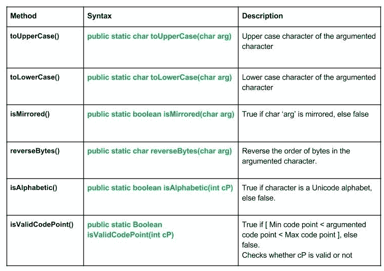

# java.lang.Character 类–方法|集合 2

> 原文:[https://www . geesforgeks . org/Java-lang-character-class-methods-set-2/](https://www.geeksforgeeks.org/java-lang-character-class-methods-set-2/)

[](https://media.geeksforgeeks.org/wp-content/uploads/lang.Character_methods.jpg)

朗。字符方法

 **[Java . lang . character class–methods | Set 1](https://www.geeksforgeeks.org/java-lang-character-class-methods-set-1/)**

下面讨论字符类的方法:

1.  **toUpperCase():****Java . lang . toUpperCase(char arg)**方法基于 Unicode 值将参数中的给定字符转换为大写。
    **语法:**

    ```
    public static char toUpperCase(char arg)
    Parameters : 
    arg : character to be converted to Upper case
    Return : 
    Upper case character of the argumented character.  

    ```

2.  **toLowerCase():****Java . lang . toLowerCase(char arg)**方法基于 Unicode 值将参数中的给定字符转换为小写。
    **语法:**

```
public static char toLowerCase(char arg)
Parameters : 
arg : character to be converted to Lower case
Return : 
Lower case character of the argumented character.  

```

*   **isMirrored() :** **java.lang.Character.isMirrored(char arg)** method checks whether passed argument is mirrored or not, based on Unicode values. Mirrored characters should have their glyphs horizontally mirrored when displayed in text that is right-to-left. For example, ‘\u0028’ LEFT PARENTHESIS is semantically defined to be an opening parenthesis. This will appear as a “(” in text that is left-to-right but as a “)” in text that is right-to-left.
    e.g. : [ ] { } ( )
    **Syntax :**

    ```
    public static boolean isMirrored(char arg)
    Parameters : 
    arg : argumented character 
    true if char 'arg' is mirrored, else false.

    ```

    **解释 toUpperCase()，toLowerCase()，isMirrored()方法使用的 Java 代码**

    ```
    // Java program explaining Character class methods
    // toUpperCase(), toLowerCase(), isMirrored()
    import java.lang.Character;
    public class NewClass
    {
        public static void main(String[] args)
        {
            // Use of toUpperCase() method
            Character g1 = new Character('g');
            Character g2 = new Character('O');

            char chUpper = Character.toUpperCase(g1);
            char chUpper1 = Character.toUpperCase(g2);

            System.out.println("Upper value for g : "+ chUpper);
            System.out.println("Upper value for O : "+ chUpper1);
            System.out.println("");        

            // Use of toLowerCase() method
            char chLower = Character.toLowerCase(g1);
            char chLower1 = Character.toLowerCase(g2);
            System.out.println("Lower value for G : "+ chLower);
            System.out.println("Lower value for O : "+ chLower1);
            System.out.println("");

            // Use of isMirrored() method
            Character g3 = new Character('-');
            Character g4 = new Character(')');
            Character g5 = new Character('{');
            Character g6 = new Character(']');

            boolean checkBool1 = Character.isMirrored(g3);
            boolean checkBool2 = Character.isMirrored(g4);
            boolean checkBool3 = Character.isMirrored(g5);
            boolean checkBool4 = Character.isMirrored(g6);

            System.out.println("Checking - : "+ checkBool1);
            System.out.println("Checking ) : "+ checkBool2);
            System.out.println("Checking { : "+ checkBool3);
            System.out.println("Checking ] : "+ checkBool4);
        }
    }
    ```

    输出:

    ```
    Upper value for g : G
    Upper value for O : O

    Lower value for G : g
    Lower value for O : o

    Checking - : false
    Checking ) : true
    Checking { : true
    Checking ] : true

    ```

    *   **reverse bytes():****Java . lang . character . reverse bytes()**方法通过反转参数化字符中字节的顺序返回一个字符。
    **语法:**

    ```
    public static char reverseBytes()
    Parameters : 
    cP : code point, need to check
    Return : 
    character with reversed order of bytes in the argumented character

    ```

    *   **isAlphabetic():****Java . lang . character . isAlphabetic(int cP)**方法检查论证字符(代码点)是否是字母表
    **语法:**

    ```
    public static boolean isAlphabetic(int codePoint)
    Parameters : 
    cP : code point, need to check.  
    Return : 
    True if character is a Unicode alphabet, else false
    Exception : 
    --> NullPointerException
    --> IndexOutOfBoundsException 

    ```

    *   **isValidCodePoint() :** **java.lang.Character.isValidCodePoint( int cP)** method checks whether the argumented Unicode is actually valid or not
    **Syntax :**

    ```
    public static boolean isValidCodePoint(int codePoint)
    Parameters : 
    cP : code point to be tested  
    Return : 
    true if Min code point <  Argumented code point < Max code point

    ```

    **解释 isValidCodePoint()，reverseBytes()，isAlphabetical()方法使用的 Java 代码**

    ```
    // Java program explaining Character class methods
    // isValidCodePoint(), reverseBytes(), isAlphabetical()
    import java.lang.Character;
    public class NewClass
    {
        public static void main(String[] args)
        {
            // Use of reverseBytes() method
            Character g1 = new Character('1');
            Character g2 = new Character('s');

            char chreverse = Character.reverseBytes(g1);
            char chreverse1 = Character.reverseBytes(g2);

            System.out.println("Reverse char for 1 : "+ chreverse);
            System.out.println("Revrese char for s : "+ chreverse1);
            System.out.println("");

            // Use of isAlphabetical() method
            int c1 = 101, c2 = 132;
            boolean check1 = Character.isAlphabetic(c1);
            boolean check2 = Character.isAlphabetic(c2);
            System.out.println("Is Unicode 66 alphabetic  : "+ check1);
            System.out.println("Is Unicode 132 alphabetic : "+ check2);
            System.out.println("");

            // Use of isValidCodePoint() method
            int c3 = 0x012343, c4 = 0x01344ffff;
            boolean check4 = Character.isValidCodePoint(c4);
            boolean check3 = Character.isValidCodePoint(c3);
            System.out.println("Validity check : "+ check3);
            System.out.println("Validity check : "+ check4);
        }
    }
    ```

    输出:

    ```
    Reverse char for 1 : ?
    Reverse char for s : ?

    Is Unicode 66 alphabetic  : true
    Is Unicode 132 alphabetic : false

    Validity check : true
    Validity check : false

    ```

    本文由 <font color="green">**莫希特·古普塔**</font> 供稿。如果你喜欢 GeeksforGeeks 并想投稿，你也可以使用[contribute.geeksforgeeks.org](http://www.contribute.geeksforgeeks.org)写一篇文章或者把你的文章邮寄到 contribute@geeksforgeeks.org。看到你的文章出现在极客博客主页上，帮助其他极客。

    如果你发现任何不正确的地方，或者你想分享更多关于上面讨论的话题的信息，请写评论。