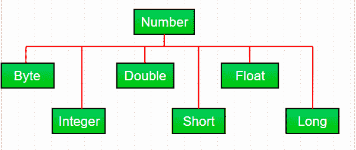

# Java 中的 Java.lang.Number 类

> 原文:[https://www.geeksforgeeks.org/java-lang-number-class-java/](https://www.geeksforgeeks.org/java-lang-number-class-java/)

大多数时候，在 java 中处理数字时，我们使用[原始数据类型](https://www.geeksforgeeks.org/data-types-in-java/)。但是，在 *java.lang* 包中的抽象类 Number 下，Java 还提供了各种数值[包装](https://www.geeksforgeeks.org/primitive-wrapper-classes-are-immutable-in-java/)子类。Number 类下主要有**六个**子类。这些子类定义了一些在处理数字时经常使用的有用方法。



这些类将原始数据类型“包装”在相应的对象中。通常，包装是由编译器完成的。如果在需要对象的地方使用基元，编译器会将该基元打包到它的包装类中。同样，如果在需要原语时使用 Number 对象，编译器会为您取消该对象的装箱。这也称为自动装箱和拆箱。
**为什么在原始数据上使用 Number 类对象？**T3】

*   由数字类定义的常数，如提供数据类型上限和下限的最小值和最大值，非常有用。
*   Number 类对象可以用作需要对象的方法的参数(通常在操作数字集合时使用)。
*   类方法可用于将值转换成其他基元类型，转换成字符串，以及在数字系统(十进制、八进制、十六进制、二进制)之间进行转换。

**所有数字子类通用的方法:**

1.  **xxx xxxValue()** :这里 xxx 代表基元数数据类型(字节、短、int、long、float、double)。该方法用于将[这个](https://www.geeksforgeeks.org/this-reference-in-java/)数字对象的值转换为指定的原始数据类型。

```
Syntax : 
byte byteValue()
short shortValue()
int intValue()
long longValue()
float floatValue()
double doubleValue()
Parameters : 
----
Returns :
the numeric value represented by this object
after conversion to specified type

```

## Java 语言(一种计算机语言，尤用于创建网站)

```
//Java program to demonstrate xxxValue() method
public class Test
{
    public static void main(String[] args)
    {
        // Creating a Double Class object with value "6.9685"
        Double d = new Double("6.9685");

        // Converting this Double(Number) object to
        // different primitive data types
        byte b = d.byteValue();
        short s = d.shortValue();
        int i = d.intValue();
        long l = d.longValue();
        float f = d.floatValue();
        double d1 = d.doubleValue();

        System.out.println("value of d after converting it to byte : " + b);
        System.out.println("value of d after converting it to short : " + s);
        System.out.println("value of d after converting it to int : " + i);
        System.out.println("value of d after converting it to long : " + l);
        System.out.println("value of d after converting it to float : " + f);
        System.out.println("value of d after converting it to double : " + d1);
    }
}
```

输出:

```
value of d after converting it to byte : 6
value of d after converting it to short : 6
value of d after converting it to int : 6
value of d after converting it to long : 6
value of d after converting it to float : 6.9685
value of d after converting it to double : 6.9685

```

**注**:转换时，可能会出现精度损失。例如，我们可以看到，在从 Double 对象转换为 int 数据类型时，省略了分数部分(" . 9685 ")。

*   **int compare to(Number subclass referenceName)**:此方法用于将[这个](https://www.geeksforgeeks.org/this-reference-in-java/) Number 对象与指定的参数进行比较。但是，不能比较两种不同的类型，因此调用该方法的参数和 Number 对象应该属于同一类型。引用名称可以是字节、双精度、整数、浮点、长或短。

```
Syntax : 
public int compareTo( NumberSubClass referenceName )
Parameters : 
referenceName - any NumberSubClass type value
Returns :
the value 0 if the Number is equal to the argument.
the value 1 if the Number is less than the argument.
the value -1 if the Number is greater than the argument.

```

## Java 语言(一种计算机语言，尤用于创建网站)

```
//Java program to demonstrate compareTo() method
public class Test
{
    public static void main(String[] args)
    {
        // creating an Integer Class object with value "10"
        Integer i = new Integer("10");

        // comparing value of i
        System.out.println(i.compareTo(7));
        System.out.println(i.compareTo(11));
        System.out.println(i.compareTo(10));
    }
}
```

输出:

```
1
-1
0

```

*   **boolean equals(Object obj)** :此方法判断[这个](https://www.geeksforgeeks.org/this-reference-in-java/) Number 对象是否等于自变量。

```
Syntax : 
public boolean equals(Object obj)
Parameters : 
obj - any object
Returns :
The method returns true if the argument is not null and 
is an object of the same type and with the same numeric value,
otherwise false.

```

## Java 语言(一种计算机语言，尤用于创建网站)

```
//Java program to demonstrate equals() method
public class Test
{
    public static void main(String[] args)
    {
        // creating a Short Class object with value "15"
        Short s = new Short("15");

        // creating a Short Class object with value "10"
        Short x = 10;

        // creating an Integer Class object with value "15"
        Integer y = 15;

        // creating another Short Class object with value "15"
        Short z = 15;

        //comparing s with other objects
        System.out.println(s.equals(x));
        System.out.println(s.equals(y));
        System.out.println(s.equals(z));
    }
}
```

输出:

```
false
false
true

```

*   **int parseInt(String s，int radix)** :此方法用于获取[字符串](https://www.geeksforgeeks.org/string-class-in-java/)的原始数据类型。基数用于返回十进制(10)、八进制(8)或十六进制(16)等表示作为输出。

```
Syntax : 
static int parseInt(String s, int radix)
Parameters : 
s - any String representation of decimal
radix - any radix value
Returns :
the integer value represented by the argument in decimal.
Throws :
NumberFormatException : if the string does not contain a parsable integer.

```

## Java 语言(一种计算机语言，尤用于创建网站)

```
//Java program to demonstrate Integer.parseInt() method
public class Test
{
    public static void main(String[] args)
    {
        // parsing different strings
        int z = Integer.parseInt("654",8);
        int a = Integer.parseInt("-FF", 16);
        long l = Long.parseLong("2158611234",10);

        System.out.println(z);
        System.out.println(a);
        System.out.println(l);

        // run-time NumberFormatException will occur here
        // "Geeks" is not a parsable string
        int x = Integer.parseInt("Geeks",8);

        // run-time NumberFormatException will occur here
        // (for octal(8),allowed digits are [0-7])
        int y = Integer.parseInt("99",8);

    }
}
```

输出:

```
428
-255
2158611234
Exception in thread "main" java.lang.NumberFormatException: For input string: "Geeks"
    at java.lang.NumberFormatException.forInputString(NumberFormatException.java:65)
    at java.lang.Integer.parseInt(Integer.java:580)
    at Test.main(Test.java:17)

```

*   **int parseInt(字符串)**:该方法是上述方法的另一个变体，默认情况下基数为 10(十进制)。

```
Syntax : 
static int parseInt(String s)
Parameters : 
s - any String representation of decimal
Returns :
the integer value represented by the argument in decimal.
Throws :
NumberFormatException : if the string does not contain a parsable integer.

```

## Java 语言(一种计算机语言，尤用于创建网站)

```
//Java program to demonstrate Integer.parseInt() method
public class Test
{
    public static void main(String[] args)
    {
        // parsing different strings
        int z = Integer.parseInt("654");
        long l = Long.parseLong("2158611234");

        System.out.println(z);
        System.out.println(l);

        // run-time NumberFormatException will occur here
        // "Geeks" is not a parsable string
        int x = Integer.parseInt("Geeks");

        // run-time NumberFormatException will occur here
        // (for decimal(10),allowed digits are [0-9])
        int a = Integer.parseInt("-FF");

    }
}
```

输出:

```
654
2158611234
Exception in thread "main" java.lang.NumberFormatException: For input string: "Geeks"
    at java.lang.NumberFormatException.forInputString(NumberFormatException.java:65)
    at java.lang.Integer.parseInt(Integer.java:580)
    at java.lang.Integer.parseInt(Integer.java:615)
    at Test.main(Test.java:15)

```

*   **String toString()**:toString()方法有两种变体。它们用于获取数字的字符串表示形式。这些方法的其他变体是**integer . tobinarystring(int I)**、**integer . toexstring(int I)**、**integer . tooctalstring(int I)**，它们将分别返回指定整数(I)的二进制、六进制、八进制字符串表示。

```
Syntax : 
String toString()
String toString(int i)
Parameters : 
String toString() - no parameter
String toString(int i) - i: any integer value
Returns :
String toString() -
returns a String object representing the value of the Number object 
on which it is invoked.
String toString(int i) -
returns a decimal String object representing the specified integer(i)

```

## Java 语言(一种计算机语言，尤用于创建网站)

```
//Java program to demonstrate Integer.toString()
//and Integer.toString(int i) method
public class Test
{
    public static void main(String[] args)
    {
        // demonstrating toString() method
        Integer x = 12;

        System.out.println(x.toString());

        // demonstrating toString(int i) method
        System.out.println(Integer.toString(12));

        System.out.println(Integer.toBinaryString(152));
        System.out.println(Integer.toHexString(152));
        System.out.println(Integer.toOctalString(152));
    }
}
```

输出:

```
12
12
10011000
98
230

```

*   **整数值 of()**:value of()方法有三种变体。所有这三种方法都返回一个包含原始整数值的整数对象。

```
Syntax : 
Integer valueOf(int i)
Integer valueOf(String s)
Integer valueOf(String s, int radix)
Parameters : 
i - any integer value
s - any String representation of decimal
radix - any radix value
Returns :
valueOf(int i) : an Integer object holding the valuerepresented by the int argument.
valueOf(String s) : an Integer object holding value represented by the string argument.
valueOf(String s, int radix) : an Integer object holding the value
 represented by the string argument with base radix.
Throws :
valueOf(String s) -
NumberFormatException : if the string does not contain a parsable integer.
valueOf(String s, int radix) -
NumberFormatException : if the string does not contain a parsable integer.

```

## Java 语言(一种计算机语言，尤用于创建网站)

```
// Java program to demonstrate valueOf() method
public class Test
{
    public static void main(String[] args)
    {
        // demonstrating valueOf(int i) method
        System.out.println("Demonstrating valueOf(int i) method");
        Integer i =Integer.valueOf(50);
        Double d = Double.valueOf(9.36);
        System.out.println(i);
        System.out.println(d);

        // demonstrating valueOf(String s) method
        System.out.println("Demonstrating valueOf(String s) method");
        Integer n = Integer.valueOf("333");
        Integer m = Integer.valueOf("-255");
        System.out.println(n);
        System.out.println(m);

        // demonstrating valueOf(String s,int radix) method
        System.out.println("Demonstrating (String s,int radix) method");
        Integer y = Integer.valueOf("333",8);
        Integer x = Integer.valueOf("-255",16);
        Long l = Long.valueOf("51688245",16);
        System.out.println(y);
        System.out.println(x);
        System.out.println(l);

        // run-time NumberFormatException will occur in below cases
        Integer a = Integer.valueOf("Geeks");
        Integer b = Integer.valueOf("Geeks",16);
    }
}
```

输出:

```
Demonstrating valueOf(int i) method
50
9.36
Demonstrating valueOf(String s) method
333
-255
Demonstrating (String s,int radix) method
219
-597
1365803589

Exception in thread "main" java.lang.NumberFormatException: For input string: "Geeks"
    at java.lang.NumberFormatException.forInputString(NumberFormatException.java:65)
    at java.lang.Integer.parseInt(Integer.java:580)
    at java.lang.Integer.valueOf(Integer.java:766)
    at Test.main(Test.java:28)

```

**练习问题:**
**给出的 java 代码输出是什么？**

## Java 语言(一种计算机语言，尤用于创建网站)

```
public class Test
{
   public static void main(String[] args)
   {
       Integer i = Integer.parseInt("Kona", 27);
       System.out.println(i);
   }
}
```

**选项:**

```
A) NumberFormatException at run-time
B) NumberFormatException at compile-time
C) 411787

```

**回答:**

```
C) 411787

```

**解释:**
由于基数是 27，所以字符串文字中允许的字符是[0-9]，[A-Q](对于 10 到 26)。所以它的值将按如下方式计算:
=>a*(27^0)+n*(27^1)+o*(27^2)+k*(27^3)
=>10 * 1+23 * 27+24 * 27 * 27+20 * 27 * 27 * 27
=>10+621+17496+393660
=>411787
本文由**高拉夫·米格拉尼
供稿如果你喜欢 GeeksforGeeks 并想投稿，你也可以使用[write.geeksforgeeks.org](https://write.geeksforgeeks.org)写一篇文章或者把你的文章邮寄到 review-team@geeksforgeeks.org。看到你的文章出现在极客博客主页上，帮助其他极客。
如果发现有不正确的地方，或者想分享更多关于上述话题的信息，请写评论。**