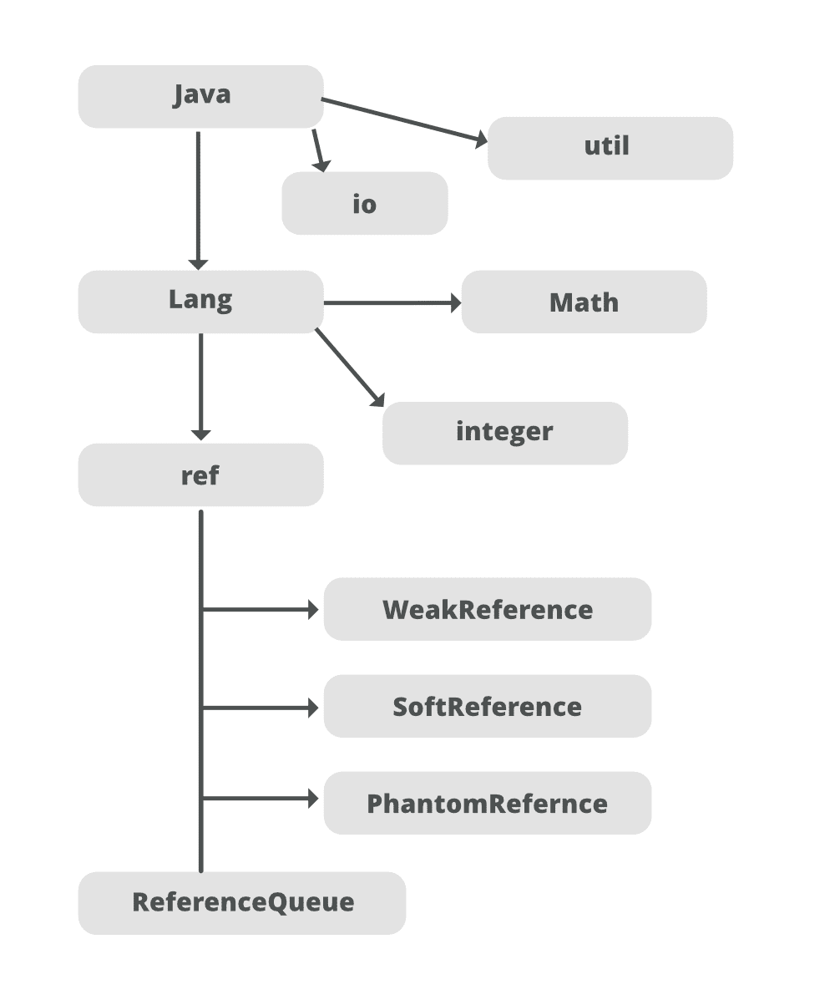

# java 中的 java.lang.ref.ReferenceQueue 类

> 原文:[https://www . geesforgeks . org/Java-lang-ref-reference queue-class-in-Java/](https://www.geeksforgeeks.org/java-lang-ref-referencequeue-class-in-java/)

A [ReferenceQueue](https://www.geeksforgeeks.org/types-references-java/) 是一个简单的数据结构，当引用字段被清除(设置为空)时，垃圾收集器将引用对象放在这个数据结构上。您可以使用一个引用队列来找出一个对象何时变得柔和、弱或幻影可达，因此您的程序可以根据这些知识采取一些行动。例如，一个程序可能会执行一些终结后清理处理，这些处理要求一个对象是不可到达的(例如，在 Java 堆之外重新分配资源)，因为它知道一个对象变成了虚拟可到达的。



ReferenceQueue 可用于确定对象是弱的、软的还是幻影不可达。现在，让我们更深入地了解一下这个类中调用的构造函数，如下所示:

**public ReferenceQueue():** 它构造了一个新的引用对象队列。

此外，让我们定义 ReferenceQueue 类中的方法

<figure class="table">

| Method name | Method description |
| --- | --- |
| polling | Poll this queue to see if the reference object is available. If one is available without further delay, it will be removed from the queue and returned. Otherwise, this method immediately returns null. |
| remove | Remove the next reference object in this queue and block until one is available. |
| Remove (long timeout) | Remove the next reference object in the queue and block until one of them becomes available or the given timeout period expires. |

</figure>

让我们单独详细讨论上述方法，如下所示:

**方法 1:**[*轮询()*](https://www.geeksforgeeks.org/queue-poll-method-in-java/) 方法[队列接口](https://www.geeksforgeeks.org/queue-interface-java/)返回并移除容器前面的元素。它删除容器中的元素。当队列为空时，该方法不会引发异常，而是返回 null。

**语法:**

```java
E poll()
```

**返回:**这个方法返回容器前面或者队列头的元素。当队列为空时，它返回空值。

**方法 2:**[队列接口](https://www.geeksforgeeks.org/queue-interface-java/)的 remove()方法返回并移除容器前面的元素。它删除容器的头部。当队列为空时，该方法抛出一个名为[的异常。](https://www.geeksforgeeks.org/collections-max-method-in-java-with-examples/)

**语法:**

```java
E remove()
```

**返回:**该方法返回队列的**头**。

**异常:**当队列为空时，函数抛出*nosucheelementexception*。

到目前为止，我们已经讨论完了这门课的主要方法。让我们直接进入这个类中这些方法的实现。

**示例:**

## Java 语言(一种计算机语言，尤用于创建网站)

```java
// Java Program to illustrate ReferenceQueue Class

// Importing classes from package- java.lang.ref
// to make a deal between program with garbage collector
import java.lang.ref.ReferenceQueue;
import java.lang.ref.WeakReference;

// Class 1
// Helper class
class HelperClass {

    // Method of this class
    void Display()
    {
        // Print statement whenever
        // function of HelperClass is called
        System.out.println(
            "HelperClass Display() invoked...");
    }
}

// Class 2
// Main class
class GFG {

    // Main drive method
    public static void main(String[] args)
    {

        // Creating new object of HelperClass
        HelperClass obj = new HelperClass();

        // Creating Reference queue of HelperClass
        ReferenceQueue<HelperClass> rq
            = new ReferenceQueue<>();

        // Creating Phantom reference
        WeakReference<HelperClass> wr
            = new WeakReference<>(obj);

        // Display message
        System.out.println("-> Reference Queue Object :");

        // Printing reference queue object
        System.out.println(rq);

        // Display message
        System.out.println("-> Reference Queue Poll :");

        // Checking if phantom object is lined up
        // or cleared in the queue
        // using the poll() method
        System.out.println(rq.poll());
    }
}
```

**Output**

```java
-> Reference Queue Object :
java.lang.ref.ReferenceQueue@214c265e
-> Reference Queue Poll :
null
```