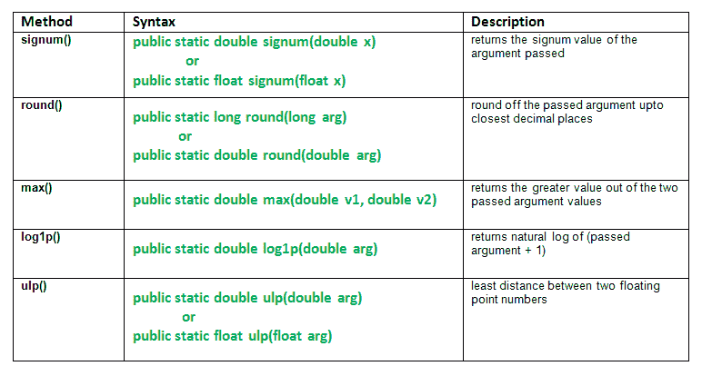

# java.math 类及其方法|第 1 集

> 原文:[https://www . geesforgeks . org/Java-math-class-methods-set-1/](https://www.geeksforgeeks.org/java-math-class-methods-set-1/)

数学类提供数学函数来执行基本的数值运算，如指数、对数、平方根和三角函数。cosh、sin、tan、abs、bitLength、乘法等等。数学类函数的实现不返回逐位相同的结果。因此，执行更好的实现。

**班级申报**

```java
public final class Math  extends Object
```

本集讲解以下方法:
[](https://media.geeksforgeeks.org/wp-content/uploads/java.math-class-methods.png)

**方法**

1.  **signum() :** **java.math.signum()** method returns the signum value of the argument passed.

    ```java
                                        -1    if x < 0
                        signum fun(x) =  0    if x = 0
                                         1    if x > 0

    ```

    **注:**

    **语法:**

    ```java
    public static double signum(double x)
                   or
    public static float signum(float x)
    Parameters:
    x - the argument whose signum value we need
    Returns:
    signum value of x

    ```

2.  **round():****Java . math . round()**方法将传递的参数四舍五入到最接近的小数位数。
    **注:**结果为 0，如果自变量为 NaN。
    **语法:**

    ```java
    public static long round(long arg)
                 or
    public static double round(double arg)
    Parameters:
    arg - argument needs to round off 
    Returns:
    round off value of the argument

    ```

3.  **max():****Java . math . max(double v1，double v2)** 方法返回两个传递的参数值中较大的值。
    这种方法只是比较使用量级，不考虑任何符号。
    **语法:**

    ```java
    public static double max(double v1, double v2)
    Parameters:
    v1 - first value
    v2 - second value
    Returns:
    v1 or v2 based on which number is greater.
    It can return either of the two if v1 = v2\. 

    ```

**在 Math 类中解释 signum()、round()、max()方法的 Java 代码。**

```java
// Java code explaining the Math Class methods
// signum(), round(), max()
import java.lang.*;
public class NewClass
{
    public static void main(String args[])
    {
        // Use of signum() method
        double x = 10.4556, y = -23.34789;
        double signm = Math.signum(x);
        System.out.println("Signum of 10.45  = " + signm);

        signm = Math.signum(y);
        System.out.println("Signum of -23.34 = " + signm);
        System.out.println("");

        // Use of round() method
        double r1 = Math.round(x);
        System.out.println("Round off 10.4556  = " + r1);

        double r2 = Math.round(y);
        System.out.println("Round off 23.34789 = " + r2);
        System.out.println("");

        // Use of max() method on r1 and r2
        double m = Math.max(r1, r2);
        System.out.println("Max b/w r1 and r2 = " + r2);
    }
}
```

输出:

```java
Signum of 10.45  = 1.0
Signum of -23.34 = -1.0

Round off 10.4556  = 10.0
Round off 23.34789 = -23.0

Max b/w r1 and r2 = -23.0

```

1.  **log1p():****Java . math . log1p()**方法返回(传递的参数+ 1)的自然对数。
    **语法:**

    ```java
    public static double log1p(double arg)
    Parameters:
    arg - the argument
    Returns:
    log of (argument + 1).
    This result is within 1 unit in the last place of exact result.

    ```

2.  **ulp():****Java . math . ulp()**方法返回**最小精度单位(ulp)** ie。两个浮点数之间的最小距离。
    这里，它是最小距离 b/w 参数和下一个较大的值。
    **语法:**

    ```java
    public static double ulp(double arg)
                  or
    public static float ulp(float arg)
    Parameters:
    arg - argument passed. 
    Returns:
    least distance b/w the argument and next larger value.

    ```

**在 Math 类中解释 ulp()，log1p()方法的 Java 代码。**

```java
// Java code explaining the Math Class methods
// ulp(), log1p()
import java.lang.*;
public class NewClass
{
    public static void main(String args[])
    {
        // Use of ulp() method
        double x = 34.652, y = -23.34789;
        double u = Math.ulp(x);
        System.out.println("ulp of 34.652    : " + u);

        u = Math.ulp(y);
        System.out.println("ulp of -23.34789 : " + u);
        System.out.println("");

        // Use of log() method
        double l = 99;
        double l1 = Math.log1p(l);
        System.out.println("Log of (1 + 99)  : " + l1);

        l1 = Math.log(100);
        System.out.println("Log of 100       : " + l1);
    }
}
```

输出:

```java
ulp of 34.652    : 7.105427357601002E-15
ulp of -23.34789 : 3.552713678800501E-15

Log of (1 + 99)  : 4.605170185988092
Log of 100       : 4.605170185988092

```

*   [java.math 类及其方法|第 2 集](https://www.geeksforgeeks.org/math-class-methods-java-examples-set-2/)
*   [java.math 类及其方法|第 3 集](https://www.geeksforgeeks.org/java-math-class-methods-set-3/)

本文由 **莫希特·古普塔** 供稿。如果你喜欢 GeeksforGeeks 并想投稿，你也可以使用[write.geeksforgeeks.org](https://write.geeksforgeeks.org)写一篇文章或者把你的文章邮寄到 review-team@geeksforgeeks.org。看到你的文章出现在极客博客主页上，帮助其他极客。

如果你发现任何不正确的地方，或者你想分享更多关于上面讨论的话题的信息，请写评论。