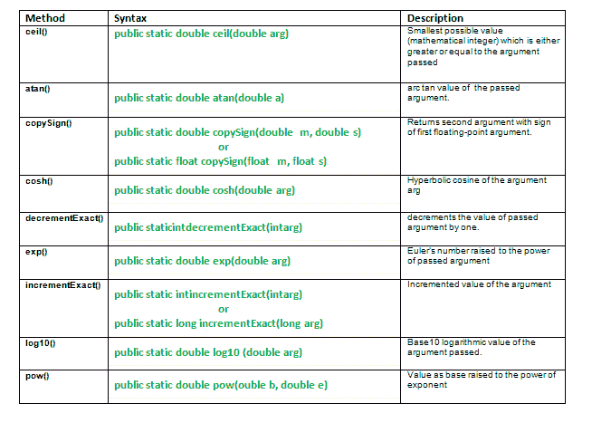

# java.math 类及其方法|第 3 集

> 原文:[https://www . geesforgeks . org/Java-math-class-methods-set-3/](https://www.geeksforgeeks.org/java-math-class-methods-set-3/)

[java.math 类及其方法|集合 1](https://www.geeksforgeeks.org/java-math-class-methods-set-1/)
[java.math 类及其方法|集合 2](https://www.geeksforgeeks.org/math-class-methods-java-examples-set-2/)



*   **ceil():Java . math . ceil(double a)**方法返回大于或等于传递的参数的最小可能值。返回值是一个数学整数。**特例:**
    *   如果返回值已经是数学整数，则结果相同。
    *   如果传递的参数是 NaN、无穷大或零，则结果相同。
    *   如果传递的参数小于零但大于-1.0，则结果为负零

**语法:**

```
public static double ceil(double arg)
Parameters:
arg - the argument value
Returns:
smallest possible value(mathematical integer)
which is either greater or equal to the argument passed
```

*   **atan() : java.math.atan()** 方法返回方法参数值的反正切。返回的角度在-π/2 到π/2 的范围内。
    弧谭是逆谭的论点通过了。
    atan(arg)= arg 的 tan 逆
    **特例:**
    *   如果传递的参数是 NaN 或其绝对值大于 1，则结果是 NaN。
    *   如果参数为零，则结果为零。

**语法:**

```
public static double atan(double a)
Parameters:
a - the argument whose arc tangent value we need.
    argument is taken as radian
Returns:
arc tan value of the argument.
```

*   **copy sign():Java . math . copy sign()**方法返回第一个浮点参数，但第二个参数有符号。
    **语法:**

```
public static double copySign(double m, double s)
                    or
public static float copySign(float m, float s)
Parameters:
m - magnitude 
s - sign 
Returns:
returns second argument with sign of first floating-point argument.
```

**在 Math 类中解释 atan()、ceil()、copySign()方法的 Java 代码。**

## Java 语言(一种计算机语言，尤用于创建网站)

```
// Java program explaining Math class methods
// atan(), ceil(), copySign()
import java.math.*;
public class NewClass
{

    public static void main(String[] args)
    {

        // Use of atan() method
        double Atani = Math.atan(0);
        System.out.println("atan value of Atani : "+Atani);
        double x = Math.PI/2;

        // Use of toRadian() method
        x = Math.toRadians(x);
        double Atanj = Math.atan(x);
        System.out.println("atan value of Atanj : "+Atanj);
        System.out.println("");

        // Use of ceil() method
        double val = 15.34 ,ceilval;
        ceilval = Math.ceil(val);
        System.out.println("ceil value of val : "+ceilval);
        System.out.println("");

        double dblMag = val;
        double dblSign1 = 3;
        double dblSign2 = -3;

        // Use of copySign() method
        double result1 = Math.copySign(dblMag,dblSign1);
        System.out.println("copySign1 : "+result1);

        double result2 = Math.copySign(dblMag,dblSign2);
        System.out.println("copySign2 : "+result2);

    }
}
```

输出:

```
atan value of Atani : 0.0
atan value of Atanj : 0.0274087022410345

ceil value of val : 16.0

copySign1 : 15.34
copySign2 : -15.34
```

*   **cosh() : java.math.cosh()** 方法返回传递的参数的双曲余弦值。
    T3 特殊情况:
    *   结果是 NaN，如果参数是 NaN。
    *   如果参数为零，则结果为 1.0。
    *   如果参数为无穷大，则结果为+ve 无穷大。

**语法:**

```
public static double cosh(double arg)
Parameters:
arg - The number whose hyperbolic cosine is to be returned.
Returns:
the hyperbolic cosine of the argument arg.
```

*   **减量精确():java.math .减量精确()**方法将传递的参数值减 1。
    **语法:**

```
public static int decrementExact(int arg)
                or
public static long decrementExact(long arg)
Parameters:
arg - argument passed. 
Returns:
return argument decremented by one.
Throws:
Exception if the result overflows long or int datatype, according to the
argumented data type.
```

*   **exp():Java . math . exp(double arg)**方法返回欧拉数的双参数幂。
    **重要案例:**
    *   结果是 NaN，如果参数是 NaN。
    *   如果参数为+ve 无穷大，则结果为+ve 无穷大。
    *   如果参数为-ve 无穷大，则结果为+ve 零。

**语法:**

```
public static double exp(double arg)
Parameters:
arg - argument passed. 
Returns:
Euler’s number raised to the power of passed argument
```

**在 Math 类中解释 exp()、redexact()、cosh()方法的 Java 代码。**

## Java 语言(一种计算机语言，尤用于创建网站)

```
// Java program explaining Math class methods
// exp(), decrementExact(), cosh()
import java.math.*;
public class NewClass
{

    public static void main(String[] args)
    {

        // Use of cosh() method
        double value = 2;
        double coshValue = Math.cosh(value);
        System.out.println("Hyperbolic Cosine of "  + coshValue);
        System.out.println("");

        // Use of decrementExact() method
        int result = Math.decrementExact(3051);
        System.out.println("Use of decrementExact() : " + result);
        System.out.println("");

        // Use of exp() method
        // declare the exponent to be used
        double exponent = 34;
        // raise e to exponent declared
        double expVal = Math.exp(exponent);
        System.out.println("Value of exp : "+ expVal);

    }
}
```

输出:

```
Using addExact() : 9

acos value of Asini : NaN
acos value of Asinj : 0.054858647341251204

cube root : 6.0 
```

*   **IngrementXact():Java . math . IngrementXact()**方法通过增加参数的值来返回参数。

```
Syntax:
public static int incrementExact(int arg)
               or
public static long incrementExact(long arg)
Parameters:
arg - the argument
Returns:
incremented value of the argument
```

*   **log 10():Java . math . log 10()**方法返回传递的参数的 base10 对数值。

```
Syntax:
public static double log(double arg)
Parameters:
arg - argument passed. 
Returns:
base10 logarithmic value of the argument passed.
```

*   **pow() : java.math.pow(double b，double e)** 方法返回值为**b<sup>e</sup>T5】**

```
Syntax:
public static double pow(double b,double e)
Parameters:
b : base
e : exponent 
Returns:
value as base<sup>exponent</sup>
```

**在 Math 类中解释 incrementExact()，log10()，pow()方法的 JAVA 代码。**

## Java 语言(一种计算机语言，尤用于创建网站)

```
// Java program explaining MATH class methods
// incrementExact(), log10(), pow()
import java.lang.*;
public class NewClass
{

    public static void main(String[] args)
    {
        // Use of incrementExact() method
        int f1 = 30, f2 = -56;
        f1 =Math.incrementExact(f1);
        System.out.println("Incremented value of f1 : "+f1);

        f2 =Math.incrementExact(f2);
        System.out.println("Incremented value of f2 : "+f2);
        System.out.println("");

        // Use of log10() method
        double value = 10;
        double logValue = Math.log10(value);
        System.out.println("Log10 value of 10 : "+logValue);
        System.out.println("");

        // Use of pow() method
        double b = 10, e = 2;
        double power = Math.pow(b,e);
        System.out.println("Use of pow() : "+power);

    }
}
```

输出:

```
Incremented value of f1 : 31
Incremented value of f2 : -55

Log10 value of 10 : 1.0

Use of pow() : 100.0
```

**注意:**不需要创建新的对象来调用这些方法，因为上面讨论的 Math 类方法是静态的。

本文由 **莫希特·古普塔** 供稿。如果你喜欢 GeeksforGeeks 并想投稿，你也可以使用[write.geeksforgeeks.org](https://write.geeksforgeeks.org/)写一篇文章或者把你的文章邮寄到 review-team@geeksforgeeks.org。看到你的文章出现在极客博客主页上，帮助其他极客。
如果发现有不正确的地方，或者想分享更多关于上述话题的信息，请写评论。