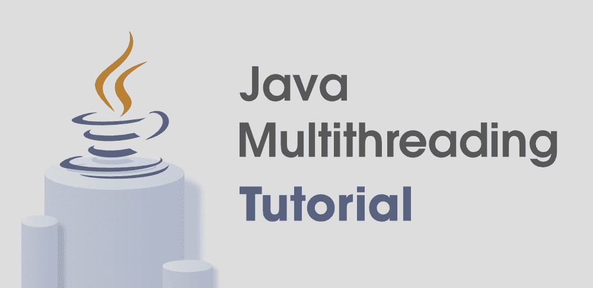
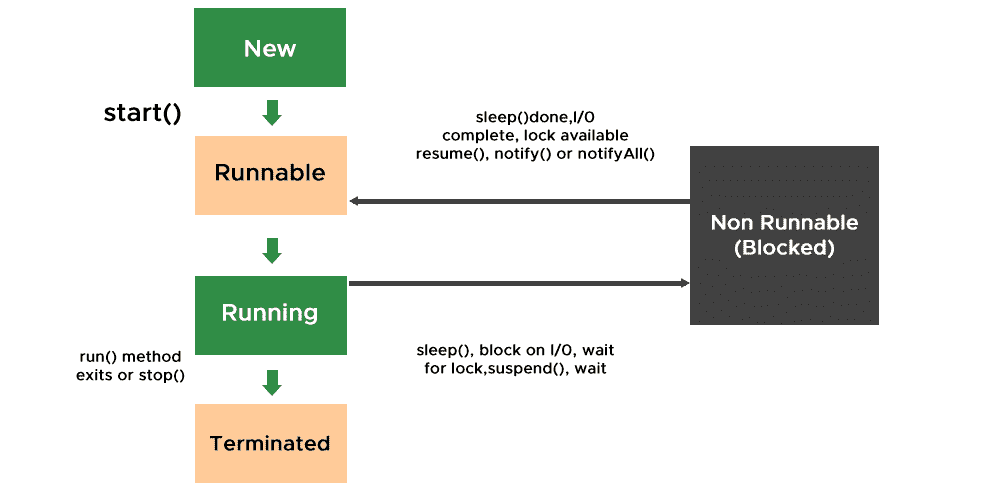
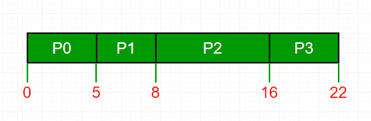
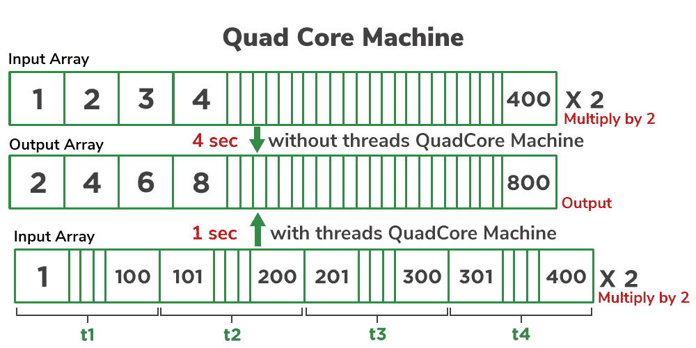
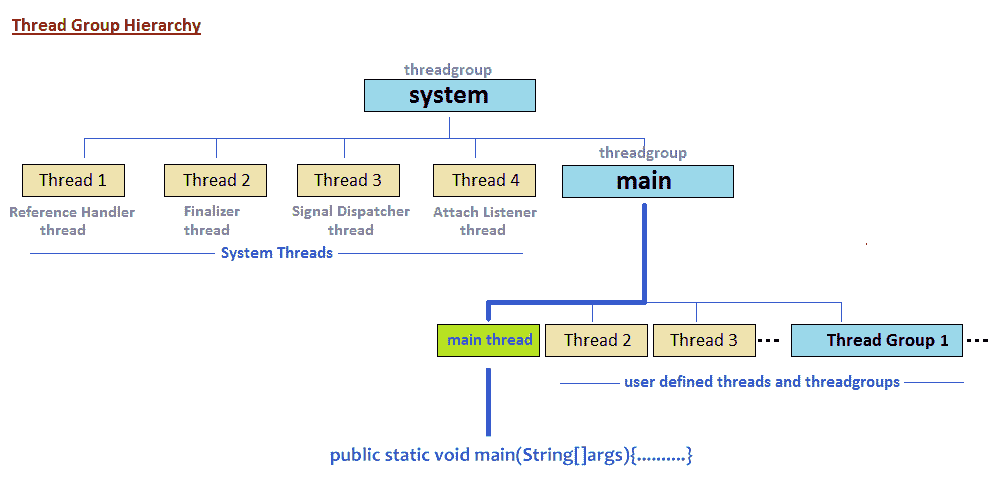
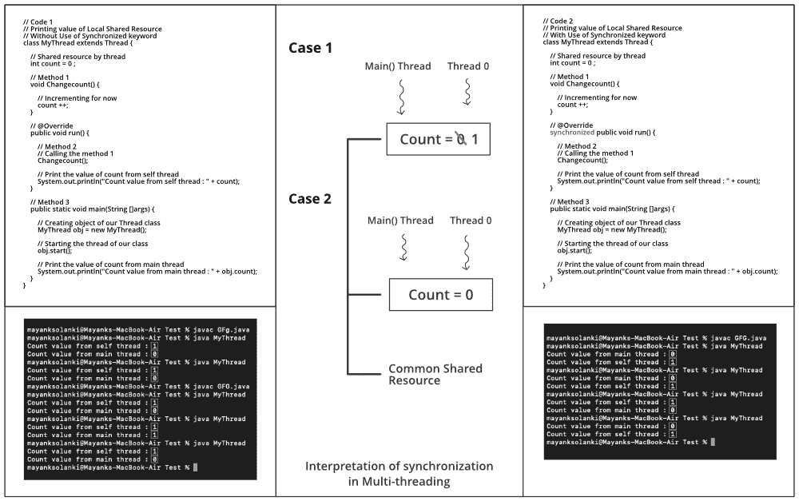
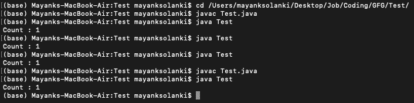
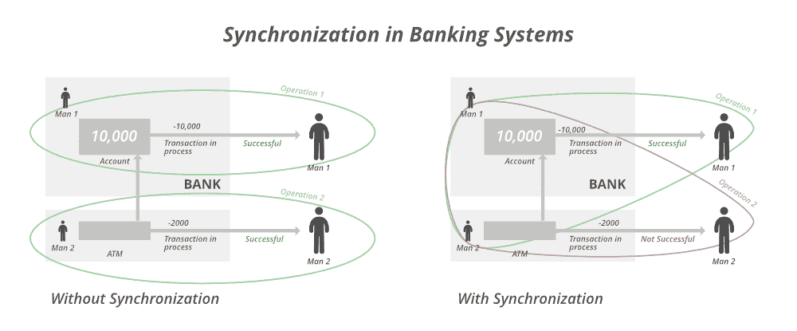

# Java 多线程教程

> 原文:[https://www.geeksforgeeks.org/java-multithreading-tutorial/](https://www.geeksforgeeks.org/java-multithreading-tutorial/)

线程是多线程的支柱。我们生活在一个真实的世界里，这个世界本身就被大量的应用程序包围着。同样，随着技术的进步，我们无法补偿同时运行它们的速度，因为我们需要更多的应用程序并行运行。它是通过线程的概念实现的。



**真实例子**

> 假设您在计算机上同时使用两项任务，即使用微软 Word 和听音乐。这两个任务称为**流程**。所以你开始在 Word 中打字，同时在上面放音乐，这叫做**多任务**。现在你犯了一个单词的错误，拼写检查显示异常，这意味着即使是一个单词也是一个分解成子过程的过程。现在，如果一台机器是双核的，那么一个进程或任务由一个内核处理，音乐由另一个内核处理。

在上面的例子中，我们遇到了多处理和多线程都以某种方式间接用于实现多任务处理。我们已经实现了这样的任务划分机制被称为多线程，其中每个进程或任务都由一个线程调用，其中一个线程负责何时执行、何时停止以及处于等待状态多长时间。因此，**线程**是最小的处理单元，而**多任务**是一次执行多个任务的过程。

**多任务处理通过两种方式实现**:

1.  **多处理**:基于进程的多任务处理是一个重量级的进程，占用内存中不同的地址空间。因此，虽然从一个进程切换到另一个进程将需要一些时间，但由于寄存器将被加载到内存映射中，并且列表将被更新，因此这很小，会导致切换时的延迟。
2.  **多线程**:基于线程的多任务是一个轻量级的进程，占用相同的地址空间。因此，虽然切换通信的成本会非常低。

**下图为螺纹的生命周期**

1.  **新建**:刚创建线程时。
2.  **可运行**:在线程调度器处理的线程上调用 start()方法时。
    *   案例一:可以是一个正在运行的线程
    *   案例二:不能是运行线程
3.  **正在运行**:当遇到情况 1 时，表示调度器已经选择让线程从可运行状态运行到运行状态。
4.  **阻塞**:当它达到情况 2 时，意味着调度器选择不允许线程从可运行状态改变为运行状态。
5.  **终止**:当 run()方法存在或者在线程上调用 stop()方法时。



如果我们确实在操作系统中引入了线程，那么我们可以发现操作系统中的进程调度算法在很大程度上是在与**甘特图**中引入线程的相同概念上深入工作的。下面列出了几个最受欢迎的例子，这些例子总结了所有的例子，并在软件开发中得到实际应用。



*   先进先出
*   后进先出
*   循环调度

现在想象一下操作系统 **和线程**中的**死锁的概念，如果你对它们有一个总体的了解，那么现在如何在内部计算切换。**

到目前为止，我们已经从概念上理解了多线程和线程，所以在介绍任何其他概念或进入多线程程序之前，我们可以总结出多线程的优势。

*   用户不会被阻止，因为线程是独立的，即使一个线程有问题，那么只有相应的进程将被停止，所有操作将被成功计算。
*   节省时间，因为同时进行的操作太多，导致工作无法完成，就好像没有使用线程一样，只有一个进程将由处理器处理。
*   线程是独立的，虽然共享相同的地址空间。

因此，我们已经触及了多线程的所有主要概念，但剩下的问题是努力。我们为什么需要它，在哪里使用它，如何使用它？现在，我们将讨论为什么需要多线程的所有三种情况，以及它是在哪里通过程序的帮助来实现的，在这些程序中，我们将进一步了解线程及其方法。我们需要在列出的四个场景中使用多线程。

*   线程类
*   移动应用
    *   异步线程
*   Web 应用程序
*   游戏开发

> **注意:**默认情况下，我们只有一个主线程负责主线程异常，就像你遇到的那样，甚至没有任何多线程的先验知识

### 实现多线程的两种方法

*   [**使用螺纹类**](https://www.geeksforgeeks.org/java-lang-thread-class-java/)
*   [**使用可运行界面**](https://www.geeksforgeeks.org/runnable-interface-in-java/)

### 方法一:使用[螺纹类](https://www.geeksforgeeks.org/java-lang-thread-class-java/)

Java 提供了 Thread 类来实现调用线程的编程，因此线程类的一些主要方法以表格的形式显示在下面，我们经常按照它们执行的操作来处理这些方法。

<figure class="table">【T62

| way | Action has been performed. |
| --- | --- |
| isDaemon() | It checks whether the current thread is a daemon. |
| 开始() | It starts the execution of the thread. |
| 运行() | It executes the executable operation statement in this method body through threads [T27 | It is a static method, which passes a thread sleeping for a certain time as a parameter to it. |
| 等待() | It sets the thread back to the waiting state. |
| 通知() | It sends a notification to a thread in the waiting state. |
| notifyAll() | It notifies all threads in the waiting state. |
| setDaemon() | It sets the current thread to Daemon thread. |
| 停止() |

</figure>

**先决条件:**处理线程的基本语法和方法

现在让我们想出如何设置线程的名称。默认情况下，线程被命名为 thread-0、thread-1 等。但也有一种方法曾经存在过，那就是经常被称为***【setName()***的方法。与之相对应的还有一个方法 ***getName()*** ，该方法返回线程的名称，无论是默认的还是已经通过使用 *setName()* 方法结算的。语法如下:

**语法:**

**(a)** 返回线程的名称

```java
public String getName() ;
```

**(b)** 更改线程名称

```java
 public void setName(String name);
```

更进一步，让我们深入到实现部分来获得更多关于多线程的概念。因此，实现多线程基本上有两种方式:

**说明:**考虑一个数组中是否有 500 个元素，所有元素都要乘以 2。



**示例**

## Java 语言(一种计算机语言，尤用于创建网站)

```java
// Case 1
// Java Program to illustrate Creation and execution of
// thread via start() and run() method in Single inheritance

// Class 1
// Helper thread Class extending main Thread Class
class MyThread1 extends Thread {

    // Method inside MyThread2
    // run() method which is called as
    // soon as thread is started
    public void run()
    {

        // Print statement when the thread is called
        System.out.println("Thread1 is running");
    }
}

// Class 2
// Main thread Class extending main Thread Class
class MyThread2 extends Thread {

    // Method inside MyThread2
    // run() method which is called
    // as soon as thread is started
    public void run()
    {

        // run() method which is called as soon as thread is
        // started

        // Print statement when the thread is called
        System.out.println("Thread2 is running");
    }
}

// Class 3
// Main Class
class GFG {

    // Main method
    public static void main(String[] args)
    {

        // Creating a thread object of our thread class
        MyThread1 obj1 = new MyThread1();
        MyThread2 obj2 = new MyThread2();

        // Getting the threads to the run state

        // This thread will transcend from runnable to run
        // as start() method will look for run() and execute
        // it
        obj1.start();

        // This thread will also transcend from runnable to
        // run as start() method will look for run() and
        // execute it
        obj2.start();
    }
}
```

## Java 语言(一种计算机语言，尤用于创建网站)

```java
// Case 2
// Java Program to illustrate Difference between Runnable
// & Non-runnable Threads And Single Inheritance

// Class 1
// Helper thread Class extending main Thread Class
class MyThread1 extends Thread {

    // Method inside MyThread2
    // run() method which is called as soon as thread is
    // started
    public void run() {

        // Print statement when the thread is called
        System.out.println("Thread 1 is running");
    }
}

// Class 2
// Main thread Class extending main Thread Class
class MyThread2 extends Thread {

    // Method
    public void show() {

        // Print statement when thread is called
        System.out.println("Thread 2");
    }
}

// Class 3
// Main Class
class GFG {

    // Main method
    public static void main(String[] args) {

        // Creating a thread object of our thread class
        MyThread1 obj1 = new MyThread1();
        MyThread2 obj2 = new MyThread2();

        // Getting the threads to the run state

        // This thread will transcend from runnable to run
        // as start() method will look for run() and execute
        // it
        obj1.start();

        // This thread will now look for run() method which is absent
        // Thread is simply created not runnable
        obj2.start();
    }
}
```

## Java 语言(一种计算机语言，尤用于创建网站)

```java
// Java Program to illustrate difference between
// start() method thread vs show() method

// Class 1
// Helper thread Class extending main Thread Class
class MyThread1 extends Thread {

    // Method inside MyThread2
    // run() method which is called as soon as thread is
    // started
    public void run() {

        // Print statement when the thread is called
        System.out.println("Thread 1 is running");
    }
}

// Class 2
// Main thread Class extending main Thread Class
class MyThread2 extends Thread {

    // Method
    public void show() {

        // Print statement when thread is called
        System.out.println("Thread 2");
    }
}

// Class 3
// Main Class
class GFG {

    // Main method
    public static void main(String[] args) {

        // Creating a thread object of our thread class
        MyThread1 obj1 = new MyThread1();
        MyThread2 obj2 = new MyThread2();

        // Getting the threads to the run state

        // This thread will transcend from runnable to run
        // as start() method will look for run() and execute
        // it
        obj1.start();

        // This thread is simply a function call as
        // no start() method is executed so here only
        // thread is created only followed by call
        obj2.show();
    }
}
```

### 输出:

**案例 1:**

```java
Thread1 is running
Thread2 is running
```

这里我们确实为每个线程创建了两个线程类。在主方法**、**中，我们只是创建这些线程类的对象，其中对象现在是线程。所以在 main **、**中，我们在两个线程上使用 start()方法调用 thread。现在 start()方法启动线程并查找要运行的 run()方法。在这里，我们的两个线程类都有 run()方法，因此调度程序将这两个线程从可运行状态置于运行状态，并且控制台上的输出是正确的。

**案例 2:**

```java
Thread 1 is running
```

这里我们确实为每个线程创建了两个线程类。在主方法中，我们只是创建这些线程类的对象，其中对象现在是线程。所以总的来说，我们在两个线程上使用 start()方法调用 thread。现在 start()方法启动线程并查找它们要运行的 run()方法。这里，只有类 1 使用 run()方法使线程从可运行状态转换到可运行状态来执行，而线程 2 仅由调度程序创建，但不会进入运行状态，因为它对应的 run()方法丢失了。因此，只有线程 1 被称为 rest 线程 2 仅被创建，并且处于可运行状态，稍后由于缺少相应的 run()方法而被调度程序阻塞。

**案例 3:**

```java
Thread 2
Thread 1 is running
```

### 方法 2:使用可运行接口

在 java 中实现多线程的另一种方法是通过 Runnable 接口。正如我们在上面的例子中所看到的，线程类在方式 1 中被扩展。这里，作为功能接口的 Runnable 接口有自己的 run()方法。在这里，类被实现到 Runnable 接口。稍后，在 main()方法中，为实现的类创建 Runnable 引用，以便在与 Thread 类之间建立绑定，从而运行我们自己相应的 run()方法。此外，在创建线程类的对象时，我们将在线程类中传递这些引用，因为它的构造函数只允许一个可运行的对象，该对象在 main()方法中创建线程类对象时作为参数传递。最后，就像我们在线程类中所做的一样，start()方法在已经与线程类对象链接的可运行对象上被调用，因此在 runnable 接口的情况下，我们的 run()方法的执行开始。如下图所示:

**示例:**

## Java 语言(一种计算机语言，尤用于创建网站)

```java
// Java Program to illustrate Runnable Interface in threads
// as multiple inheritance is not allowed

// Importing basic packages
import java.io.*;
import java.util.*;

// Class 1
// Helper class implementing Runnable interface
class MyThread1 implements Runnable {

    // run() method inside this class
    public void run()
    {
        // Iterating to get more execution of threads
        for (int i = 0; i < 5; i++) {

            // Print statement whenever run() method
            // of this class is called
            System.out.println("Thread1");

            // Getting sleep method in try block to
            // check for any exceptions
            try {
                // Making the thread pause for a certain
                // time using sleep() method
                Thread.sleep(1000);
            }

            // Catch block to handle the exceptions
            catch (Exception e) {
            }
        }
    }
}

// Class 2
// Helper class implementing Runnable interface
class MyThread2 implements Runnable {

    // run() method inside this class
    public void run()
    {
        for (int i = 0; i < 5; i++) {

            // Print statement whenever run() method
            // of this class is called
            System.out.println("Thread2");

            // Getting sleep method in try block to
            // check for any exceptions
            try {

                // Making the thread pause for a certain
                // time
                // using sleep() method
                Thread.sleep(1000);
            }

            // Catch block to handle the exceptions
            catch (Exception e) {
            }
        }
    }
}

// Class 3
// Main class
public class GFG {

    // Main driver method
    public static void main(String[] args)
    {

        // Creating reference of Runnable to
        // our classes above in main() method
        Runnable obj1 = new MyThread1();
        Runnable obj2 = new MyThread2();

        // Creating of of thread class
        // by passing object of Runnable in constructor o
        // Thread class
        Thread t1 = new Thread(obj1);
        Thread t2 = new Thread(obj2);

        // Starting the execution of our own run() method
        // in the classes above
        t1.start();
        t2.start();
    }
}
```

**Output**

```java
Thread2
Thread1
Thread2
Thread1
Thread2
Thread1
Thread2
Thread1
Thread2
Thread1
```

**要记住的点:**每当你想创建线程时，只有两种方法:

1.  扩展类
2.  实现可运行的接口

确保创建一个线程对象，在该对象中必须传递 runnable 对象

### 螺纹的特殊方法

现在让我们讨论一下线程的各种方法。在这里，我们将讨论一些主要的问题，以便对线程和多线程有一个实际的理解，它们是按顺序排列的，如下所示:

1.  [*启动()方法*](https://www.geeksforgeeks.org/start-function-multithreading-java/)
2.  [*暂停()方法*](https://www.geeksforgeeks.org/how-to-temporarily-stop-a-thread-in-java/)
3.  [*停()法*](https://www.geeksforgeeks.org/killing-threads-in-java/)
4.  [*等待()方法*](https://www.geeksforgeeks.org/differences-between-wait-and-join-methods-in-java/)
5.  [*通知()方法*](https://www.geeksforgeeks.org/difference-notify-notifyall-java/)
6.  [*通知法*](https://www.geeksforgeeks.org/difference-notify-notifyall-java/)
7.  [*睡眠()法*](https://www.geeksforgeeks.org/thread-sleep-method-in-java-with-examples/)
    *   不休眠输出()方法
    *   串行执行进程中带睡眠()方法的输出(阻塞方法方法)
    *   并行执行进程中带有 sleep()方法的输出(解除阻塞方法方法)
8.  [*加入()方法*](https://www.geeksforgeeks.org/joining-threads-in-java/)

> **注意:**对于以线程为骨干的多线程中的幼稚用户来说，通过程序 4 来获得线程的基本知识，如何启动、保持或终止，然后只切换到程序 1 并休息，如下所示。

**实施:**

## Java 语言(一种计算机语言，尤用于创建网站)

```java
// Example 1
// Java Program to illustrate Output Without sleep() Method

// Class 1
// Helper Class 1
class Shot extends Thread {

    // Method 1
    public void show() {

        // Iterating to print more number of times
        for (int i = 0; i < 5; i++) {

            // Print statement whenever method
            // of this class is called
            System.out.println("Shot");

        }
    }
}

// Class 2
// Helper Class 2
class Miss extends Thread {

    // Method 2
    public void show() {

        // Iterating to print more number of times
        for (int i = 0; i < 5; i++) {

            // Print statement whenever method
            // of this class is called
            System.out.println("Miss");

        }
    }

}

// Class 3
// Main class
public class GFG {

    // Method 3
    // Main method
    public static void main(String[] args) {

        // Creating objects in the main() method
        // of class 1 and class 2
        Shot obj1 = new Shot();
        Miss obj2 = new Miss();

        // Calling methods of the class 1 and class 2
        obj1.show();
        obj2.show();

    }
}
```

## Java 语言(一种计算机语言，尤用于创建网站)

```java
// Example 2
// Java Program to illustrate Output Using sleep() Method
// in Serial Execution

// Class 1
// Helper Class 1
class Shot extends Thread {

    // Method 1
    // public void show() {
    public void show()
    {

        // Iterating to print more number of times
        for (int i = 0; i < 5; i++) {

            // Print statement
            System.out.println("Shot");

            // Making thread to sleep using sleep() method

            // Try-catch block for exceptions
            try {
                Thread.sleep(1000);
            }
            catch (Exception e) {
            }
        }
    }
}

// Class 2
// Helper Class 2 Hello
class Miss extends Thread {

    // Method 2
    // public void show() {
    public void show()
    {

        // Iterating to print more number of times
        for (int i = 0; i < 5; i++) {

            // Print statement
            System.out.println("Miss");

            // Making thread to sleep using sleep() method

            // Try-catch block for exceptions
            try {
                Thread.sleep(1000);
            }
            catch (Exception e) {
            }
        }
    }
}

// Class 3
// Main class
public class GFG {

    // Method 3
    // Main method
    public static void main(String[] args)
    {

        // Creating objects in the main() method
        Shot obj1 = new Shot();
        Miss obj2 = new Miss();

        // Starting the thread objects
        obj1.start();
        obj2.start();

        // Calling methods of class 1 and class 2
        obj1.show();
        obj2.show();
    }
}
```

## Java 语言(一种计算机语言，尤用于创建网站)

```java
// Example 3
// Java Program to illustrate Output Using sleep() Method
// in Parallel Execution

// Class 1
// Helper Class 1
class Shot extends Thread {

    // Method 1
    // public void show() {
    public void run()
    {

        // Iterating to print more number of times
        for (int i = 0; i < 5; i++) {

            // Print statement
            System.out.println("Shot");

            // Making thread to sleep using sleep() method

            // Try catch block for exceptions
            try {
                Thread.sleep(1000);
            }
            catch (Exception e) {
            }
        }
    }
}

// Class 2
// Helper Class 2 Hello
class Miss extends Thread {

    // Method 2
    // public void show() {
    public void run()
    {

        // Iterating to print more number of times
        for (int i = 0; i < 5; i++) {

            // Print statement
            System.out.println("Miss");

            // Making thread to sleep using sleep() method

            // Try catch block for exceptions
            try {
                Thread.sleep(1000);
            }
            catch (Exception e) {
            }
        }
    }
}

// Class 3
// Main class
public class GFG {

    // Method 3
    // Main method
    public static void main(String[] args)
    {

        // Creating objects in the main() method
        Shot obj1 = new Shot();
        Miss obj2 = new Miss();

        // Starting the thread objects
        // using start() method

        // start() method calls the run() method
        // automatically
        obj1.start();
        obj2.start();
    }
}
```

**输出:**

**案例 1:**

```java
Shot
Shot
Shot
Shot
Shot
Miss
Miss
Miss
Miss
Miss
```

<video class="wp-video-shortcode" id="video-612303-1" width="640" height="360" preload="metadata" controls=""><source type="video/mp4" src="https://media.geeksforgeeks.org/wp-content/uploads/20210421122723/output1.mp4?_=1">[https://media.geeksforgeeks.org/wp-content/uploads/20210421122723/output1.mp4](https://media.geeksforgeeks.org/wp-content/uploads/20210421122723/output1.mp4)</video>

**情况 2: V** 视频输出

```java
Shot
Shot
Shot
Shot
Shot
Miss
Miss
Miss
Miss
Miss
```

<video class="wp-video-shortcode" id="video-612303-2" width="640" height="360" preload="metadata" controls=""><source type="video/mp4" src="https://media.geeksforgeeks.org/wp-content/uploads/20210421123020/output2.mp4?_=2">[https://media.geeksforgeeks.org/wp-content/uploads/20210421123020/output2.mp4](https://media.geeksforgeeks.org/wp-content/uploads/20210421123020/output2.mp4)</video>

**情况 3:** 视频输出

```java
Shot
Miss
Shot
Miss
Shot
Miss
Shot
Miss
Shot
Miss
```

<video class="wp-video-shortcode" id="video-612303-3" width="640" height="360" preload="metadata" controls=""><source type="video/mp4" src="https://media.geeksforgeeks.org/wp-content/uploads/20210421134720/output3.mp4?_=3">[https://media.geeksforgeeks.org/wp-content/uploads/20210421134720/output3.mp4](https://media.geeksforgeeks.org/wp-content/uploads/20210421134720/output3.mp4)</video>

> **注意:**没有为线程设置优先级，因为线程输出的执行顺序会有所不同，所以一定要记住多线程处理不同输出导致数据不一致的缺点，我们将在后面的线程同步部分深入讨论这个问题。

### 线程中的优先级

[**线程中的优先级**](https://www.geeksforgeeks.org/java-thread-priority-multithreading/) 是一个概念，其中每个线程都有一个优先级，用外行人的语言来说，这里可以说每个对象都有优先级，用 1 到 10 的数字来表示。

*   默认优先级按预期设置为 5。
*   最低优先级设置为 0。
*   最大优先级设置为 10。

这里定义了 3 个常数，即:

1.  公共静态 int NORM_PRIORITY
2.  公共静态 int MIN_PRIORITY
3.  公共静态 int MAX_PRIORITY

让我们用一个例子来讨论一下如何在内部执行工作。在这里，我们将使用上面收集的知识，如下所示:

*   我们将使用[*【currentThread()*](https://www.geeksforgeeks.org/naming-thread-fetching-name-current-thread-java/)方法获取当前线程的名称。用户也可以使用 [*设置名称()*](https://www.geeksforgeeks.org/naming-thread-fetching-name-current-thread-java/) 方法，如果他/她为了理解的目的想要按照选择来命名线程。
*   [*getName()* 方法](https://www.geeksforgeeks.org/method-class-getname-method-in-java/)将用于获取线程的名称。

## Java 语言(一种计算机语言，尤用于创建网站)

```java
// Java Program to illustrate Priority Threads
// Case 1: No priority is assigned (Default priority)

// Importing input output thread class
import java.io.*;
// Importing Thread class from java.util package
import java.util.*;

// Class 1
// Helper Class (Our thread  class)
class MyThread extends Thread {

    public void run()
    {

        // Printing the current running thread via getName()
        // method using currentThread() method
        System.out.println("Running Thread : "
                           + currentThread().getName());

        // Print and display the priority of current thread
        // via currentThread() using getPriority() method
        System.out.println("Running Thread Priority : "
                           + currentThread().getPriority());
    }
}

// Class 2
// Main Class
class GFG {

    // Main driver method
    public static void main(String[] args)
    {

        // Creating objects of MyThread(above class)
        // in the main() method
        MyThread t1 = new MyThread();
        MyThread t2 = new MyThread();

        // Case 1: Default Priority no setting
        t1.start();
        t2.start();
    }
}
```

## Java 语言(一种计算机语言，尤用于创建网站)

```java
// Java Program to illustrate Priority Threads
// Case 2: NORM_PRIORITY

// Importing input output thread class
import java.io.*;
// Importing Thread class from java.util package
import java.util.*;

// Class 1
// Helper Class (Our thread  class)
class MyThread extends Thread {

    // run() method to transit thread from
    // runnable to run state
    public void run()
    {

        // Printing the current running thread via getName()
        // method using currentThread() method
        System.out.println("Running Thread : "
                           + currentThread().getName());

        // Print and display the priority of current thread
        // via currentThread() using getPriority() method
        System.out.println("Running Thread Priority : "
                           + currentThread().getPriority());
    }
}

// Class 2
// Main Class
class GFG {

    // Main driver method
    public static void main(String[] args)
    {

        // Creating objects of MyThread(above class)
        // in the main() method
        MyThread t1 = new MyThread();
        MyThread t2 = new MyThread();

        // Setting priority to thread via NORM_PRIORITY
        // which set priority to 5 as default thread
        t1.setPriority(Thread.NORM_PRIORITY);
        t2.setPriority(Thread.NORM_PRIORITY);

        // Setting default priority using
        // NORM_PRIORITY
        t1.start();
        t2.start();
    }
}
```

## Java 语言(一种计算机语言，尤用于创建网站)

```java
// Java Program to illustrate Priority Threads
// Case 3: MIN_PRIORITY

// Importing input output thread class
import java.io.*;
// Importing Thread class from java.util package
import java.util.*;

// Class 1
// Helper Class (Our thread  class)
class MyThread extends Thread {

    // run() method to transit thread from
    // runnable to run state
    public void run()
    {

        // Printing the current running thread via getName()
        // method using currentThread() method
        System.out.println("Running Thread : "
                           + currentThread().getName());

        // Print and display the priority of current thread
        // via currentThread() using getPriority() method
        System.out.println("Running Thread Priority : "
                           + currentThread().getPriority());
    }
}

// Class 2
// Main Class
class GFG {

    // Main driver method
    public static void main(String[] args)
    {

        // Creating objects of MyThread(above class)
        // in the main() method
        MyThread t1 = new MyThread();
        MyThread t2 = new MyThread();

        // Setting priority to thread via NORM_PRIORITY
        // which set priority to 1 as least priority thread
        t1.setPriority(Thread.MIN_PRIORITY);
        t2.setPriority(Thread.MIN_PRIORITY);

        // Setting default priority using
        // NORM_PRIORITY
        t1.start();
        t2.start();
    }
}
```

## Java 语言(一种计算机语言，尤用于创建网站)

```java
// Java Program to illustrate Priority Threads
// Case 4: MAX_PRIORITY

// Importing input output thread class
import java.io.*;
// Importing Thread class from java.util package
import java.util.*;

// Class 1
// Helper Class (Our thread  class)
class MyThread extends Thread {

    // run() method to transit thread from
    // runnable to run state
    public void run()
    {

        // Printing the current running thread via getName()
        // method using currentThread() method
        System.out.println("Running Thread : "
                           + currentThread().getName());

        // Print and display the priority of current thread
        // via currentThread() using getPriority() method
        System.out.println("Running Thread Priority : "
                           + currentThread().getPriority());
    }
}

// Class 2
// Main Class
class GFG {

    // Main driver method
    public static void main(String[] args)
    {

        // Creating objects of MyThread(above class)
        // in the main() method
        MyThread t1 = new MyThread();
        MyThread t2 = new MyThread();

        // Setting priority to thread via MAX_PRIORITY
        // which set priority to 1 as most priority thread
        t1.setPriority(Thread.MAX_PRIORITY);
        t2.setPriority(Thread.MAX_PRIORITY);

        // Setting default priority using
        // MAX_PRIORITY

        // Starting the threads using start() method
        // which automatically invokes run() method
        t1.start();
        t2.start();
    }
}
```

**输出:**

**情况 1:** 默认优先级

```java
Running Thread : Thread-0
Running Thread : Thread-1
Running Thread Priority : 5
Running Thread Priority : 5
```

**情况 2:** NORM_PRIORITY

```java
Running Thread : Thread-0
Running Thread : Thread-1
Running Thread Priority : 5
Running Thread Priority : 5
```

**情况 3:** MIN_PRIORITY

```java
Running Thread : Thread-0
Running Thread : Thread-1
Running Thread Priority : 1
Running Thread Priority : 1
```

**情况 4:** 最大 _ 优先级

```java
Running Thread : Thread-1
Running Thread : Thread-0
Running Thread Priority : 10
Running Thread Priority : 10
```

**输出解释**:

如果我们仔细观察，我们确实看到情况 1 和 2 的输出是相等的。这意味着，当用户甚至不知道优先级线程时，NOM _ PRIVATE 仍然显示相同的结果，直到默认优先级。这是因为只要调用相应的 start()方法，运行线程的默认优先级就会按照将所有线程的优先级设置为 5 来执行，这相当于 NORM 情况下的优先级。这是因为两个输出相互等效。而在情况 3 中，优先级在 1 到 10 的等级上被设置为最小值，因此在情况 4 中也是如此，其中优先级在相同的等级上被分配给 10。

因此，就优先事项而言，所有产出都是合理的。现在让我们继续讨论优先级线程的一个重要方面，它已经融入到日常生活中，就是 Daemon 线程

[**守护线程**](https://www.geeksforgeeks.org/daemon-thread-java/) 基本上是一个为用户线程提供服务的服务提供者线程。这个线程 start()或 be it()的作用域完全依赖于用户的线程，因为它在后端支持用户线程的运行。一旦用户线程被终止，守护进程线程也与服务提供者线程同时终止。

因此，守护进程线程的特征如下:

*   它只是服务提供者线程，不负责用户线程中的解释。
*   所以，它是一个低优先级的线程。
*   它是一个依赖的线程，因为它本身不存在。
*   一旦用户线程终止，JVM 就终止线程，并在用户线程启动时重新运行。
*   是的，你猜最流行的例子是 java 中的垃圾收集器。其他一些例子包括“终结器”。

**异常:**[IllegalArgumentException](https://www.geeksforgeeks.org/how-to-solve-illegalargumentexception-in-java/)作为返回类型，而设置守护线程是布尔型的，所以一定要小心应用。

> **注意:**要摆脱异常，用户线程应该只在设置为守护线程后才启动。在将其设置为守护程序之前启动的另一种方法将不起作用，因为它会弹出 IllegalArgumentException

如上所述在 Thread 类中使用最广泛的两种方法如下:

<figure class="table">

| [daemon thread method](https://www.geeksforgeeks.org/daemon-thread-java/) | 已执行的操作 |
| --- | --- |
| isDaemon() | It checks whether the current thread is a daemon thread. |
| 【setDaemon() | It sets the thread to be marked as a daemon thread [T25 |

</figure>

让我们在跳到垃圾收集器之前讨论一下 Daemon 线程的实现。

## Java 语言(一种计算机语言，尤用于创建网站)

```java
// Java Program to show Working of Daemon Thread
// with users threads

import java.io.*;
// Importing Thread class from java.util package
import java.util.*;

// Class 1
// Helper Class extending Thread class
class CheckingMyDaemonThread extends Thread {

    // Method
    // run() method which is invoked as soon as
    // thread start via start()
    public void run()
    {

        // Checking whether the thread is daemon thread or
        // not
        if (Thread.currentThread().isDaemon()) {

            // Print statement when Daemon thread is called
            System.out.println(
                "I am daemon thread and I am working");
        }

        else {

            // Print statement whenever users thread is
            // called
            System.out.println(
                "I am user thread and I am working");
        }
    }
}

// Class 2
// Main Class
class GFG {

    // Main driver method
    public static void main(String[] args)
    {

        // Creating threads in the main body
        CheckingMyDaemonThread t1
            = new CheckingMyDaemonThread();
        CheckingMyDaemonThread t2
            = new CheckingMyDaemonThread();
        CheckingMyDaemonThread t3
            = new CheckingMyDaemonThread();

        // Setting thread named 't2' as our Daemon thread
        t2.setDaemon(true);

        // Starting all 3 threads using start() method
        t1.start();
        t2.start();
        t3.start();

        // Now start() will automatically
        // invoke run() method
    }
}
```

## Java 语言(一种计算机语言，尤用于创建网站)

```java
// Java Program to show Working of Daemon Thread
// with users threads where start() is invoked
// prior before setting thread to Daemon

import java.io.*;
// Basically we are importing Thread class
// from java.util package
import java.util.*;

// Class 1
// Helper Class extending Thread class
class CheckingMyDaemonThread extends Thread {

    // Method
    // run() method which is invoked as soon as
    // thread start via start()
    public void run()
    {

        // Checking whether the thread is daemon thread or
        // not
        if (Thread.currentThread().isDaemon()) {

            // Print statement when Daemon thread is called
            System.out.println(
                "I am daemon thread and I am working");
        }

        else {

            // Print statement whenever users thread is
            // called
            System.out.println(
                "I am user thread and I am working");
        }
    }
}

// Class 2
// Main Class
class GFG {

    // Method
    // Main driver method
    public static void main(String[] args)
    {

        // Creating threads objects of above class
        // in the main body
        CheckingMyDaemonThread t1
            = new CheckingMyDaemonThread();
        CheckingMyDaemonThread t2
            = new CheckingMyDaemonThread();
        CheckingMyDaemonThread t3
            = new CheckingMyDaemonThread();

        // Starting all 3 threads using start() method
        t1.start();
        t2.start();
        t3.start();

        // Now start() will automatically invoke run()
        // method

        // Now at last setting already running thread 't2'
        // as our Daemon thread will throw an exception
        t2.setDaemon(true);
    }
}
```

另一种方法是通过**线程组**，顾名思义，多线程被视为一个对象，稍后所有操作都在这个对象上进行，这有助于为线程池提供一个替代品。

> **注:**
> 
> 在实现线程组时，请注意线程组是 java 中的一部分，而不是线程类的一部分，所以在继续之前，请查看线程组类的构造函数和方法，并检查他的类中不推荐使用的方法，以免遇到任何进一步的歧义。



这里 main()方法本身是一个线程，因此在运行程序时，您会在 main()中看到异常，因为在执行程序时，有时会抛出 system.main 线程异常 。

### 同步

这种机制限制了多个线程共享一个公共资源的访问权限，因此建议在一次只有一个线程被授予运行权限的情况下使用。

> 在程序中使用“ [*【同步】*](https://www.geeksforgeeks.org/synchronized-in-java/) ”关键字实现。

现在，在实现同步之前，让我们最后讨论一下同步的一些优点和缺点。为了在同步中更有深度，还可以学习[对象级锁](https://www.geeksforgeeks.org/object-level-lock-in-java/)和[类级锁](https://www.geeksforgeeks.org/class-level-lock-in-java/)并做[注意两者之间的差异](https://www.geeksforgeeks.org/object-level-lock-vs-class-level-lock-in-java/?ref=rp)以在实现相同之前对相同有一个公平的理解。

**为什么需要同步？**

1.  数据不一致问题是多个线程访问公共内存时的主要问题，这有时会导致错误，以避免一个线程在失败时被另一个线程忽略。
2.  数据完整性
3.  使用共同的共享资源，这在现实世界中非常重要，例如在银行系统中。

> **注意:**除非最需要，否则不要使用 synchronized 关键字，请记住这一点，因为线程没有优先级设置，所以如果主线程在其他线程之前或之后运行，程序的输出会有所不同。

同步的最大优点是增加了白痴的抵抗力，因为人们不能任意选择一个对象来锁定，结果字符串文字不能被锁定或成为内容。因此，这些不良做法不可能在同步方法块上执行。

正如我们已经看到巨大的优势，并了解它有多重要，但随之而来的是缺点。

> **缺点:**性能问题将会出现，因为在一个线程的执行过程中，所有其他线程都被置于[阻塞状态](https://www.geeksforgeeks.org/thread-states-in-operating-systems/)，请注意它们不处于[等待状态](https://www.geeksforgeeks.org/thread-states-in-operating-systems/)。如果一个线程花费的时间过长，这将导致性能下降。



从图片中我们可以看出，共享资源的计数变量是随机更新的。正是因为多线程，这个概念才成为必要。

*   **情况 1:** 如果“*主线程”*首先执行，则计数将递增，随后是同步的“*线程 T”*
*   **情况 2:** 如果“*线程 T* 先执行，那么计数不会递增，然后是同步的“*主线程*

**实现:**让我们用一个示例程序来观察这个 0 1 计数冲突

**示例:**

## Java 语言(一种计算机语言，尤用于创建网站)

```java
// Java Program to illustrate Output Conflict between
// Execution of Main thread vs Thread created

// count = 1 if main thread executes first
// count = 1 if created thread executes first

// Importing basic required libraries
import java.io.*;
import java.util.*;

// Class 1
// Helper Class extending Thread class
class MyThread extends Thread {

    // Declaring and initializing initial count to zero
    int count = 0;

    // Method 1
    // To increment the count above by unity
    void increment() { count++; }

    // Method 2
    // run method for thread invoked after
    // created thread has started
    public void run()
    {

        // Call method in this method
        increment();

        // Print and display the count
        System.out.println("Count : " + count);
    }
}

// Class 2
public class GFG {

    // Main driver method
    public static void main(String[] args)
    {
        // Creating the above our Thread class object
        // in the main() method
        MyThread t1 = new MyThread();

        // start() method to start executio of created
        // thread that will look for run() method
        t1.start();
    }
}
```

**输出:**



**输出说明:**

在这里，计数增加到 1，表示主线程在*创建线程*之前已经执行。我们已经运行了很多次，编译并再次运行，其中这里的所有情况下，主线程的执行速度都比创建的线程快，但是请记住，输出可能会有所不同。我们创建的线程可以在“*主线程*之前执行，导致“计数:0”作为控制台上的输出。

现在在处理线程中的同步时出现的另一个话题是 java 中的[线程安全](https://www.geeksforgeeks.org/thread-safety-and-how-to-achieve-it-in-java/) 同步是同步中出现的新概念，所以让我们考虑一下它

*   接下来的真实场景
*   作为插图的绘画作品
*   技术描述和实施

**现实生活场景**

> 假设一个人正在从银行提取一定数量的钱，同时注册了相同账号的自动柜员机卡正在由其他用户进行提取操作。现在假设从网上银行提取一定数量的资金，使得账户中的资金少于需要提取的数量，或者相反。这使得银行不安全，因为从账户中借记的资金比账户中实际存在的资金多，使得银行非常不安全，并且在日常生活中看不到。所以银行做的是一次只允许一笔交易。一旦它结束，那么另一个是允许的。

插图:



将相同的技术解释为有两个不同的进程在运行，在并行执行的情况下，哪个对象由线程来领导。现在在线程上拥有这样的特性，使得它们在执行之前应该被关注，或者更简单地说，使它们同步。这种机制被称为线程安全，在并行执行公共共享方法/函数之前使用关键字“ *synchronized* ”。

**技术说明:**

我们知道 Java 有一个特性，[多线程](https://www.geeksforgeeks.org/multithreading-in-java/)，这是一个同时运行多个线程的过程。当多个线程在处理同一个数据，而我们的数据值在变化时，这种情况不是线程安全的，我们会得到不一致的结果。当一个线程已经在一个对象上工作，并阻止另一个线程在同一个对象上工作时，这个过程称为线程安全。现在有几种方法可以在我们的程序中实现线程安全，即:

1.  使用[同步](https://www.geeksforgeeks.org/synchronized-in-java/)
2.  使用[可变关键字](https://www.geeksforgeeks.org/volatile-keyword-in-java/)
3.  使用[原子变量](https://www.geeksforgeeks.org/atomic-variables-in-java-with-examples/)
4.  使用[最终关键词](https://www.geeksforgeeks.org/final-keyword-java/)

> **结论:**因此，如果我们一次访问一个线程，那么我们可以说线程安全的程序，如果多个线程被访问，那么该程序被称为线程不安全的，即一次一个资源不能被多个线程共享。

**实施:**

*   说明不完整线程迭代返回计数器值为零的 Java 程序，与迭代界限无关
*   说明完整线程迭代的 Java 程序，说明 join()方法
*   说明线程不安全或不同步的程序的不完整迭代的 Java 程序
*   用“ **synchronized** ”关键字说明线程安全和同步程序的 Java 程序。

**示例**

## Java 语言(一种计算机语言，尤用于创建网站)

```java
// Example 1
// Java Program to illustrate Incomplete Thread Iterations
// Returning Counter Value to Zero
// irrespective of iteration bound

// Importing input output classes
import java.io.*;

// Class 1
// Helper Class
class TickTock {

    // Member variable of this class
    int count;

    // Method of this Class
    // It increments counter value whenever called
    public void increment()
    {
        // Increment count by unity
        // i.e count = count + 1;
        count++;
    }
    //
}

// Class 2
// Synchronization demo class
// Main Class
class GFG {

    // Main driver method
    public static void main(String[] args) throws Exception
    {

        // Creating an object of class TickTock in main()
        TickTock tt = new TickTock();

        // Now, creating an thread object
        // using Runnable interface
        Thread t1 = new Thread(new Runnable() {
            // Method
            // To begin the execution of thread
            public void run()
            {

                // Expression
                for (int i = 0; i < 10000; i++) {

                    // Calling object of above class
                    // in main() method
                    tt.increment();
                }
            }
        });

        // Making above thread created to start
        // via start() method which automatically
        // calls run() method in Ticktock class
        t1.start();

        // Print and display the count
        System.out.println("Count : " + tt.count);
    }
}
```

## Java 语言(一种计算机语言，尤用于创建网站)

```java
// Example 2
// Java Program to Illustrate Complete Thread Iterations
// illustrating join() Method

// Importing input output classes
import java.io.*;

// Class 1
// Helper Class
class TickTock {

    // Member variable of this class
    int count;

    // Method of this Class
    public void increment()
    {

        // Increment count by unity
        // whenever this function is called
        count++;
    }
}

// Class 2
// Synchronization demo class
// Main Class
class GFG {

    // Main driver method
    public static void main(String[] args) throws Exception
    {

        // Creating an object of class TickTock in main()
        TickTock tt = new TickTock();

        // Now, creating an thread object
        // using Runnable interface
        Thread t1 = new Thread(new Runnable() {
            // Method
            // To begin the execution of thread
            public void run()
            {

                // Expression
                for (int i = 0; i < 1000; i++) {

                    // Calling object of above class
                    // in main() method
                    tt.increment();
                }
            }
        });

        // Making above thread created to start
        // via start() method which automatically
        // calls run() method
        t1.start();

        // Now we are making main() thread to wait so
        // that thread t1 completes it job
        // using join() method
        t1.join();

        // Print and display the count value
        System.out.println("Count : " + tt.count);
    }
}
```

## Java 语言(一种计算机语言，尤用于创建网站)

```java
// Example 3
// Java Program to Illustrate Thread Unsafe Or
// Non-synchronizing Programs as of Incomplete Iteations
// Without using 'synchronized' program

// Importing input output classes
import java.io.*;

// Class 1
// Helper Class
class TickTock {

    // Member variable of this class
    int count;

    // Method of this Class
    public void increment()
    {

        // Increment count by unity
        count++;
    }
}

// Class 2
// Synchronization demo class
// Main Class
class GFG {

    // Main driver method
    public static void main(String[] args) throws Exception
    {

        // Creating an object of class TickTock in main()
        TickTock tt = new TickTock();

        // Now, creating an thread object
        // using Runnable interface
        Thread t1 = new Thread(new Runnable() {
            // Method
            // To begin the execution of thread
            public void run()
            {

                // Expression
                for (int i = 0; i < 100000; i++) {

                    // Calling object of above class
                    // in main() method
                    tt.increment();
                }
            }
        });

        // Now creating another thread and lets check
        // how they increment count value running parallely
        // Thread 2
        Thread t2 = new Thread(new Runnable() {
            // Method
            // To begin the execution of thread
            public void run()
            {

                // Expression
                for (int i = 0; i < 100000; i++) {

                    // Calling object of above class
                    // in main() method
                    tt.increment();
                }
            }
        });

        // Making above thread created to start
        // via start() method which automatically
        // calls run() method
        t1.start();
        t2.start();

        // Now we are making main() thread to wait so
        // that thread t1 completes it job
        t1.join();
        t2.join();

        // Print and display the count
        System.out.println("Count : " + tt.count);
    }
}
```

## Java 语言(一种计算机语言，尤用于创建网站)

```java
// Example 4
// Java Program to Illustrate Thread Safe And
// Synchronized Programs as of Complete Iteations
// using 'synchronized' Keyword

// Importing input output classes
import java.io.*;

// Class 1
// helper Class
class TickTock {

    // Member variable of this class
    int count;

    // Method of this Class
    public synchronized void increment()
    {

        // Increment count by unity
        count++;
    }
    //
}

// Class 2
// Synchronization demo class
// Main Class
class GFG {

    // Main driver method
    public static void main(String[] args) throws Exception
    {

        // Creating an object of class TickTock in main()
        TickTock tt = new TickTock();

        // Now, creating an thread object
        // using Runnable interface
        Thread t1 = new Thread(new Runnable() {
            // Method
            // To begin the execution of thread
            public void run()
            {

                // Expression
                for (int i = 0; i < 100000; i++) {

                    // Calling object of above class
                    // in main() method
                    tt.increment();
                }
            }
        });

        // Thread 2
        Thread t2 = new Thread(new Runnable() {
            // Method
            // To begin the execution of thread
            public void run()
            {

                // Expression
                for (int i = 0; i < 100000; i++) {

                    // Calling object of above class
                    // in main() method
                    tt.increment();
                }
            }
        });

        // Making above thread created to start
        // via start() method which automatically
        // calls run() method
        t1.start();
        t2.start();

        // Now we are making main() thread to wait so
        // that thread t1 completes it job
        t1.join();
        t2.join();

        // Print and display the count
        System.out.println("Count : " + tt.count);
    }
}
```

**输出:**

**案例 1**

```java
Count : 0
```

**案例 2**

```java
Count : 10000
```

**案例 3**

```java
Count : 151138
```

**案例 4**

```java
Count : 200000
```

**输出说明:**

在案例 1 中，我们可以看到计数在初始化时为零。现在我们有两个线程主线程和线程 t1。所以有两个线程，所以现在发生的事情有时实例在两个线程之间共享。

在案例 1 中，两者都在访问 count 变量，我们直接尝试通过线程 t1 访问线程，count 总是抛出 0，因为我们需要在对象的帮助下调用它来执行执行。

现在我们已经理解了同步的工作是一个线程**，这个线程**只不过是 java 中的一个术语 **Concurrency，在外行语言中**是执行多个任务。让我们借助图示来描述线程的并发性。


考虑将元素数组乘以乘数 2 的任务。现在，如果我们开始随机地将每个元素相乘，这将花费大量的时间，因为每次元素都将被搜索和计算。到目前为止，我们已经在上面研究了多线程，其中我们得出了一个结论，线程是多线程的主干。因此，在上述情况下结合线程，因为机器是四核的，所以我们在这里为每个核取 4 个线程，其中我们将上述计算样本集划分为(1/4) <sup>th</sup> ，结果计算速度提高了 4 倍。如果在上面的场景中需要 4 秒钟，那么现在只需要 1 秒钟。这种并行运行线程以实现更快和无延迟计算的机制被称为并发。

> **注意:**使用多线程总是为了并发执行，如果不使用这个概念，尽管有更大的代码块，也要使用顺序执行，因为我们代码的安全是首要问题。