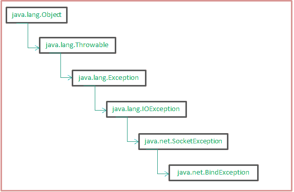
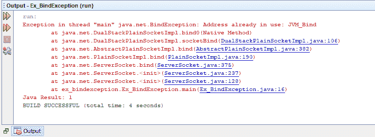

# java.net.BindException 在 java 中的示例

> 原文:[https://www . geesforgeks . org/Java-net-bind exception-in-Java-with-examples/](https://www.geeksforgeeks.org/java-net-bindexception-in-java-with-examples/)

**java.net.BindException** 是当应用程序试图将套接字绑定到本地地址和端口时，绑定中出现错误时引发的异常。大多数情况下，这可能是由于两个原因造成的，要么端口已经在使用中(由于另一个应用程序)，要么所请求的地址无法分配给这个应用程序。**绑定异常**继承自**套接字异常**类，因此显示存在与套接字创建或访问相关的错误。

**施工人员**

下列构造函数可用于 BindException:

*   **BindException():** 创建一个没有详细消息的 BindException 类的简单实例
*   **绑定异常(字符串消息):**用指定的消息创建绑定异常类的实例，作为发生绑定错误的原因。

**方法总结**

1.  **从 java.lang.Throwable 类继承的方法:**
    [添加抑制的](https://www.geeksforgeeks.org/throwable-addsuppressed-method-in-java-with-examples/)、[填充跟踪](https://www.geeksforgeeks.org/throwable-fillinstacktrace-method-in-java/#:~:text=Throwable%20class%2C%20records%20within%20this,fillInStackTrace()%20method%20is%20called.)、[获取原因](https://www.geeksforgeeks.org/throwable-getcause-method-in-java-with-examples/)、[获取本地化消息](https://www.geeksforgeeks.org/throwable-getlocalizedmessage-method-in-java-with-examples/)、[获取消息](https://www.geeksforgeeks.org/throwable-getmessage-method-in-java-with-examples/)、[获取堆栈跟踪](https://www.geeksforgeeks.org/throwable-getstacktrace-method-in-java-with-examples/)、[获取抑制的](https://www.geeksforgeeks.org/throwable-getsuppressed-method-in-java-with-examples/)、[初始化原因](https://www.geeksforgeeks.org/throwable-initcause-method-in-java-with-examples/)、[打印堆栈跟踪](https://www.geeksforgeeks.org/throwable-printstacktrace-method-in-java-with-examples/?ref=leftbar-rightbar)、[设置堆栈](https://www.geeksforgeeks.org/throwable-setstacktrace-method-in-java-with-examples/) 
2.  **方法继承自 java.lang.Object 类:**
    [克隆](https://www.geeksforgeeks.org/clone-method-in-java-2/)，[等于](https://www.geeksforgeeks.org/method-class-equals-method-in-java/#:~:text=equals(Object%20obj)%20method%20of,is%20same%20as%20passed%20object.)，[最终确定](https://www.geeksforgeeks.org/finalize-method-in-java-and-how-to-override-it/#:~:text=The%20finalize()%20method%20of,to%20perform%20clean%2Dup%20activity.)， [getClass](https://www.geeksforgeeks.org/object-class-in-java/#:~:text=getClass()%20%3A%20Returns%20the%20class,we%20don't%20override%20it.) ， [hashCode](https://www.geeksforgeeks.org/equals-hashcode-methods-java/#:~:text=Read%20InstanceOf%20operator.-,hashCode()%20method,which%20overrides%20equals()%20method.) ，[notify all](https://www.geeksforgeeks.org/difference-notify-notifyall-java/)， [wait](https://www.geeksforgeeks.org/differences-between-wait-and-join-methods-in-java/) 。



**Java . net . BindException 的层次结构**

**示例:**

在下面的例子中，我们创建了一个类 Ex_BindException 来演示 BindException:

## Java 语言(一种计算机语言，尤用于创建网站)

```java
// java.net.BindException in Java with Examples

import java.io.*;
import java.net.*;
public class Ex_BindException {

    // Creating a variable PORT1 with arbitrary port value
    private final static int PORT1 = 8000;

    public static void main(String[] args)
        throws IOException
    {

        // Creating instance of the ServerSocket class
        // and binding it to the arbitrary port
        ServerSocket socket1 = new ServerSocket(PORT1);

        // Creating another instance of the ServerSocket
        // class and binding it to the same arbitrary
        // port,thus it gives a BindException.
        ServerSocket socket2 = new ServerSocket(PORT1);
        socket1.close();
        socket2.close();
    }
}
```

**输出:**



在上面的代码中，我们首先使用指定的端口创建了一个 [**服务器套接字**类](https://www.geeksforgeeks.org/socket-programming-in-java/)的实例。该实例已成功绑定。但是，当使用同一端口创建另一个实例时，会出现**绑定异常**，因为该端口已经绑定到另一个套接字。在这里，我们可以简单地为第二个套接字使用另一个任意端口(它没有被使用)来消除这个异常。