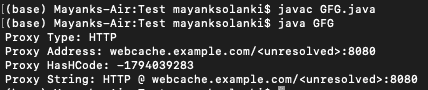

# java 中的 java.net.Proxy 类

> 原文:[https://www.geeksforgeeks.org/java-net-proxy-class-in-java/](https://www.geeksforgeeks.org/java-net-proxy-class-in-java/)

代理是一种不可变的对象和类型的工具或应用程序或程序或系统，它有助于保护其用户和计算机的信息。它是计算机和互联网用户之间的一道屏障。代理对象定义用于连接的代理设置。[代理服务器](https://www.geeksforgeeks.org/proxy-server/)已经预装在 Windows 中的某类程序或应用程序中。它会自动保存在设置部分。您也可以为您想要使用代理的站点设置海关。[来自 java.net 包的 InetSocketAddress 类](https://www.geeksforgeeks.org/java-net-inetsocketaddress-class-java/)实现了 IP 套接字地址(IP 地址和端口号的组合)。这个类的对象是不可变的，可以用于绑定、连接的目的

类代表一个基本上是类型的[代理](https://www.geeksforgeeks.org/proxy-server/)设置和一个[套接字地址](https://www.geeksforgeeks.org/java-net-inetsocketaddress-class-java/)。该类包含一个特殊字段，即无代理字段。写成*代理 NO _ PROXY*该设置告诉协议处理程序不要使用任何代理设置，并表示*直接*连接。

**语法:**类声明

```
public class Proxy extends Object
```

让我们在跳到方法之前讨论一下这个类的构造函数

```
Proxy(Proxy.Type type, SocketAddress sa)
```

该类的方法如下:

<figure class="table">

| Method name | describe |
| --- | --- |
| address | The socket address returned by the proxy or the direct connection returned null. |
| be equal to | Compare two proxy objects and return true only if the type and address are the same. |
| hashCode() | HashCode returned by the proxy. |
| toString() | Returns the string representation of the proxy. |
| 类型() | Returns the type of proxy object. |

</figure>

**接近**:

1.  首先，我们创建了一个套接字地址，以便与代理对象一起使用。
2.  然后用该地址创建了一个 HTTP 类型的代理。
3.  然后，我们用创建的代理创建了一个 URL 连接。

**实施:**

**例**

## Java 语言(一种计算机语言，尤用于创建网站)

```
// Java Program to illustrate Proxy Class
// of java.net package

// Importing input output classes
import java.io.*;
// importing java net package to use address and url fields
import java.net.*;
// importing the java proxy package
import java.net.Proxy;

// Main class
public class GFG {

    // Main driver method
    public static void main(String[] args)
    {
        // Creating  socket addressaddresses with port 8080
        // by creating object of SocketAddress class
        SocketAddress addr = new InetSocketAddress(
            "webcache.example.com", 8080);

        // Creating proxy object of type HTTP with
        // address addr using the class constructor
        Proxy proxy = new Proxy(Proxy.Type.HTTP, addr);

        // Try block to check for exceptions
        try {

            // Creating URL connection using the above proxy
            // by creating an object of URL class
            URL url = new URL("http://java.example.org/");

            // Now setting the connecting by
            // creating an object of URLConnection class
            URLConnection conn = url.openConnection(proxy);
        }

        // Catch block to handle the exceptions
        catch (Exception e) {

            // Print the line number here exception occured
            // using the printStackTrace() method
            e.printStackTrace();

            // Display message only illustrating
            System.out.println(false);
        }

        // Printing Proxy Type
        // using type() method
        System.out.println("Proxy Type: " + proxy.type());

        // Printing Proxy Address
        // using address() method
        System.out.println("Proxy Address: "
                           + proxy.address());

        // Printing Proxy Hashcode
        // using hashCode() method
        System.out.println("Proxy HasHCode: "
                           + proxy.hashCode());

        // Printing Proxy String representation
        // using toString() method
        System.out.println("Proxy String: "
                           + proxy.toString());
    }
}
```

**输出:**

