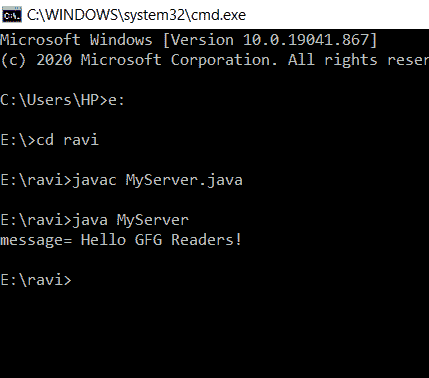
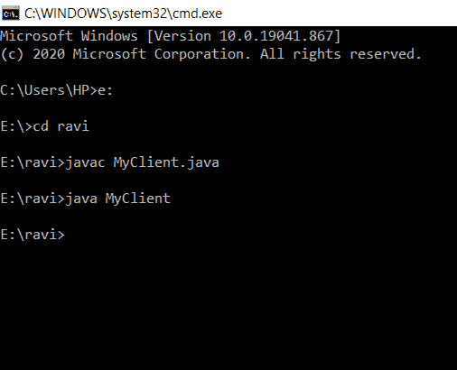

# java 中的 java.net.ServerSocket 类

> 原文:[https://www . geesforgeks . org/Java-net-server socket-class-in-Java/](https://www.geeksforgeeks.org/java-net-serversocket-class-in-java/)

服务器套接字类用于提供客户机/服务器套接字连接的服务器端的独立于系统的实现。如果服务器套接字的构造函数无法侦听指定的端口(例如，该端口已被使用)，它将引发异常。

所以 java.net.ServerSocket 类的应用被广泛使用，具体如下:

1.  在 java.nio 通道中，serverSocket 类用于检索与该通道关联的 ServerSocket。
2.  在 java.rmi.Server 中，ServerSocket 类用于在指定端口上创建服务器套接字(端口 0 表示匿名端口)。
3.  在 javax.net，服务器套接字被广泛使用，以便:
    *   返回未绑定的服务器套接字。
    *   返回绑定到指定端口的服务器套接字。
    *   返回绑定到指定端口的服务器套接字，并使用指定的连接积压。
    *   返回绑定到指定端口的服务器套接字，具有指定的监听积压和本地 IP。

让我们来看一下这个类的方法，如下所示:

<figure class="table">

| 【 Method 】 | describe |
| --- | --- |
| accept | Listen for the connection to be established with this socket and accept it. |
| 绑定(SocketAddress 端点) | Bind the server socket to a specific address (IP address and port number). |
| -你好(套接字地址什么事，int backlog) | Bind the server socket to a specific address (IP address and port number). |
| 关闭() | This close socket |
| getChannel（） | Returns the unique ServerSocketChannel object associated with this socket, if any. |
| getnetaddress() | Returns the local address of this server socket. |
| getLocalPort() | Returns the port number on which the socket is listening. |
| getLocalSocketAddress() | Returns the address of the endpoint to which this socket is bound, or null if it is not already bound. |
| getReceiveBufferSize() | Gets the value of the SO_RCVBUF option of this server socket, that is, the suggested buffer size to be used for sockets accepted from this server socket. |
| getReuseAddress() | Test whether SO_REUSEADDR is enabled. |
| getSoTimeout() | Retrieve settings for SO_TIMEOUT. |
| 植入插座 | A subclass of ServerSocket uses this method to override Accept () and return its own subclass [T0】 Socket. |
| isBound() | Returns the binding status of the server socket. |
| isClosed() | Returns the closed state of the ServerSocket. |
| 设置性能首选项(内部连接时间、内部延迟、内部带宽) | Set performance preferences for this server socket. |
| Set performance preferences for this server socket. | Sets the default recommended value of the SO_RCVBUF option for sockets accepted from this server socket. |
| setReuseAddress(boolean on) | Enable/disable the SO_REUSEADDR socket option. |
| setsxmlsocket factory(socket implfactory fac) | Set the server socket implementation factory for the application. |
| int time out(内部时间输出) | Enable/disable SO_TIMEOUT with the specified timeout in milliseconds. |
| toString() | Returns the implementation address and implementation port of this socket as a String. |

</figure>

**实施:**

**示例 1** 服务器端

## Java 语言(一种计算机语言，尤用于创建网站)

```java
// Java Program to implement ServerSocket class
// Server Side

// Importing required libraries
import java.io.*;
import java.net.*;

// Main class
public class MyServer {

    // Main driver method
    public static void main(String[] args)
    {

        // Try block to check for exceptions
        try {

            // Creating an object of ServerSocket class
            // in the main() method  for socket connection
            ServerSocket ss = new ServerSocket(6666);

            // Establishing a connection
            Socket soc = ss.accept();

            // Invoking input stream via getInputStream()
            // method by creating DataInputStream class
            // object
            DataInputStream dis
                = new DataInputStream(s.getInputStream());

            String str = (String)dis.readUTF();

            // Display the string on the console
            System.out.println("message= " + str);

            // Lastly close the socket using standard close
            // method to release memory resources
            ss.close();
        }

        // Catch block to handle the exceptions
        catch (Exception e) {

            // Display the exception on the console
            System.out.println(e);
        }
    }
}
```

**输出:**



**示例 2** 客户端

## Java 语言(一种计算机语言，尤用于创建网站)

```java
// Java Program to implement ServerSocket class
// Client - side

// Importing required libraries
import java.io.*;
import java.net.*;

// Main class
public class MyClient {

    // Main driver method
    public static void main(String[] args)
    {

        // Try block to check if exception occurs
        try {

            // Creating Socket class object and
            // initializing Socket
            Socket soc = new Socket("localhost", 6666);

            DataOutputStream d = new DataOutputStream(
                soc.getOutputStream());

            // Message to be displayed
            d.writeUTF("Hello GFG Readers!");

            // Flushing out internal buffers,
            // optimizing for better performance
            d.flush();

            // Closing the connections

            // Closing DataOutputStream
            d.close();
            // Closing socket
            soc.close();
        }

        // Catch block to handle exceptions
        catch (Exception e) {

            // Print the exception on the console
            System.out.println(e);
        }
    }
}
```

**输出:**

