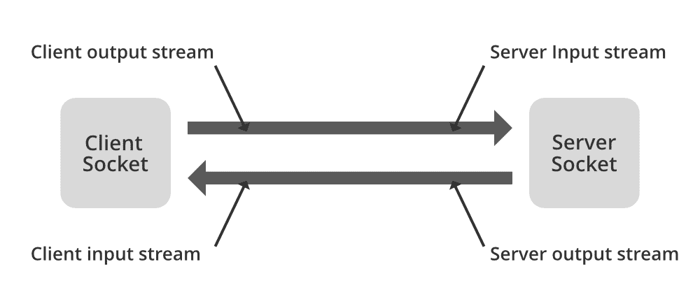

# java 中的 java.net.SocketException 示例

> 原文:[https://www . geesforgeks . org/Java-net-socket exception-in-Java-with-examples/](https://www.geeksforgeeks.org/java-net-socketexception-in-java-with-examples/)

**SocketException** 是 **IOException** 的子类，所以它是一个选中的异常。这是在试图打开或访问套接字时发出问题信号的最常见的异常。此错误的完整异常层次结构是:

```
java.lang.Object
     java.lang.Throwable
         java.lang.Exception
             java.io.IOException
                 java.net.SocketException
```

您可能已经知道，强烈建议使用最具体的套接字异常类来更准确地指定问题。还值得注意的是，SocketException 通常会附带一条错误消息，该消息非常详细地说明了导致异常的情况。

```
Implemented Interfaces: *Serializable*
Direct Known Subclasses: *BindException, ConnectException, NoRouteToHostException, PortUnreachableException*
```

**什么是套接字编程？**

这是一种编程概念，它利用套接字来建立连接，并使多个程序能够使用网络相互交互。套接字提供了使用网络协议栈建立通信的接口，并使程序能够通过网络共享消息。套接字是网络通信中的端点。套接字服务器通常是可以接受套接字连接请求的多线程服务器。套接字客户端是启动套接字通信请求的程序/进程。



**java.net.SocketException:连接重置**

当客户端在通过套接字返回响应之前关闭套接字连接时，服务器端会出现此**套接字异常**。例如，在检索响应之前退出浏览器。连接重置仅仅意味着收到了一个 TCP RST。TCP RST 包是指远端告诉你发送前一个 TCP 包的连接不被识别，可能连接已经关闭，可能端口没有打开，诸如此类。重置数据包只是一个没有有效负载的数据包，并且在 TCP 报头标志中设置了 RST 位。

现在作为实现，很明显我们需要两个程序，一个处理客户端，另一个处理服务器。它们如下:

**示例 1:** 服务器端

## Java 语言(一种计算机语言，尤用于创建网站)

```
// Java Program to Illustrate SocketException
// Server Side App

// Importing required classes
import java.io.BufferedReader;
import java.io.IOException;
import java.io.InputStreamReader;
import java.net.ServerSocket;
import java.net.Socket;
import java.net.SocketTimeoutException;

// Main class
public class SimpleServerApp {

    // Main driver method
    public static void main(String[] args)
        throws InterruptedException
    {

        new Thread(new SimpleServer()).start();
    }

    static class SimpleServer implements Runnable {

        // run() method for thread
        @Override public void run()
        {

            ServerSocket serverSocket = null;

            // Try block to check for exceptions
            try {

                serverSocket = new ServerSocket(3333);
                serverSocket.setSoTimeout(0);

                // Till condition holds true
                while (true) {

                    try {
                        Socket clientSocket
                            = serverSocket.accept();

                        // Creating an object of
                        // BufferedReader class
                        BufferedReader inputReader
                            = new BufferedReader(
                                new InputStreamReader(
                                    clientSocket
                                        .getInputStream()));

                        System.out.println(
                            "Client said :"
                            + inputReader.readLine());
                    }

                    // Handling the exception
                    catch (SocketTimeoutException e) {

                        // Print the exception along with
                        // line number
                        e.printStackTrace();
                    }
                }
            }

            // Catch block to handle the exceptions
            catch (IOException e1) {

                // Display the line where exception occurs
                e1.printStackTrace();
            }

            finally {

                try {
                    if (serverSocket != null) {
                        serverSocket.close();
                    }
                }
                catch (IOException e) {

                    e.printStackTrace();
                }
            }
        }
    }
}
```

**示例 2:** 客户端

## Java 语言(一种计算机语言，尤用于创建网站)

```
// Java Program to Illustrate SocketException
// Client Side App

// Importing required classes
import java.io.IOException;
import java.io.PrintWriter;
import java.net.Socket;
import java.net.SocketException;
import java.net.UnknownHostException;

// Class 1
// Main class
public class SimpleClientApp {

    // Main driver method
    public static void main(String[] args)
    {

        // Calling inside main()
        new Thread(new SimpleClient()).start();
    }

    // Class 2
    // Helper class
    static class SimpleClient implements Runnable {

        // run() method for the thread
        @Override public void run()
        {

            // Initially assign null to our socket to be
            // used
            Socket socket = null;

            // Try block to e=check for exceptions
            try {

                socket = new Socket("localhost", 3333);

                // Creating an object of PrintWriter class
                PrintWriter outWriter = new PrintWriter(
                    socket.getOutputStream(), true);

                // Display message
                System.out.println("Wait");

                // making thread to sleep for 1500
                // nanoseconds
                Thread.sleep(15000);

                // Display message
                outWriter.println("Hello Mr. Server!");
            }
            // Catch block to handle the exceptions

            // Catch block 1
            catch (SocketException e) {

                // Display the line number where exception
                // occurred using printStackTrace() method
                e.printStackTrace();
            }

            // Catch block 2
            catch (InterruptedException e) {
                e.printStackTrace();
            }

            // Catch block 3
            catch (UnknownHostException e) {
                e.printStackTrace();
            }

            // Catch block 4
            catch (IOException e) {
                e.printStackTrace();
            }

            finally {

                try {

                    // If socket goes NULL
                    if (socket != null)

                        // Close the socket
                        socket.close();
                }
                catch (IOException e) {

                    e.printStackTrace();
                }
            }
        }
    }
}
```

**输出:**

> **java.net.SocketException:连接重置**
> 
> at Java . net . socket input stream . read(socket input stream . Java:196)
> 
> at Java . net . socket input stream . read(socket input stream . Java:122)
> 
> at sun . nio . cs . stream decoder . read bytes(stream decoder . Java:283)
> 
> at sun . nio . cs . stream decoder . implread(stream decoder . Java:325)
> 
> at sun . nio . cs . stream decoder . read(stream decoder . Java:177)
> 
> 在 Java . io . input streaming reader . read 中(InputStreamReader.java:184)
> 
> at Java . io . bufferedreader . fill(buffer edreader . Java:154)
> 
> at Java . io . bufferedreader . readline(buffer edreader . Java:317)
> 
> at Java . io . bufferedreader . readline(buffer edreader . Java:382)
> 
> at . com . javacodegeks . core . lang . numberformateexceptionexample . simpleserver app $ simpleserver . run(simpleserver app . Java:36)
> 
> 在 java.lang.Thread.run

现在，为了摆脱[**Java . net . SocketException**](https://www.geeksforgeeks.org/working-udp-datagramsockets-java/)**以获得适当的输出，可以通过感知，就好像您是一个客户端，并在连接到服务器端应用程序时获得此错误，然后追加如下更改:**

1.  **首先，通过在运行服务器的主机端口上进行远程登录来检查服务器是否正在运行。**
2.  **检查服务器是否已重新启动**
3.  **检查服务器是否故障切换到不同的主机**
4.  **记录错误**
5.  **向服务器团队报告问题**

> ****注意:**在大多数情况下，您会发现任一服务器没有运行或手动或自动重启。**