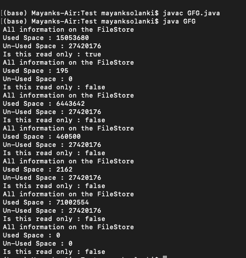
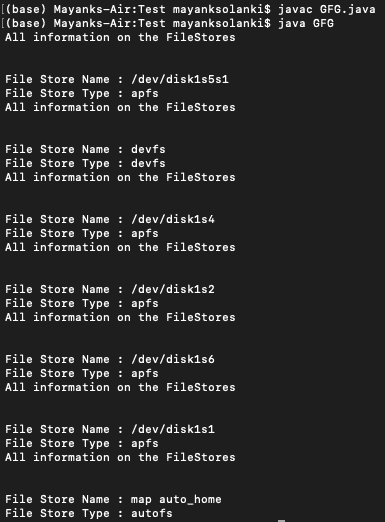

# java 中的 java.nio.file.FileStore 类

> 原文:[https://www . geesforgeks . org/Java-nio-file-filestore-class-in-Java/](https://www.geeksforgeeks.org/java-nio-file-filestore-class-in-java/)

Java.nio.file 是 Java 中的一个包，由 FileStore 类组成。FileStore 类是一个提供方法的类，目的是对文件存储执行一些操作。

*   FileStore 是一个从 java.lang 包扩展 Object 的类。FileStore 类可以从 java.lang.Object 包继承的方法很少，它们是 clone()、equals()、finalize()、getClass()、hashCode()、notifyAll()、toString()、wait()。
*   getFileStore()是一个由 FileStore 类提供的方法，它被调用来知道文件存储在哪里，一般来说，它告诉文件存储在光驱中的位置。
*   文件存储还支持更少或更多的类，如文件存储属性视图，它提供一组文件存储属性的只读或向上视图。

**语法:**类声明

```java
public abstract class FileStore extends Object
{
abstract CheckResult( );
// Here an abstract method which 
// don't have usually a method definition part. 
} 
```

注意:每当您为抽象类创建一个对象并试图在编译时调用它时，编译器都会抛出一个错误，说“方法不完整”，这是因为抽象被认为是不完整的，这意味着您不能为这样的方法创建一个对象。

文件存储类的构造函数如下:

<figure class="table">

| 构造器 | 描述 |
| --- | --- |
| 文件存储() | 此构造函数初始化此类的新实例。 |

</figure>

文件存储类的方法如下:

<figure class="table">

| 方法 | 描述 |
| --- | --- |
| getAttribute(字符串属性) | 此方法读取文件存储属性值。 |
| getFileStoreAttributeView(类<v>类型)</v> | 此方法返回给定类型的文件属性视图。 |
| getTotalSpace() | 此方法返回文件存储的大小(以字节为单位)。 |
| getUnallocatedSpace() | 此方法返回文件存储中未分配的字节数。 |
| getUsableSpace() | 此方法返回文件存储中该 Java 虚拟机可用的字节数。 |
| isReadOnly（） | 这个方法告诉这个文件存储是否是只读的。 |
| 名称() | 此方法返回此文件存储的名称。 |
| supportsFileAttributeView(类 extends FileAttributeView>类型) | 此方法告知此文件存储是否支持由给定文件属性视图标识的文件属性。 |
| 支持文件属性视图(字符串名称) | 此方法告知此文件存储是否支持由给定文件属性视图标识的文件属性。 |
| 类型() | 此方法返回此文件存储的类型。 |

</figure>

**例 1:**

## Java 语言(一种计算机语言，尤用于创建网站)

```java
// Java Program to demonstrate FileStore Class
// with its methods

// Importing required libraries
import java.nio.file.FileStore;
import java.nio.file.FileSystem;
import java.nio.file.FileSystems;

// Main class
public class GFG {

    // Declaring and initializing variable
    static long Bytes = 1000;

    // Main driver method
    public static void main(String[] args) throws Exception
    {

        // Creating an object of FileSystem class
        FileSystem fileSystem = FileSystems.getDefault();

        for (FileStore fileStore :
             fileSystem.getFileStores()) {

            // Here we use Bytes to
            // get the usable space in terms of bytes.

            // Here getUsableSpace method is used to
            // know the free space in the drive.
            // then it writtens back the value into
            // usableSpace variable
            long usableSpace
                = fileStore.getUsableSpace() / Bytes;

            // Here we use Bytes to
            // get the used space in terms of bytes.

            // Here we get the usedspace value by
            // subtracting the methods given below.
            long usedSpace = (fileStore.getTotalSpace()
                              - fileStore

                                    .getUnallocatedSpace())
                             / Bytes;

            // Readonly writes true or false based on
            // the mode the we file open.
            boolean readOnly = fileStore.isReadOnly();

            // Print and display the information
            // that the methods are allocated with
            System.out.println(
                "All information on the FileStore");

            // Print and display used and unused space
            System.out.println("Used Space : " + usedSpace);
            System.out.println("Un-Used Space : "
                               + usableSpace);

            // Print boolean true false whether it is read
            // only
            System.out.println("Is this read only : "
                               + readOnly);
        }
    }
}
```

**输出:**



**例 2:**

## Java 语言(一种计算机语言，尤用于创建网站)

```java
// Java Program to demonstrate FileStore Class
// with its methods

// Importing required libraries
import java.nio.file.FileStore;
import java.nio.file.FileSystem;
import java.nio.file.FileSystems;

// Main class
// FileStoreExample
public class GFG {

    // Main driver method
    public static void main(String[] args) throws Exception
    {

        // Creating an object of FileSystem class
        FileSystem fileSystem = FileSystems.getDefault();

        // Iterating for file storage using for each loop
        for (FileStore fileStore :
             fileSystem.getFileStores()) {

            // Here filestore() is used to know the
            // folder/drive name where the actual file is
            // getting stored
            String fileStoreName = fileStore.name();

            // This method returns the fileStore type
            String fileStoreType = fileStore.type();

            // Print and display commands

            // 1\. information of file
            System.out.println(
                "All information on the FileStores\n\n");

            // 2\. Name of a file stored
            System.out.println("File Store Name : "
                               + fileStoreName);

            // 3\. Type of file stored
            System.out.println("File Store Type : "
                               + fileStoreType);
        }
    }
}
```

**输出**

