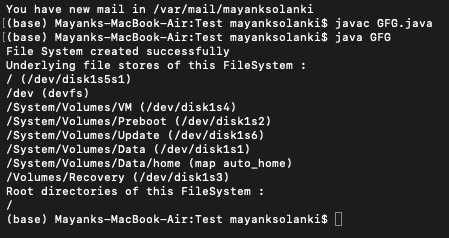

# java 中的 java.nio.file.FileSystems 类

> 原文:[https://www . geesforgeks . org/Java-nio-file-files systems-class-in-Java/](https://www.geeksforgeeks.org/java-nio-file-filesystems-class-in-java/)

**Java . nio . file . file systems**类充当了创建新文件系统的工厂。这个类提供了创建文件系统的方法。这个文件系统充当创建不同对象的工厂，如路径、路径匹配器、用户原则允许服务和监视服务。该对象有助于访问文件系统中的文件和其他对象。

**语法:**类声明

```
public final class FileSystems extends Object
```

此类的方法如下:

<figure class="table">

| 方法 | 描述 |
| --- | --- |
| getDefault（） | 这个方法返回一个新的默认文件系统。 |
| getFileSystem(URI) | 该方法返回对现有文件系统的引用。 |
| 新文件系统(路径路径，类加载器加载器) | 该方法用于构建一个新的文件系统来访问该文件系统的文件内容。 |
| newFileSystem(URI，map<string>env)</string> | 此方法用于使用给定的 URI 创建新的文件系统 |
| newFileSystem(URI，map<string>env，ClassLoader)</string> | 此方法用于使用给定的 URI 创建新的文件系统 |

</figure>

**例 1:**

## Java 语言(一种计算机语言，尤用于创建网站)

```
// Java Program to illustrate FileSystems Class by
// creating a new file system using getDefault() method and
// printing its file stores and root directories

// Importing classes from java.nio package
// for network linking
import java.nio.file.FileStore;
import java.nio.file.FileSystem;
import java.nio.file.FileSystems;
import java.nio.file.Path;

// Main class
public class GFG {

    // Main driver method
    public static void main(String[] args)
    {
        // Try block to check for exceptions
        try {

            // Create a new file system by
            // creating object of FileSystem class
            // using getDefault() method
            FileSystem filesystem
                = FileSystems.getDefault();

            // Display commands only
            System.out.println(
                "File System created successfully");

            System.out.println(
                "Underlying file stores of this FileSystem :");

            // Printing the underlying file stores of this
            // FileSystem using for each loop
            for (FileStore store :
                 filesystem.getFileStores()) {

                // Print statement
                System.out.println(store.toString());
            }

            // Display message only
            System.out.println(
                "Root directories of this FileSystem :");

            // Printing the root directories of this
            // FileSystem using for each loop
            for (Path rootdir :
                 filesystem.getRootDirectories()) {

                // Print statement
                System.out.println(rootdir.toString());
            }
        }

        // Catch block to handle the exceptions
        catch (Exception e) {

            // Print the exception along with line number
            // using printStackTrace() method
            e.printStackTrace();
        }
    }
}
```

**输出:**



**例 2:**

## Java 语言(一种计算机语言，尤用于创建网站)

```
// Java Program to illustrate FileSystems Class by
// creating new file system using newFileSystem() method

// Importing URI class from java.net package
import java.net.URI;
// Importing required file classes from java.nio package
import java.nio.file.FileSystem;
import java.nio.file.FileSystems;
import java.nio.file.Path;
import java.nio.file.Paths;
// Importing Map and HashMap classes from java.util package
import java.util.HashMap;
import java.util.Map;

// Main class
public class GFG {

    // Main driver method
    public static void main(String[] args)
    {

        // Try block to check for exceptions
        try {

            // Creating object of Map class
            // Declaring object of string types
            Map<String, String> env = new HashMap<>();

            // Getting path of zip file
            Path zipPath = Paths.get("ZipFile.zip");

            // Creating URI from zip path received
            URI Uri
                = new URI("jar:file",
                          zipPath.toUri().getPath(), null);

            // Create new file system from uri
            FileSystem filesystem
                = FileSystems.newFileSystem(Uri, env);

            // Display message for better readability
            System.out.println(
                "FileSystem created successfully");

            // Checking if file system is open or not
            // using isOpen() method
            if (filesystem.isOpen())

                // Print statement
                System.out.println("File system is open");
            else

                // Print statement
                System.out.println("File system is close");
        }

        // Catch block to handle the exceptions
        catch (Exception e) {

            // Print the exception with line number
            // using the printStack() method
            e.printStackTrace();
        }
    }
}
```

**输出:**

```
File System created successfully
File system is open
```