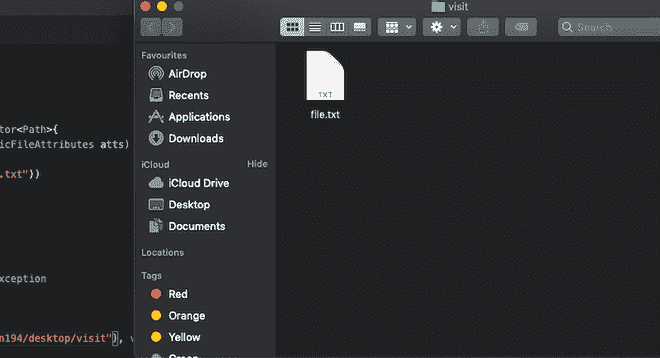
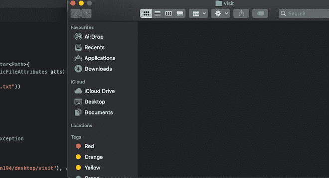

# java 中的 Java . nio . file . simplefile visitor 类

> 原文:[https://www . geesforgeks . org/Java-nio-file-simplefile visitor-class-in-Java/](https://www.geeksforgeeks.org/java-nio-file-simplefilevisitor-class-in-java/)

Java . nio . file . simplefile visitor 类用于访问目录中的所有文件，并在出现输入/输出错误时重新抛出输入/输出异常。

**类申报:**

```
public class SimpleFileVisitor<T>
extends Object
implements FileVisitor<T>
```

**施工方:**

*   **受保护的 SimpleFileVIsitor():** 创建 SimpleFileVIsitor 类的新对象。

**方法:**

<figure class="table">

| 

**方法**

 | 

**描述**

 |
| --- | --- |
| 公共文件默认预览目录(目录，基本属性属性) | 在访问条目之前，将为此目录调用此方法。除非被重写，否则此方法返回 CONTINUE。 |
| 公共文件访问默认后访问目录 | 在访问条目后，将为此目录调用此方法。除非被重写，否则此方法返回 CONTINUE。 |
| 公共文件访问默认访问文件(T 文件，基本文件属性) | 此方法以前在目录中为此文件调用过。除非被重写，否则此方法返回 CONTINUE。

 |
| public file visitresult visitfilefailed(t 文件，IOException) | 对无法访问的文件调用此方法。除非被重写，否则此方法将重新引发输入/输出异常。这是阻止文件被访问的异常。 |

</figure>

**1 . public file visitresult preVisitDirectory(T 目录，BasicFileAttributes 属性):**在访问中的条目之前，将为此目录调用此方法。此方法返回[继续](https://www.geeksforgeeks.org/continue-statement-in-java/)除非[超越](https://www.geeksforgeeks.org/overriding-in-java/)。

```
Parameters:
directory- reference to this directory.
attributes- attributes of this directory.

Returns: the file visit result.

Throws: I/O Exception.
```

**2 . public file visitresult post visitdirectory(T 目录，IOException e):** 访问中的条目后，将为此目录调用此方法。除非被重写，否则此方法返回 CONTINUE。

```
Parameters:
directory- reference to this directory.
e- NULL if there is no error in this directory's 
iteration,else the I/O exception.

Returns: the file visit result.

Throws: I/O Exception.
```

**3 . public file visitresult visitFile(T 文件，BasicFileAttributes 属性):**此方法之前在目录中为此文件调用。除非被重写，否则此方法返回 CONTINUE。

```
Parameters:
file- reference to this file.
arributes- attributes of this file.

Returns: the file visit result.

Throws: I/O Exception 
```

**4 . public file visitresult visitfilefile(T 文件，IOException 异常):**对无法访问的文件调用此方法。除非被重写，否则此方法将重新引发输入/输出异常。这是阻止文件被访问的异常。

```
Parameters:
file - reference to this file.
exc - exception that prevented the file from being visited.

Returns: the file visit result.

Throws: I/O Exception 
```

## Java 语言(一种计算机语言，尤用于创建网站)

```
// Java program to demonstrate working of simpleFileVisitor
// class

import java.io.IOException;
import java.nio.file.*;
import java.nio.file.attribute.*;

public class FileVisitorDemo
    extends SimpleFileVisitor<Path> {
    public FileVisitResult
    visitFile(Path file, BasicFileAttributes atts)
        throws IOException
    {
        if (file.getFileName().toString().endsWith(
                ".txt")) { // delete files ending with .txt
            Files.delete(file);
        } // return result of the operation
        return FileVisitResult.CONTINUE;
    }
    // Method to print message if file visit was not
    // successful
    public FileVisitResult visitFileFailed(Path file,
                                           IOException e)
        throws IOException
    {
        System.err.println("File could not be visited");
        return FileVisitResult.CONTINUE;
    }
    public static void main(String args[]) throws Exception
    {
        FileVisitorDemo visitor = new FileVisitorDemo();
        try {
            // visiting all files at
            // "/Users/abhinavjain194/desktop/visit"
            Files.walkFileTree(
                Paths.get(
                    "/Users/abhinavjain194/desktop/visit"),
                visitor);
        }
        catch (Exception e) { // printing error if occured
            System.err.print(e.toString());
        }
    }
}
```

在运行程序之前



运行程序后

