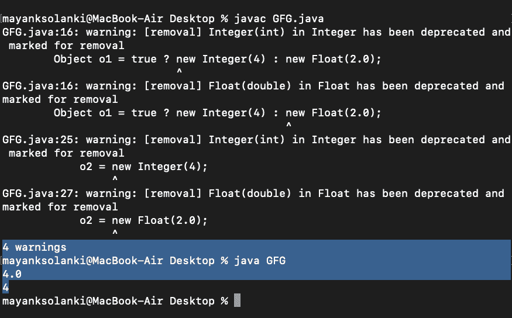

# 条件表达式中的 Java 数值提升

> 原文:[https://www . geesforgeks . org/Java-数值-条件表达式中的提升/](https://www.geeksforgeeks.org/java-numeric-promotion-in-conditional-expression/)

随着 if-else 条件在编程中的重复使用，无论我们如何优化代码，这种情况都有可能发生。因此，考虑到这个因素，引入了条件运算符，使我们编写代码的工作变得更容易，因为它确实有特定的语法来检查传递给它的条件。条件运算符？:使用一个表达式的布尔值来决定应该计算另外两个表达式中的哪一个。让我们用一个例子来熟悉它的语法。

插图:

```java
Object obj ;
if (true) {
    obj = new Integer(4) ;
} else {
    obj = new Float(2.0);
}
```

因此，使用条件运算符时，我们期望表达式的语法如下:

```java
Object obj = true ? new Integer(4) : new Float(2.0));
```

> **注意**:但是运行代码的结果给出了一个意想不到的结果。

**示例:**

## Java 语言(一种计算机语言，尤用于创建网站)

```java
// Java Program to Demonstrate
// Replacing of Conditional Operator
// with If-else and viceversa

// Importing required classes
import java.io.*;

// Main class
class GFG {

    // Main driver method
    public static void main (String[] args) {

        // Expression 1 (using ?: )
        // Automatic promotion in conditional expression
        Object o1 = true ? new Integer(4) : new Float(2.0);

        // Printing the output using conditional operator
        System.out.println(o1);

        // Expression 2 (Using if-else)
        // No promotion in if else statement
        Object o2;
        if (true)
            o2 = new Integer(4);
        else
            o2 = new Float(2.0);

        // Printing the output using if-else statement
        System.out.println(o2);
    }
}
```

**输出:**



根据 [Java 语言规范第 15.25 节](https://docs.oracle.com/javase/specs/jls/se7/html/jls-15.html#jls-15.25)，如果有两种不同的类型作为第二个和第三个操作数，条件运算符将实现数值类型提升。转换规则在[二进制数字升级](https://docs.oracle.com/javase/specs/jls/se8/html/jls-5.html#jls-5.6.2)中定义。因此，根据给定的规则，如果任一操作数是 double 类型，则另一个被转换为 double，因此 4 变成 4.0。然而，if/else 构造并不执行数值提升，因此行为符合预期。

本文由**迪帕克·加尔格**供稿。如果你喜欢极客博客并想投稿，你也可以写一篇文章并把你的文章邮寄到 review-team@geeksforgeeks.org。看到你的文章出现在极客博客主页上，帮助其他极客。如果你发现任何不正确的地方，或者你想分享更多关于上面讨论的话题的信息，请写评论。