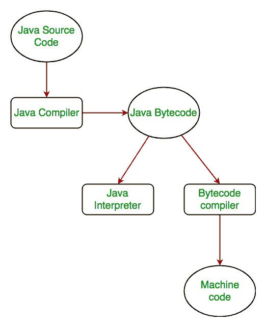

# Java 平台如何独立？

> 原文:[https://www.geeksforgeeks.org/java-platform-independent/](https://www.geeksforgeeks.org/java-platform-independent/)

平台无关的意思是 java 编译代码(字节码)可以在所有操作系统上运行。
程序是用人类可读的语言编写的。它可能包含机器不理解的单词、短语等。为了让机器能够理解源代码，它需要使用机器能够理解的语言，通常是机器级语言。那么，编译器的作用来了。编译器将高级语言(人类语言)转换成机器能够理解的格式。因此，编译器是将另一个程序的源代码从一种编程语言翻译成可执行代码的程序。
该可执行代码可以是可由 CPU 直接执行的机器指令序列，也可以是由虚拟机解释的中间表示。Java 中的这种中间表示是 **Java 字节码。**

**Java 程序的分步执行:**

*   每当一个程序用 JAVA 编写时，javac 就会编译它。
*   JAVA 编译器的结果是**。类文件或字节码**而不是机器原生代码(不像 C 编译器)。
*   生成的字节码是不可执行的代码，需要解释器在机器上执行。这个解释器是 JVM，因此字节码由 JVM 执行。
*   最后程序运行给出想要的输出。

。

如果是 C 或 C++(非平台独立的语言)，编译器会生成一个。依赖于操作系统的. exe 文件。当我们试图运行这个的时候。exe 文件，因为它依赖于操作系统，因此与其他操作系统不兼容。

**Java 是平台无关的，但是 JVM 是平台相关的**

在 Java 中，这里的要点是 JVM 依赖于操作系统——所以如果你运行的是 Mac OS X，你会有一个不同于运行 Windows 或其他操作系统的 JVM。这一事实可以通过尝试为您的特定机器下载 JVM 来验证——当尝试下载它时，您将获得一个对应于不同操作系统的 JVM 列表，并且您显然会选择您正在运行的操作系统的目标 JVM。所以我们可以得出结论，JVM 是依赖于平台的，这也是 Java 能够成为“平台独立”的原因。
**要点:**

*   在 Java 的情况下，**正是字节码的魔力使其与平台无关**。
*   这增加了 JAVA 语言中称为**可移植性**的一个重要特性。每个系统都有自己的 JVM，当安装 jdk 软件时，JVM 会自动安装。对于每个操作系统，都有单独的 JVM 可以读取。类文件或字节代码。
*   需要注意的一点是，虽然 **JAVA 是独立于平台的语言，但是 JVM 是依赖于平台的。**不同的 JVM 是为不同的 OS 设计的，字节码能够在不同的 OS 上运行。

本文由 **Sania Parween** 供稿。如果你喜欢 GeeksforGeeks 并想投稿，你也可以使用[contribute.geeksforgeeks.org](http://www.contribute.geeksforgeeks.org)写一篇文章或者把你的文章邮寄到 contribute@geeksforgeeks.org。看到你的文章出现在极客博客主页上，帮助其他极客。

如果你发现任何不正确的地方，或者你想分享更多关于上面讨论的话题的信息，请写评论。