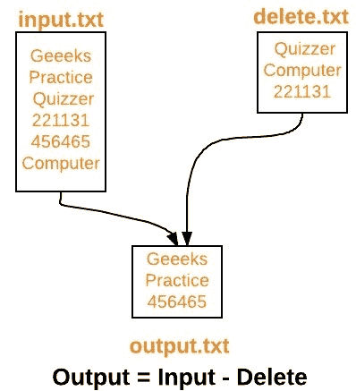

# 从文件中删除某些文本的 Java 程序

> 原文:[https://www . geesforgeks . org/Java-program-delete-seven-text-file/](https://www.geeksforgeeks.org/java-program-delete-certain-text-file/)

**先决条件:** [打印作者](https://www.geeksforgeeks.org/java-io-printwriter-class-java-set-1/)[缓冲器](https://www.geeksforgeeks.org/java-io-bufferedreader-class-java/)

给定两个文件 input.txt 和 delete.txt，我们的任务是执行文件提取(Input-Delete)并将输出保存在文件中，比如 output.txt

示例:



**朴素算法:**

```
1\. Create PrintWriter object for output.txt
2\. Open BufferedReader for input.txt
3\. Run a loop for each line of input.txt
   3.1 flag = false
   3.2 Open BufferedReader for delete.txt
   3.3 Run a loop for each line of delete.txt
      ->  If  line of delete.txt is equal to current line of input.txt 
            -> flag = true
            -> break loop

4\. Check flag, if false
     -> write current line of input.txt to output.txt
5\. Flush PrintWriter stream and close resources.

```

要成功运行以下程序，input.txt 和 delete.txt 必须存在于同一个文件夹中，或者为它们提供完整路径。

```
// Java program to perform file
// operation output = input-delete

import java.io.*;

public class FileOperation
{
    public static void main(String[] args) throws IOException 
    {
        // PrintWriter object for output.txt
        PrintWriter pw = new PrintWriter("output.txt");

        // BufferedReader object for input.txt
        BufferedReader br1 = new BufferedReader(new FileReader("input.txt"));

        String line1 = br1.readLine();

        // loop for each line of input.txt
        while(line1 != null)
        {
            boolean flag = false;

            // BufferedReader object for delete.txt
            BufferedReader br2 = new BufferedReader(new FileReader("delete.txt"));

            String line2 = br2.readLine();

            // loop for each line of delete.txt
            while(line2 != null)
            {
                if(line1.equals(line2))
                {
                    flag = true;
                    break;
                }

                line2 = br2.readLine();
            }

            // if flag = false
            // write line of input.txt to output.txt
            if(!flag)
                pw.println(line1);

            line1 = br1.readLine();

        }

        pw.flush();

        // closing resources
        br1.close();
        pw.close();

        System.out.println("File operation performed successfully");
    }
}
```

输出:

```
File operation performed successfully

```

**注意:**如果在 cwd(当前工作目录)中存在 output.txt，那么它将被上述程序覆盖，否则将创建新文件。

一个**更好的解决方案**是使用 [HashSet](https://www.geeksforgeeks.org/hashset-in-java/) 来存储每一行 delete.txt，然后在循环输入. txt 的同时，检查它是否在 HashSet 中。如果不存在，将该行写入 output.txt。

要成功运行以下程序，input.txt 和 delete.txt 必须存在于同一个文件夹中，或者为它们提供完整路径。

```
// Efficient Java program to perform file
// operation output = input-delete

import java.io.*;
import java.util.HashSet;

public class FileOperation
{
    public static void main(String[] args) throws IOException 
    {
        // PrintWriter object for output.txt
        PrintWriter pw = new PrintWriter("output.txt");

        // BufferedReader object for delete.txt
        BufferedReader br2 = new BufferedReader(new FileReader("delete.txt"));

        String line2 = br2.readLine();

        // hashset for storing lines of delete.txt
        HashSet<String> hs = new HashSet<String>();

        // loop for each line of delete.txt
        while(line2 != null)
        {
            hs.add(line2);
            line2 = br2.readLine();
        }

        // BufferedReader object for input.txt
        BufferedReader br1 = new BufferedReader(new FileReader("input.txt"));

        String line1 = br1.readLine();

        // loop for each line of input.txt
        while(line1 != null)
        {
            // if line is not present in delete.txt
            // write it to output.txt
            if(!hs.contains(line1))
                pw.println(line1);

            line1 = br1.readLine();
        }

        pw.flush();

        // closing resources
        br1.close();
        br2.close();
        pw.close();

        System.out.println("File operation performed successfully");
    }
}
```

输出:

```
File operation performed successfully

```

**注意:**如果在 cwd(当前工作目录)中存在 output.txt，那么它将被上述程序覆盖，否则将创建新文件。

本文由**高拉夫·米格拉尼**供稿。如果你喜欢 GeeksforGeeks 并想投稿，你也可以使用[contribute.geeksforgeeks.org](http://www.contribute.geeksforgeeks.org)写一篇文章或者把你的文章邮寄到 contribute@geeksforgeeks.org。看到你的文章出现在极客博客主页上，帮助其他极客。

如果你发现任何不正确的地方，或者你想分享更多关于上面讨论的话题的信息，请写评论。